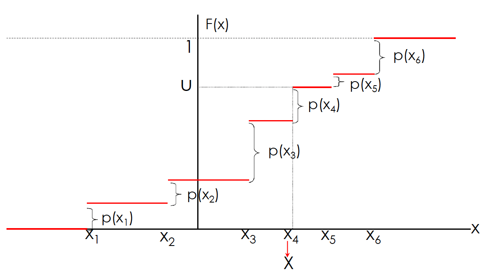
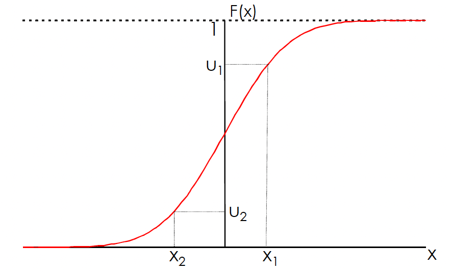

---
editor_options:
  markdown:
    wrap: 72
---

# Normas de Funcionamento

**Docente**: Renato de Paula

Gabinete: 6.4.21

email:
[rrpaula\@ciencias.ulisboa.pt](mailto:rrpaula@ciencias.ulisboa.pt){.email}

**Monitora**: Ana Catarina Fernandes

Gabinete: 6.4.17

email: acafernandes@fc.ul.pt

**AVALIAÇÃO**

-   Dois exercícios práticos a realizar em aula e dois testes.

**ou**

-   **Exame final**

- Nota mínima de 8.5 valores em cada um dos testes.
- Datas de realização dos testes:
- Primeiro Exercício prático: 22 de outubro de 2024
- Primeiro teste: 5 de novembro de 2024
- Segundo teste: 21 de janeiro de 2025

-   **Nota final**:

    -   (1):
        $0.10\times(Ex1) + 0.10\times(Ex2) + 0.40\times(Teste1) + 0.40\times(Teste2)$

**ou**

-   (2): Nota do Exame final

-   Exercício prático não efetuado tem cotação igual a zero.

**Consulta permitida**

-   Teste 1: formulário com dimensão máxima igual a uma folha A4, frente
    e verso.

-   Teste 2: formulário com dimensão máxima igual a uma folha A4, frente
    e verso.

-   O formulário deve ser preparado individualmente e escrito à mão (não
    podem ser fotocópias).

# R e RStudio

O R é um software de código aberto desenvolvido como uma implementação
gratuita da linguagem S, que foi concebida especificamente para
computação estatística, programação estatística e geração de gráficos. A
principal intenção era proporcionar aos utilizadores a capacidade de
explorar dados de maneira intuitiva e interativa, utilizando
representações gráficas significativas para facilitar a compreensão dos
dados. O software estatístico R foi originalmente criado por Ross Ihaka
e Robert Gentleman, da Universidade de Auckland, Nova Zelândia.

O R oferece um conjunto integrado de ferramentas para manipulação de
dados, cálculo e visualização gráfica. Ele oferece:

-   Manipulação eficiente de dados e armazenamento flexível;
-   Operadores poderosos para cálculos em arrays e matrizes;
-   Uma coleção abrangente, coerente e integrada de ferramentas para
    análise de dados;
-   Recursos gráficos avançados para análise e visualização de dados,
    seja na tela ou em cópia impressa;
-   Uma linguagem de programação robusta, intuitiva e eficaz, que inclui
    estruturas condicionais, loops, funções recursivas definidas pelo
    utilizador, além de recursos de entrada e saída de dados.

## Instalação e funcionalidades básicas

-   A versão base do R, que inclui o conjunto fundamental de comandos e
    funções, pode ser descarregada diretamente do site oficial:
    <https://www.r-project.org/>. Após instalar o R, é altamente
    recomendável instalar também um ambiente de desenvolvimento
    integrado (IDE) para facilitar o trabalho com o código R. Um IDE
    permite ao utilizador escrever, guardar e organizar scripts de
    código R de forma mais eficiente, além de executar comandos
    diretamente no Console do R e gerir configurações e saídas de forma
    conveniente. Uma escolha popular de IDE é o RStudio, que é gratuito
    e pode ser descarregado em <https://www.rstudio.com/>.

-   Além do conjunto base de funções, o R oferece uma vasta gama de
    pacotes adicionais desenvolvidos pela comunidade de utilizadores.
    Estes pacotes podem ser instalados diretamente pelo Console do R ou
    através do menu do RStudio. Para instalar um pacote no Console, pode
    usar a função `install.packages("nome_do_pacote")`. É importante
    lembrar que, para instalar pacotes, é necessário estar ligado à
    internet. Para visualizar todos os pacotes já instalados no seu
    ambiente R, pode utilizar a função `installed.packages()`. Para usar
    os packages nãoo incluídos na base do R é necessário torna-los
    activos, usando a função `library()`.

## Navegar no RStudio

Existem quatro painéis principais no ambiente de trabalho do RStudio:

-   **Editor/Scripts**. Este painel é utilizado para criar, carregar e
    exibir scripts de código R. Ele oferece recursos como realce de
    sintaxe, preenchimento automático e a capacidade de executar o
    código linha por linha ou em blocos, o que facilita a edição e
    depuração do código.

-   **Console**. No Console, os comandos são executados diretamente. Ele
    funciona de maneira semelhante ao console padrão do R, mas com
    melhorias significativas, como realce de sintaxe, preenchimento
    automático de código e integração com os demais painéis do RStudio.
    O Console é o local ideal para testes rápidos e execução de comandos
    imediatos.

-   **Environment/Histórico**. O painel “Environment” (Ambiente) exibe
    informações sobre os objetos actualmente carregados na sessão do R,
    como conjuntos de dados, funções definidas pelo utilizador e outras
    variáveis. Isto ajuda a gerir e visualizar o conteúdo da memória de
    trabalho. A aba “History” (Histórico) armazena todos os comandos
    executados durante a sessão, permitindo fácil recuperação e
    reutilização de códigos anteriores.

-   **Painel Inferior Direito**. Este painel é multifuncional e contém
    várias abas úteis:

    -   **Files** (Ficheiros): lista todos os ficheiros no diretório de
        trabalho actual.
    -   **Plots** (Gráficos): exibe quaisquer gráficos gerados durante a
        análise.
    -   **Packages** (Pacotes): permite visualizar os pacotes instalados
        e carregados na sessão.
    -   **Help** (Ajuda): fornece acesso ao sistema de ajuda embutido em
        HTML, que oferece documentação detalhada sobre funções e
        pacotes.
    -   **Viewer** (Visualizador): utilizado para visualizar documentos
        HTML, PDFs e outros conteúdos dentro do RStudio.

## Atalhos

-   **CTRL+ENTER**: executa a(s) linha(s) de código selecionada(s) no
    script.

-   **ALT+-**: insere o operador de atribuição (`<-`) no script.

-   **CTRL+SHIFT+M**: (%\>%) operador pipe no script.

-   **CTRL+1**: move o cursor para o painel de script.

-   **CTRL+2**: move o cursor para o console.

-   **CTRL+ALT+I**: insere um novo “chunk” de código no R Markdown.

-   **CTRL+SHIFT+K**: compila um documento R Markdown.

-   **ALT+SHIFT+K**: abre uma janela com todos os atalhos de teclado
    disponíveis.

No MacBook, os atalhos geralmente são os mesmos, substituindo o **CTRL**
por **Command** e o **ALT** por **Option**.

# R como Calculadora e Operações Aritméticas

A Estatística está intimamente ligada à Álgebra, especialmente no que
diz respeito ao uso de matrizes e vetores para representar conjuntos de
dados e variáveis. No R, estas estruturas de dados são amplamente
utilizadas para facilitar a manipulação e a análise estatística. Por
isso, é importante primeiro entender como o R lida com estas estruturas
antes de avançar para comandos estatísticos mais específicos.

## O Prompt do R

O R utiliza uma interface de linha de comando para executar operações e
aceitar comandos diretamente. Esta interface é marcada pelo símbolo \>,
conhecido como o **prompt**. Quando se digita um comando após o prompt e
se pressiona Enter, o R interpreta o comando, executa a operação
correspondente e exibe o resultado no ecrã.

```{r eval=FALSE}
print("Meu primeiro comando no R!")
## [1] "Meu primeiro comando no R!"
```

Nas notas de aula, o código R digitado no console é exibido em caixas
cinzentas. Quando se vê o símbolo \## no início de uma linha, isso
indica o resultado (output) gerado pelo console R após a execução do
código.

No R, o caractere `#` é utilizado para inserir comentários no código.
Qualquer texto que aparece após `#` na mesma linha é ignorado pelo R
durante a execução. Comentários são úteis para adicionar explicações ou
anotações no código, como no exemplo abaixo:

```{r eval=FALSE}
# Este é um exemplo de comentário
2 + 2 # O R vai calcular 2 mais 2
## [1] 4
```

Se conhecer o nome de uma função e desejar aprender mais sobre o seu
funcionamento, pode utilizar o comando `?` seguido do nome da função
para aceder à documentação de ajuda correspondente. Por exemplo:

```{r eval=FALSE}
?sum
```

Este comando abrirá a página de ajuda para a função `sum`, que é
utilizada para calcular a soma de elementos.

Além disso, o R oferece uma forma prática de visualizar exemplos de como
uma função pode ser utilizada. Para ver exemplos de uso de uma função,
pode usar o comando `example()` com o nome da função como argumento:

```{r eval=FALSE}
example(sum)
```

Este comando mostrará exemplos de aplicação da função `sum`, ajudando a
entender melhor como pode ser usada em diferentes contextos.

## Objetos e Variáveis

Em R, um **objeto** é uma unidade de armazenamento que pode conter
diferentes tipos de dados ou funções, sendo referenciado por um nome.
Esses dados podem incluir números, caracteres, vetores, matrizes, data
frames, listas ou até mesmo funções. Objetos são criados e manipulados
através de comandos, permitindo que seus valores sejam reutilizados em
qualquer parte do código. Em resumo, tudo o que é criado ou carregado na
sessão do R, como dados ou funções, é considerado um objeto.

### O que é uma Variável?

Uma **variável** é um nome ou identificador associado a um objeto.
Quando se cria uma variável, está-se, na verdade, a criar um “rótulo”
que aponta para o objeto armazenado na memória. Assim, uma variável é o
nome que se utiliza para aceder aos dados ou funções armazenados no
objeto. Ela permite manipular e referenciar o objeto de forma
conveniente ao longo do seu script ou análise.

<!-- Em R, uma variável é um local de armazenamento nomeado na memória onde os dados podem ser armazenados para recuperação e manipulação posterior. Variáveis em R são usadas para armazenar diferentes tipos de dados, como números, caracteres, vetores, data frames e muito mais. O tipo de dado de uma variável em R é determinado pelo valor atribuído a ela.-->

### Atribuições

-   A expressão `x <- 10` cria uma variável chamada `x` e atribui-lhe o
    valor 10. Note que o operador de atribuição `<-` atribui o valor do
    lado direito à variável do lado esquerdo. O lado esquerdo deve
    conter apenas um único nome de variável.

-   Também é possível realizar atribuições usando o sinal de igualdade
    `=` ou o operador `->`. No entanto, para evitar confusões entre o
    operador de atribuição e o operador de igualdade, é recomendável
    usar `<-` para atribuições.

```{r}
# Atribuição correta 
a <- 10
b <- a + 1
```

```{r eval=FALSE}
# Atribuição incorreta
10 = a
a + 2 = 10 # Uma atribuição não é uma equação
```

-   O comando `c(1,2,3,4,5)` combina os números 1, 2, 3, 4 e 5 em um
    vetor, criando uma sequência de valores.

-   Vetores podem ser atribuídos a objetos. Por exemplo:

```{r}
X <- c(2,12,22,32)
```

Esta linha de código atribui um vetor numérico de comprimento 4 ao
objeto `X`. É importante lembrar que o R distingue entre maiúsculas e
minúsculas, o que significa que `X` e `x` são considerados dois objetos
distintos.

Ao definir objetos no console, está a modificar o espaço de trabalho
actual. Para visualizar todas as variáveis e objetos actualmente
guardados no seu espaço de trabalho, pode usar o comando:

```{r eval=FALSE}
ls()
```

No RStudio, a aba *Environment* exibe todos os objetos e valores
presentes no espaço de trabalho.

### Regras para definição de variáveis

Os nomes de variáveis em R devem começar com uma letra ou um ponto final
(desde que o ponto final seja seguido por uma letra) e podem incluir
letras, números, pontos e sublinhados.

-   O nome de uma variável **não pode** conter espaços ou caracteres
    especiais (como \@, #, \$, %). Apenas letras, números, pontos e
    sublinhados (\_) são permitidos. Exemplo de nome válido:
    `nome_cliente2`.

-   Ao definir nomes de variáveis, **não é permitido** usar palavras
    reservadas do R. Palavras reservadas são termos que têm um
    significado especial no R e não podem ser redefinidos. Exemplos de
    palavras reservadas incluem: `if`, `else`, `for`, `while`, `class`,
    `FALSE`, `TRUE`, `exp`, `sum`.

-   O R diferencia letras maiúsculas de minúsculas, o que significa que
    `fcul` e `Fcul` são tratadas como variáveis diferentes. Uma
    convenção comum é usar letras minúsculas para nomes de variáveis e
    separar palavras com sublinhados. Exemplo: `faculdade_de_ciencias`.

-   Escolha nomes de variáveis que descrevam claramente a sua finalidade
    para que o código seja mais legível e compreensível. Por exemplo,
    use `nome` em vez de `x`.

```{r}
idade <- 20
Idade <- 30
```

Neste exemplo, `idade` e `Idade` são duas variáveis diferentes devido à
diferenciação entre letras maiúsculas e minúsculas.

### Tipos de Dados

Em R, variáveis podem armazenar diferentes tipos de dados, incluindo:

-   **Numeric**: números inteiros ou decimais. Exemplo: `42`, `3.14`.
-   **Character**: sequências de caracteres (texto). Exemplo: `"Olá"`.
-   **Logical**: valores booleanos que representam verdadeiro ou falso.
    Exemplo: `TRUE`, `FALSE`.
-   **Vectors**: coleções de elementos do mesmo tipo. Exemplos:
    `c(1, 2, 3)` para números, `c("a", "b", "c")` para caracteres.
-   **Data Frames**: estruturas de dados tabulares que contêm linhas e
    colunas, semelhantes a uma tabela de banco de dados ou a uma folha
    de cálculo.
-   **Lists**: coleções que podem conter elementos de diferentes tipos,
    como números, caracteres, vetores, e até mesmo outros data frames.
-   **Factors**: variáveis categóricas que representam dados categóricos
    e são armazenadas como inteiros. São especialmente úteis para
    análises estatísticas que envolvem dados categóricos.

```{r}
# Numeric
a <- 3.14

# Character
b <- "Programação R"

# Logical
c <- 3 < 2

# Vectors
d <- c(1, 2, 3)
```

### Comandos Importantes

Abaixo estão alguns comandos úteis para manipular variáveis e objetos no
R:

```{r eval=FALSE}
ls() # Exibe a lista de variáveis atualmente armazenadas na memória
	
ls.str() # Mostra a estrutura das variáveis armazenadas na memória
	
rm(a) # Remove o objeto 'a' da memória
	
rm(list=ls()) # Remove todos os objetos da memória
	
save.image('nome-do-arquivo.RData') # Salva o espaço de trabalho atual em um arquivo .RData
```

## Operadores Aritméticos em R

| **Operador** | **Descrição**                            | **Exemplo**            |
|------------------|-----------------------------------|--------------------|
| \+           | Adiciona dois valores                    | `5 + 2` resulta em 7   |
| \-           | Subtrai dois valores                     | `5 - 2` resulta em 3   |
| \*           | Multiplica dois valores                  | `5 * 2` resulta em 10  |
| /            | Divide dois valores (sem arredondamento) | `5 / 2` resulta em 2.5 |
| %/%          | Realiza divisão inteira                  | `5 %/% 2` resulta em 2 |
| %%           | Retorna o resto da divisão               | `5 %% 2` resulta em 1  |
| \^           | Realiza exponenciação                    | `5 ^ 2` resulta em 25  |

**Exemplos:**

```{r eval=FALSE}
1+1
## [1] 2

5-2
## [1] 3

5*21
## [1] 105

sqrt(9)
## [1] 3

3^3
## [1] 27

3**3
## [1] 27

log(9)
## [1] 2.197225

log10(9)
## [1] 0.9542425

exp(1)
## [1] 2.718282

# prioridade de resolução
19 + 26 /4 -2 *10
## [1] 5.5

((19 + 26) /(4 -2))*10
## [1] 225
```

Ao contrário de funções simples como `ls()`, a maioria das funções no R
requer um ou mais *argumentos*. Nos exemplos acima, utilizamos funções
predefinidas do R como `sqrt()`, `log()`, `log10()` e `exp()`, que
aceitam argumentos específicos.

### Controle da Quantidade de Dígitos Mostrados

O R permite ajustar a precisão dos números exibidos alterando a
configuração global de dígitos. Veja o exemplo a seguir:

```{r eval=FALSE}
exp(1)
## [1] 2.718282

options(digits = 20)
exp(1)
## [1] 2.7182818284590450908

options(digits = 3)
exp(1)
## [1] 2.72
```

### Objetos Predefinidos, Infinito, Indefinido e Valores Ausentes

O R inclui diversos conjuntos de dados predefinidos que podem ser usados
para prática e teste de funções. Para visualizar todos os conjuntos de
dados disponíveis, pode-se utilizar o seguinte comando:

```{r eval=FALSE}
data()
```

Este comando exibe uma lista de nomes de objetos para cada conjunto de
dados disponível. Esses conjuntos de dados podem ser utilizados
diretamente ao simplesmente digitar o nome no console. Por exemplo, ao
digitar:

```{r eval=FALSE}
co2
```

O R exibirá os dados de concentração atmosférica de CO2 coletados em
Mauna Loa.

Além dos conjuntos de dados, o R também possui objetos predefinidos que
representam constantes matemáticas, como `pi` para o número $\pi$ e
`Inf` para o $\infty$.

```{r eval=FALSE}
pi
## [1] 3.14

1/0  
## [1] Inf

2*Inf
## [1] Inf

-1/0
## [1] -Inf

0/0
## [1] NaN

0*Inf
## [1] NaN

Inf - Inf
## [1] NaN

sqrt(-1)
## Warning in sqrt(-1): NaNs produced
## [1] NaN
	
c(1,2,3,NA,5)
## [1]  1  2  3 NA  5

mean(c(1,2,3,NA,5))
## [1] NA

mean(c(1,2,3,NA,5), na.rm = TRUE)
## [1] 2.75
	
x <- c(1, 2, NaN, 4, 5)
y <- c(1, 2, NA, 4, 5)

# Note que isso não funciona
y == NA
## [1] NA NA NA NA NA

# E isso também não
y == "NA"
## [1] FALSE FALSE    NA FALSE FALSE

is.na(x)
## [1] FALSE FALSE  TRUE FALSE FALSE

is.nan(x) 
## [1] FALSE FALSE  TRUE FALSE FALSE

is.na(y)
## [1] FALSE FALSE  TRUE FALSE FALSE

is.nan(y)
## [1] FALSE FALSE FALSE FALSE FALSE

# Operações com NaN e NA
sum(x)  # Retorna: NaN, porque a soma envolve um NaN
## [1] NaN

sum(y)  # Retorna: NA, porque a soma envolve um NA
## [1] NA
	
sum(x, na.rm = TRUE)  # Retorna: 12, ignora NaN na soma
## [1] 12

sum(y, na.rm = TRUE)  # Retorna: 12, ignora NA na soma
## [1] 12
```

-   **NaN** (Not a Number): Representa resultados indefinidos de
    operações matemáticas. Por exemplo, operações como `0/0` ou
    `sqrt(-1)` geram um `NaN` porque o resultado não é um número real.
    No R, `NaN` é tecnicamente um tipo especial de `NA` que indica
    especificamente um resultado numérico indefinido.

-   **NA** (Not Available): Indica dados ausentes ou valores que não
    estão disponíveis num conjunto de dados. Por exemplo, em um vetor de
    dados, se um valor está ausente ou não foi medido, ele é
    representado por `NA`. Ao contrário de `NaN`, `NA` é utilizado para
    representar qualquer tipo de dado ausente, não apenas valores
    numéricos.

### Lidando com NaN e NA em Operações

Ao trabalhar com dados, é importante saber como lidar com `NaN` e `NA`
para evitar erros inesperados. Funções como `mean()` e `sum()` podem
retornar `NA` ou `NaN` se contiverem esses valores. Para ignorar `NA` ou
`NaN` ao realizar cálculos, você pode usar o argumento `na.rm = TRUE`,
que remove os valores ausentes ou indefinidos da operação.

```{r eval=FALSE}
mean(c(1, 2, 3, NA, 5), na.rm = TRUE)  # Calcula a média ignorando NA
## [1] 2.75

sum(x, na.rm = TRUE)  # Soma ignorando NaN
## [1] 12

sum(y, na.rm = TRUE)  # Soma ignorando NA
## [1] 12
```

### Funções Úteis para Detectar NaN e NA

Para verificar a presença de `NA` ou `NaN` em um vetor ou conjunto de
dados, pode-se usar as funções `is.na()` e `is.nan()`. A função
`is.na()` identifica todos os valores que são `NA` ou `NaN`, enquanto
`is.nan()` identifica especificamente valores que são `NaN`. Por
exemplo:

```{r eval=FALSE}
is.na(x)
## [1] FALSE FALSE  TRUE FALSE FALSE

is.nan(x) 
## [1] FALSE FALSE  TRUE FALSE FALSE

is.na(y)
## [1] FALSE FALSE  TRUE FALSE FALSE

is.nan(y)
## [1] FALSE FALSE FALSE FALSE FALSE
```

Essas funções são úteis para limpar e preparar dados antes de realizar
análises estatísticas, garantindo que os cálculos sejam precisos e
significativos.

### Tipagem Dinâmica em R

Em R, o tipo de uma variável é determinado dinamicamente com base no
valor atribuído a ela. Isso significa que o R automaticamente define o
tipo de dado de uma variável quando lhe é atribuído um valor.

```{r eval=FALSE}
x <- 5         
class(x) 
## [1] "numeric"

y <- "Cinco"   
class(y) 
## [1] "character"

z <- TRUE  
class(z) 
## [1] "logical"
```

-   A função `class()` retorna a **classe** de um objeto em R. A classe
    de um objeto determina como ele será tratado pelas funções e
    operações que podem ser aplicadas a ele. Por exemplo, vetores,
    matrizes, data frames e listas são diferentes classes de objetos em
    R, cada uma com suas próprias características e métodos.

-   A função `typeof()` em R é usada para retornar o **tipo de
    armazenamento interno** de um objeto. Ela fornece informações
    detalhadas sobre como os dados são representados na memória do
    computador.

```{r eval=FALSE}
x <- 1:10
class(x)
## [1] "integer"

typeof(x) 
## [1] "integer"

y <- c(1.1, 2.2, 3.3)
class(y) 
## [1] "numeric"

typeof(y) 
## [1] "double"

z <- data.frame(a = 1:3, b = c("A", "B", "C"))
class(z)
## [1] "data.frame"

typeof(z) 
## [1] "list"

w <- list(a = 1, b = "text")
class(w) 
## [1] "list"

typeof(w) 
## [1] "list"
```

Neste exemplo, `class(x)` e `typeof(x)` ambos retornam “integer” para um
vetor de inteiros, enquanto `class(y)` retorna “numeric” para um vetor
de números de ponto flutuante, e `typeof(y)` retorna “double”, mostrando
o tipo específico de armazenamento na memória. Para um data.frame,
`class(z)` retorna “data.frame”, enquanto `typeof(z)` retorna “list”,
indicando que os data frames são armazenados internamente como listas.

### Conversão entre Tipos de Dados

Em R, é possível converter uma variável de um tipo de dado para outro
usando funções de conversão. Isso é especialmente útil ao trabalhar com
dados que podem ter sido importados de fontes externas e precisam ser
manipulados ou analisados de diferentes maneiras.

```{r eval=FALSE}
# Convertendo um inteiro em uma string (caractere)
a <- 15
b <- as.character(15)
print(b)
## [1] "15"
	
# Convertendo um número de ponto flutuante (float) em um inteiro
x <- 1.5
y <- as.integer(x)
print(y)
## [1] 1

# Convertendo uma string em um número (float)
z <- "10"
w <- as.numeric(z)
print(w)
## [1] 10
```

Essas funções de conversão são essenciais quando há necessidade de
manipular diferentes tipos de dados de forma eficiente em análises
estatísticas e outras operações de programação.

## Funções `print()`, `readline()`, `paste()` e `cat()`

No R, existem várias funções úteis para exibir, receber e concatenar
informações. Aqui estão algumas das mais comuns:

-   `print()`: Utilizada para exibir valores e resultados de expressões
    no console. É a função básica para mostrar a saída de dados no R.

-   `readline()`: Usada para receber entradas do utilizador via teclado.
    Esta função permite que o script pause e aguarde a entrada do
    utilizador

-   `paste()`: Utilizada para concatenar (combinar) sequências de
    caracteres (strings) com um separador específico entre elas. Por
    padrão, o separador é um espaço.

-   `paste0()`: Semelhante a `paste()`, mas concatena strings sem
    qualquer separador.

-   `cat()`: Usada para concatenar e exibir uma ou mais strings ou
    valores de uma forma direta, sem estruturas de formatação adicionais
    como aspas. Ao contrário de `print()`, `cat()` não retorna o
    resultado em uma nova linha.

**Exemplo 1:**

```{r eval=FALSE}
nome1 <- "faculdade"
nome2 <- "ciências"
print(paste(nome1, nome2))
## [1] "faculdade ciências"
```

Neste exemplo, `paste()` concatena as duas strings com um espaço entre
elas.

**Exemplo 2:**

```{r eval=FALSE}
# Solicitar entrada do utilizador
n <- readline(prompt = "Digite um número: ")

# Converta a entrada em um valor numérico
n <- as.integer(n)

# Imprima o valor no console
print(n+1)
```

Aqui, `readline()` recebe a entrada do utilizador, e `as.integer()`
converte essa entrada para um número inteiro. O resultado é incrementado
em 1 e exibido.

**Exemplo 3:**

```{r eval=FALSE}
# Solicitar entrada do utilizador
nome <- readline(prompt = "Entre com o seu nome: ")
	
# Imprima uma mensagem de saudação
cat("Olá, ",nome, "!")
```

O uso de `cat()` aqui é para exibir uma mensagem de saudação que inclui
o nome do utilizador.

**Exemplo 4:**

```{r eval=FALSE}
# Solicitar ao utilizador a entrada numérica
idade <- readline(prompt = "Digite a sua idade: ")
	
# Converta a entrada em um valor numérico
idade <- as.numeric(idade)
	
# Verifique se a entrada é numérica
if (is.na(idade)) {
cat("Entrada inválida. Insira um valor numérico.\n")
} else {
  cat("Você tem ", idade, " anos.\n")
}
```

Este exemplo mostra como verificar se a entrada é numérica usando
`is.na()` e fornecer feedback apropriado ao utilizador.

**Concatenando Strings**

```{r eval=FALSE}
result <- paste("Hello", "World")
print(result)
## [1] "Hello World"
```

**Concatenando Múltiplas Strings**

```{r eval=FALSE}
result <- paste("Data", "Science", "with", "R")
print(result)
## [1] "Data Science with R"
```

**Concatenando Strings com um Separador Específico**

```{r eval=FALSE}
result <- paste("2024", "04", "28", sep="-")
print(result)
## [1] "2024-04-28"
```

**Concatenando Vetores de Strings**

```{r eval=FALSE}
first_names <- c("Anna", "Bruno", "Carlos")
last_names <- c("Smith", "Oliveira", "Santos")
result <- paste(first_names, last_names)
print(result)
## [1] "Anna Smith"     "Bruno Oliveira" "Carlos Santos"
```

**Concatene com cada elemento de um vetor**

```{r eval=FALSE}
numbers <- 1:3
result <- paste("Number", numbers)
print(result)
## [1] "Number 1" "Number 2" "Number 3"
```

**Usando `paste0()` para Concatenar sem Espaço**

```{r eval=FALSE}
result <- paste0("Hello", "World")
print(result)
## [1] "HelloWorld"
```

**Concatenando Strings com Números**

```{r eval=FALSE}
age <- 25
result <- paste("I am", age, "years old")
print(result)
## [1] "I am 25 years old"
```

## Quizz

1.  O que é o ‘prompt’ do R?

-   

    a)  Um símbolo que marca o início de um comando

-   

    b)  Um objeto armazenado na memória

-   

    c)  Uma função para adicionar números

-   

    d)  Um operador lógico

2.  Qual comando é usado para imprimir texto no console no R?

-   

    a)  `print()`

-   

    b)  `paste()`

-   

    c)  `cat()`

-   

    d)  `readline()`

3.  O que o caractere `#` faz em um script R?

-   

    a)  Executa o comando

-   

    b)  Cria uma variável

-   

    c)  Indica um comentário

-   

    d)  Combina dois números

4.  Como você cria um vetor com os números 1 a 5?

-   

    a)  `c(1 2 3 4 5)`

-   

    b)  `combine(1,2,3,4,5)`

-   

    c)  `c(1,2,3,4,5)`

-   

    d)  `vector(1,2,3,4,5)`

5.  O que o operador `<-` faz no R?

-   

    a)  Atribui um valor a uma variável

-   

    b)  Compara dois números

-   

    c)  Soma dois números

-   

    d)  Remove um objeto

6.  Como remover um objeto da memória no R?

-   

    a)  `delete(x)`

-   

    b)  `remove(x)`

-   

    c)  `rm(x)`

-   

    d)  `clear(x)`

7.  Qual operador é usado para divisão inteira em R?

-   

    a)  `/`

-   

    b)  `%/%`

-   

    c)  `%%`

-   

    d)  `^`

8.  Qual operador retorna o resto da divisão de dois números?

-   

    a)  `%/%`

-   

    b)  `%%`

-   

    c)  `^`

-   

    d)  `/`

9.  Como você controla a precisão dos números exibidos no console do R?

-   

    a)  Usando a função `precision()`

-   

    b)  Alterando a opção `options(digits=)`

-   

    c)  Usando a função `format()`

-   

    d)  Usando o comando `round()`

10. Qual função retorna a classe de um objeto no R?

-   

    a)  `typeof()`

-   

    b)  `class()`

-   

    c)  `str()`

-   

    d)  `is()`

11. O que `c()` faz no R?

-   

    a)  Cria um vetor

-   

    b)  Calcula a soma de números

-   

    c)  Remove um vetor

-   

    d)  Compara dois números

12. O que a função `readline()` faz?

-   

    a)  Imprime texto no console

-   

    b)  Lê uma linha de texto do utilizador

-   

    c)  Remove um objeto da memória

-   

    d)  Soma dois números

13. O que `paste()` faz?

-   

    a)  Soma números

-   

    b)  Imprime texto sem quebrar linhas

-   

    c)  Combina strings

-   

    d)  Cria vetores

## Operadores Lógicos e Relacionais

Em R, operadores lógicos e relacionais são utilizados para realizar
comparações e tomar decisões com base nos resultados dessas comparações.
Esses operadores são fundamentais para a construção de estruturas de
controle de fluxo, como instruções condicionais (`if`, `else`) e loops
(`for`, `while`).

### Operadores Lógicos

Os operadores lógicos são usados para combinar ou modificar condições
lógicas, retornando valores booleanos (`TRUE` ou `FALSE`).

-   `&` (E lógico): Retorna `TRUE` se **todas** as expressões forem
    verdadeiras.

-   `|` (OU lógico): Retorna `TRUE` se **pelo menos uma** das expressões
    for verdadeira.

-   `!` (Não lógico): Inverte o valor de uma expressão booleana,
    transformando `TRUE` em `FALSE` e vice-versa.

**Exemplos:**

```{r eval=FALSE}
(5 > 3) & (4 > 2)   # Ambas as condições são verdadeiras
## [1] TRUE

(5 < 3) | (4 > 2)   # Apenas uma condição é verdadeira
## [1] TRUE

!(5 > 3)            # Inverte o valor lógico de TRUE para FALSE
## [1] FALSE
```

### Operadores Relacionais

Os operadores relacionais são usados para comparar valores e retornam
valores lógicos (`TRUE` ou `FALSE`) com base na comparação.

-   `a == b`: Verifica se "a" é igual a "b".
-   `a != b`: Verifica se "a" é diferente de "b".
-   `a > b`: Verifica se "a" é maior que "b".
-   `a < b`: Verifica se "a" é menor que "b".
-   `a >= b`: Verifica se "a" é maior ou igual a "b".
-   `a <= b`: Verifica se "a" é menor ou igual a "b".
-   `is.na(a)`: Verifica se "a" é um valor ausente (NA).
-   `is.null(a)`: Verifica se "a" é nulo (NULL).

**Exemplos:**

```{r eval=FALSE}
# Maior que 
2 > 1
## [1] TRUE

1 > 2
## [1] FALSE

# Menor que
1 < 2
## [1] TRUE

# Maior ou igual a
0 >= (2+(-2))
## [1] TRUE

# Menor ou igual a 
1 <= 3
## [1] TRUE

# Conjunção E (ambas as condições devem ser verdadeiras)
9 > 11 & 0 < 1
## [1] FALSE

# Disjunção OU (pelo menos uma condição deve ser verdadeira)
6 < 5 | 0>-1
## [1] TRUE

# Igual a
1 == 2/2
## [1] TRUE

# Diferente de
1 != 2
## [1] TRUE
```

## Quizz

1.  Qual operador relacional verifica se dois valores são iguais?

-   

    a)  `=`

-   

    b)  `==`

-   

    c)  `!=`

-   

    d)  `<=`

2.  Qual operador verifica se um valor é maior que outro?

-   

    a)  `>=`

-   

    b)  `<`

-   

    c)  `>`

-   

    d)  `<=`

3.  Qual o resultado de `5 != 3`?

-   

    a)  `TRUE`

-   

    b)  `FALSE`

-   

    c)  `NA`

-   

    d)  `NULL`

4.  O que `x & y` faz em R, onde `x` e `y` são lógicos?

-   

    a)  Realiza uma operação “OR”.

-   

    b)  Verifica se ambos são `TRUE`.

-   

    c)  Verifica se ao menos um é `TRUE`.

-   

    d)  Inverte o valor lógico de `x`.

5.  O que faz o operador `|` em expressões lógicas?

-   

    a)  Verifica se ambos os operandos são verdadeiros.

-   

    b)  Verifica se ao menos um dos operandos é verdadeiro.

-   

    c)  Verifica se ambos os operandos são falsos.

-   

    d)  Compara se os operandos são iguais.

6.  O que faz o operador `!` em R?

-   

    a)  Inverte um valor lógico

-   

    b)  Multiplica dois valores

-   

    c)  Compara dois valores

-   

    d)  Calcula o resto da divisão

7.  Qual o resultado de `!(TRUE)`?

-   

    a)  TRUE

-   

    b)  FALSE

-   

    c)  NA

-   

    d)  NULL

## Exercícios

**1.** Escreva um programa em R que leia dois inteiros inseridos pelo
utilizador e imprima:

-   A soma dos dois números.
-   O produto dos dois números.
-   A diferença entre o primeiro e o segundo número.
-   A divisão do primeiro pelo segundo número.
-   O resto da divisão do primeiro pelo segundo.
-   O resultado do primeiro número elevado à potência do segundo.

*Dica*: Use as funções `readline()` para entrada de dados e
`as.integer()` para conversão de tipos.

**2.** Escreva um programa em R que leia dois números de ponto flutuante
(números decimais) e imprima:

-   A soma dos dois números.
-   A diferença entre os dois números.
-   O produto dos dois números.
-   O resultado do primeiro número elevado à potência do segundo.

*Dica*: Use `as.numeric()` para converter a entrada para números de
ponto flutuante.

**3.** Escreva um programa em R que leia uma distância em milhas
inserida pelo utilizador e a converta para quilómetros usando a fórmula:
$K = M*1.609344$.

*Dica*: Lembre-se de usar `as.numeric()` para converter a entrada para
um número.

**4.** Escreva um programa em R que leia três inteiros correspondentes
ao comprimento, largura e altura de um paralelepípedo, e imprima seu
volume.

**5.** Escreva um programa em R que leia três inteiros e imprima a média
dos três números.

**6.** Escreva um programa em R que leia uma temperatura em graus
Fahrenheit e a converta para graus Celsius usando a fórmula::
$C = \frac{F - 32}{1.8}$.

**7.** Escreva um programa em R que leia uma hora no formato de 24 horas
e imprima a hora correspondente no formato de 12 horas.

**8.** Está a olhar para um relógio e são exatamente 14h. Definiu um
alarme para tocar dentro de 51 horas. A que horas o alarme tocará?

**9.** Escreva um programa em R que resolva a versão geral do problema
acima. Peça ao utilizador para inserir a hora atual (em horas) e o
número de horas de espera antes que o alarme toque. O programa deve
imprimir a hora em que o alarme tocará.

**10.** Escreva um programa em R que leia um número inteiro fornecido
pelo utilizador e verifique se esse número é maior que 10. O programa
deve imprimir `TRUE` se o número for maior que 10 ou `FALSE` caso
contrário.

**11.** Escreva um programa em R que leia dois números fornecidos pelo
utilizador e verifique se eles são iguais. O programa deve imprimir
`TRUE` se os números são iguais ou `FALSE` caso contrário.

**12.** Escreva um programa em R que peça ao utilizador para inserir
dois números e verifique se o primeiro número é maior ou igual ao
segundo. O programa deve imprimir `TRUE` ou `FALSE`.

**13.** Escreva um programa em R que peça ao utilizador para inserir um
número e verifique se esse número está entre 0 e 100, inclusive. O
programa deve imprimir `TRUE` se o número está no intervalo e `FALSE`
caso contrário.

**14.** Escreva um programa em R que leia três números fornecidos pelo
utilizador e verifique se o primeiro número é menor que o segundo e se o
segundo é menor que o terceiro. O programa deve imprimir uma mensagem
indicando se a condição é verdadeira ou falsa.

# Estrutura de Dados Básicas

Em R, temos dois tipos principais de objetos: funções e dados.

-   **Funções**: São objetos que executam operações específicas.

    -   Exemplos de funções:

        -   `cos()` - calcula o cosseno de um ângulo.
        -   `print()` - imprime valores no console.
        -   `plot()` - cria gráficos.
        -   `integrate()` - calcula a integral de uma função.

-   **Dados**: São objetos que contêm informações, como números, textos
    ou outros tipos de dados.

    -   Exemplos de dados:

        -   `23` (número)
        -   `"Hello"` (texto ou string)
        -   `TRUE` (valor lógico)
        -   `c(1, 2, 3)` (vetor numérico)
        -   `data.frame(nome = c("Alice", "Bob"), idade = c(25, 30))`
            (estrutura tabular)
        -   `list(numero = 42, nome = "Alice", flag = TRUE)` (coleção de
            elementos de diferentes tipos)
        -   `factor(c("homem", "mulher", "mulher", "homem"))` (dados
            categóricos)

## Vetor

Um **vetor** é uma estrutura de dados básica que armazena uma sequência
de elementos do **mesmo tipo**. Os vetores podem conter dados numéricos,
caracteres, valores lógicos (`TRUE`/`FALSE`), números complexos, entre
outros.

-   Todos os elementos de um vetor devem ser do mesmo tipo.
-   Os elementos de um vetor são indexados a partir de 1 (ou seja, o
    primeiro elemento está na posição 1).
-   Os vetores podem ser criados usando a função `c()` (concatenate) e
    são facilmente manipulados com uma variedade de funções.

### Tipos Comuns de Vetores

```{r eval=FALSE}
# Vetor numérico
c(1.1, 2.2, 3.3)
## [1] 1.1 2.2 3.3

# Vetor de caracteres
c("a", "b", "c")
## [1] "a" "b" "c"
# ou
c('a','b','c')
## [1] "a" "b" "c"

# Vetor lógico
c(TRUE, 1==2)
## [1]  TRUE FALSE

# Não podemos misturar tipos de dados em um vetor...
c(3, 1==2, "a") # Observe que o R converteu tudo para "character"!
## [1] "3"     "FALSE" "a"
```

### Construindo Vetores

```{r eval=FALSE}
# Inteiros de 1 a 10
x <- 1:10
x
##  [1]  1  2  3  4  5  6  7  8  9 10

b <- 10:1
b
##  [1]  10  9  8  7  6  5  4  3  2 1

# Sequência de 0 a 50 com incrementos de 10
a <- seq(from = 0, to = 50, by=10)
a
## [1]  0 10 20 30 40 50

# Sequência de 15 números de 0 a 1
y <- seq(0,1, length=15)
y
##  [1] 0.0000 0.0714 0.1429 0.2143 0.2857 0.3571 0.4286 0.5000 0.5714 0.6429
## [11] 0.7143 0.7857 0.8571 0.9286 1.0000

# Repetição de um vetor várias vezes
z <- rep(1:3, times=4)
z
##  [1] 1 2 3 1 2 3 1 2 3 1 2 3

# Repetição de cada elemento do vetor várias vezes
t <- rep(1:3, each=4)
t
##  [1] 1 1 1 1 2 2 2 2 3 3 3 3

# Combine números, vetores ou ambos em um novo vetor
w <- c(x,z,5)
w
##  [1]  1  2  3  4  5  6  7  8  9 10  1  2  3  1  2  3  1  2  3  1  2  3  5
```

### Acesso a Elementos de um Vetor

Pode aceder a elementos específicos de um vetor utilizando colchetes [ ]
e índices.

```{r eval=FALSE}
# Defina um vetor com inteiros de (-5) a 5 e extraia os números com valor absoluto menor que 3:
x <- (-5):5
x
##  [1] -5 -4 -3 -2 -1  0  1  2  3  4  5

# Acesso por índice:
x[4:8]
## [1] -2 -1  0  1  2
 
# Seleção negativa (excluindo elementos):
x[-c(1:3,9:11)]
## [1] -2 -1  0  1  2

# Todos menos o último
x[-length(x)]
## [1] -5 -4 -3 -2 -1  0  1  2  3  4

# Vetor lógico para seleção
index <- abs(x)<3
index 
##  [1] FALSE FALSE FALSE  TRUE  TRUE  TRUE  TRUE  TRUE FALSE FALSE FALSE

# Utilizando o vetor lógico para extrair elementos desejados:
x[index]
## [1] -2 -1  0  1  2

# Ou de forma compacta:
x[abs(x) < 3]
## [1] -2 -1  0  1  2

# Acesso a elementos com vetores predefinidos
letters[1:3]
## [1] "a" "b" "c"

letters[c(2,4,6)]
## [1] "b" "d" "f"

LETTERS[1:3]
## [1] "A" "B" "C"

y <- 1:10
y[ (y>5) ] # Seleciona qualquer número > 5
## [1]  6  7  8  9 10

y[ (y%%2==0) ] # Números divisíveis por 2
## [1]  2  4  6  8 10

y[ (y%%2==1) ] # Números não divisíveis por 2
## [1] 1 3 5 7 9

y[5] <- NA
y[!is.na(y)] # Todos os valores de y que não são NA
## [1]  1  2  3  4  6  7  8  9 10
```

### Funções Comuns para Vetores

Os vetores são uma das estruturas de dados mais utilizadas no R, e
existem diversas funções para manipular e obter informações sobre eles.
Abaixo estão algumas das funções mais comuns usadas com vetores
numéricos:

```{r eval=FALSE}
num_vector <- c(2.2, 1.1, 3.3)

# Obtém o comprimento (número de elementos) de um vetor
length(num_vector)
## [1] 3

# Calcula o valor máximo de um vetor
max(num_vector)
## [1] 3.3

# Calcula o valor mínimo de um vetor
min(num_vector)
## [1] 1.1

# Calcula a soma dos elementos de um vetor
sum(num_vector)
## [1] 6.6

# Calcula a média (valor médio) dos elementos de um vetor
mean(num_vector)
## [1] 2.2

# Calcula a mediana dos elementos de um vetor
median(num_vector)
## [1] 2.2

# Retorna um vetor contendo o mínimo e o máximo
range(num_vector)
## [1] 1.1 3.3

# Calcula a variância amostral dos elementos de um vetor
var(num_vector)
## [1] 1.21

# Calcula os quantis dos elementos de um vetor
quantile(num_vector, type = 2)
##   0%  25%  50%  75% 100% 
## 1.1  1.1  2.2  3.3  3.3 

# Calcula a soma cumulativa dos elementos de um vetor
cumsum(num_vector)
## [1] 2.2 3.3 6.6

# Calcula o produto cumulativo dos elementos de um vetor
cumprod(num_vector)
## [1] 2.20 2.42 7.99

# Ordena os elementos de um vetor em ordem crescente
sort(num_vector)
## [1] 1.1 2.2 3.3

# Ordena os elementos de um vetor em ordem decrescente
sort(num_vector, decreasing = TRUE)
## [1] 3.3 2.2 1.1

# Remove elementos duplicados de um vetor
duplicate_vector <- c(1, 2, 2, 3, 3, 3)
unique(duplicate_vector)
## [1] 1 2 3
```

A função `which` é utilizada para encontrar os índices dos elementos de
um vetor que satisfazem uma condição específica. Isto é útil quando se
quer localizar a posição de certos valores dentro de um vetor.

```{r eval=FALSE}
y <- c(8, 3, 5, 7, 6, 6, 8, 9, 2, 3, 9, 4, 10, 4, 11)

# Encontrar os índices dos elementos que são maiores que 5
which(y > 5)
## [1]  1  4  5  6  7  8 11 13 15
```

Aqui, a função `which(y > 5)` retorna os índices dos elementos em `y`
que são maiores que 5. Se quiser ver os valores em `y` que são maiores
que 5, basta fazer:

```{r eval=FALSE}
y[y>5]
## [1]  8  7  6  6  8  9  9 10 11
```

### Operações com Vetores

Os vetores no R suportam operações aritméticas e lógicas de forma
elementar. Isto significa que as operações são aplicadas a cada elemento
do vetor.

```{r eval=FALSE}
# Adição de 1 a cada elemento do vetor
num_vector + 1  
## [1] 3.2 2.1 4.3

# Multiplicação de cada elemento por 2
num_vector * 2  
## [1] 4.4 2.2 6.6

# Comparações: verifica se cada elemento é maior que 2
num_vector > 2  
## [1]  TRUE FALSE  TRUE

# Exponenciação de elementos
c(2, 3, 5, 7)^2
## [1]  4  9 25 49

c(2, 3, 5, 7)^c(2, 3)
## [1]   4  27  25 343

c(1, 2, 3, 4, 5, 6)^c(2, 3, 4)
## [1]    1    8   81   16  125 1296

c(2, 3, 5, 7)^c(2, 3, 4)
## [1]   4  27 625  49
```

Os exemplos acima ilustram a **propriedade de reciclagem** do R. Quando
operações são realizadas entre vetores de diferentes comprimentos, o R
“recicla” (ou repete) o vetor menor até que corresponda ao comprimento
do vetor maior. Se o comprimento do vetor maior não for um múltiplo
inteiro do comprimento do vetor menor, o R emitirá um aviso.

Por exemplo:

```{r eval=FALSE}
c(2,3,5,7)^c(2,3)
## [1]   4  27  25 343
```

Este comando é expandido internamente para:

```{r eval=FALSE}
c(2,3,5,7)^c(2,3,2,3)
## [1]   4  27  25 343
```

No entanto, se os vetores não puderem ser “reciclados” perfeitamente, o
R irá gerar um aviso:

```{r eval=FALSE}
c(2,3,5,7)^c(2,3,4)
## Warning in c(2, 3, 5, 7)^c(2, 3, 4): longer object length is not a multiple of
## shorter object length
## [1]   4  27 625  49
```

Neste caso, `c(2,3,5,7)^c(2,3,4)` é expandido para:

```{r eval=FALSE}
c(2,3,5,7)^c(2,3,4,2)
## [1]   4  27 625  49
```

Observe que o último elemento do vetor menor foi reciclado para
corresponder ao comprimento do vetor maior, mas não completamente,
resultando no aviso.

### Exercícios

**1.** Crie os vetores:

(a) $(1,2,3,\ldots,19,20)$

(b) $(20,19,\ldots,2,1)$

(c) $(1,2,3,\ldots,19,20,19,18,\ldots,2,1)$

(d) $(10,20,30,\ldots,90,10)$

(e) $(1,1,\ldots,1,2,2,\ldots,2,3,3,\ldots,3)$ onde existem 10
    ocorrências do 1, 20 ocorrências do 2 e 30 ocorrências do 3.

**2.** Use a função `paste()` para criar o seguinte vetor de caracteres
de tamanho 20:

("nome 1", "nome 2", $\ldots$, "nome 20")

**3.** Crie um vetor $x_1$ igual a “A” “A” “B” “B” “C” “C” “D” “D” “E”
“E”

**4.** Crie um vetor $x_2$ igual a “a” “b” “c” “d” “e” “a” “b” “c” “d”
“e”

**5.** Crie um vetor $x_3$ igual as palavras "uva" 10 vezes, "maçã" 9
vezes, "laranja" 6 vezes e "banana" 1 vez.

**6.** Crie um vetor de notas `notas <- c(7, 8, 9)` e atribua os nomes
dos alunos “Ana”, “João” e “Pedro” aos elementos. Acesse a nota do aluno
“João” usando o nome. Dica: use a função `names()`.

**7.** Crie um vetor de 15 números aleatórios entre 1 e 100 (use a
função `sample()`). Ordene esse vetor em ordem crescente e depois em
ordem decrescente. Encontre o menor e o maior valor no vetor.

**8.** Crie um vetor de 20 números aleatórios entre 1 e 50 (use a função
`sample()`). Calcule a soma, a média, o desvio padrão e o produto de
todos os elementos do vetor.

**9.** Crie um vetor de 10 números aleatórios entre 1 e 100 (use a
função `sample()`). Extraia os elementos do vetor que são maiores que
50. De seguida, substitua os valores menores que 30 por 0.

**10.** Crie um vetor de 10 números. Verifique quais elementos são
maiores que 5 e quais são pares. Crie um novo vetor que contenha apenas
os números que satisfazem ambas as condições.

**11.** Crie um vetor com 10 números inteiros. Multiplique os elementos
nas posições 2, 4 e 6 por 2. Substitua o último elemento por 100.

**12.** Calcule a média dos vetores:

(a) $x = (1,0,NA, 5,7)$

(b) $y = (-Inf,0,1,NA,2,7,Inf)$

**13.** Crie:

(a) um vetor com valores $e^{x} \sin(x)$ nos pontos
    $x=2,2.1,2.2,\ldots,6$

(b) um vetor com valores
    $\left(3,\frac{3^2}{2},\frac{3^3}{3},\ldots,\frac{3^{30}}{30}\right)$

**14.** Calcule:

(a) $$\sum_{i=1}^{1000}\frac{9}{10^{i}}$$
(b) $$\sum_{i=10}^{100}i^{3}+4i^{2}$$
(c) $$\sum_{i=1}^{25}\frac{2^{i}}{i} + \frac{3^{i}}{i^2}$$

## Fatores

Em R, um **fator** é uma estrutura de dados usada para representar dados
**categóricos**, ou seja, dados que podem ser classificados em
categorias distintas. Os fatores são amplamente utilizados em análises
estatísticas e visualizações de dados, pois permitem o tratamento
eficiente e consistente de variáveis categóricas.

-   **Níveis**: Os fatores possuem **níveis** (ou **levels**), que
    representam os diferentes valores possíveis que a variável
    categórica pode assumir. Por exemplo, para uma variável categórica
    que representa tamanho de roupa, os níveis poderiam ser “Pequeno”,
    “Médio” e “Grande”.
-   **Armazenamento Interno**: Internamente, os fatores são armazenados
    como inteiros, onde cada inteiro corresponde a um nível específico.
    No entanto, quando exibidos, os fatores mostram os seus rótulos
    (labels) para facilitar a compreensão.
-   **Fatores Ordenados e Não Ordenados**: Os fatores podem ser
    **ordenados** (quando há uma ordem lógica entre os níveis, como
    “Baixo”, “Médio”, “Alto”) ou **não ordenados** (quando os níveis não
    têm uma ordem intrínseca).

**Exemplos**:

```{r eval=FALSE}
# Vetor de dados categóricos
data <- c("baixo", "medio", "alto", "medio", "baixo", "alto")

# Criar um fator não ordenado a partir dos dados categóricos
factor_data <- factor(data)

print(factor_data)
## [1] baixo    medio alto   medio baixo    alto
## Levels: alto baixo medio
```

Por padrão, os níveis são ordenados alfabeticamente. Podemos especificar
a ordem dos níveis de acordo com a lógica desejada:

```{r eval=FALSE}
# Especificar a ordem dos níveis do fator
factor_data <- factor(data, levels = c("baixo", "medio", "alto"))
print(factor_data)
## [1] baixo    medio alto   medio baixo    alto
## Levels: baixo medio alto
```

Para criar um fator ordenado, onde os níveis têm uma ordem específica,
usamos o argumento `ordered = TRUE`:

```{r eval=FALSE}
# Criar um fator ordenado
ordered_factor <- factor(data, levels = c("baixo", "medio", "alto"), ordered = TRUE)
print(ordered_factor)
## [1] baixo    medio alto   medio baixo    alto
## Levels: baixo < medio < alto

# Comparação entre categorias
ordered_factor[1] < ordered_factor[3]
## TRUE
```

### Manipulação de Fatores

Podemos utilizar várias funções para verificar e modificar os níveis de
um fator:

```{r eval=FALSE}
# Verificar Níveis
levels(factor_data)
## [1] "baixo"    "medio" "alto"

# Modificar Níveis
levels(factor_data) <- c("Baixo", "Medio", "Alto")
print(factor_data)
## [1] Baixo    Medio Alto   Medio Baixo    Alto
## Levels: Baixo Medio Alto
```

### Gerando Fatores com `gl()`

A função `gl()` (generate levels) é usada para criar fatores de maneira
eficiente, especialmente quando se deseja gerar fatores com padrões
repetitivos.

```{r eval=FALSE}
# Sintaxe
gl(n, k, labels = seq_len(n), ordered = FALSE)
```

-   `n`: um inteiro que fornece o número de níveis.

-   `k`: um inteiro que fornece o número de replicações.

-   `labels`: um vetor opcional de rótulos para os níveis de fatores
    resultantes.

-   `ordered`: uma lógica que indica se o resultado deve ser ordenado ou
    não.

```{r eval=FALSE}
# Gerar níveis de fator com gl()
gl(n=4,k=3)
##  [1] 1 1 1 2 2 2 3 3 3 4 4 4
## Levels: 1 2 3 4

# Gerar fatores com labels personalizados
gl(n=2, k=10, labels = c("mulher", "homem"))
##  [1] mulher mulher mulher mulher mulher mulher mulher mulher mulher mulher
## [11] homem  homem  homem  homem  homem  homem  homem  homem  homem  homem 
## Levels: mulher homem

# Também podemos fazer
as.factor(c(rep("mulher", 10), rep("homem", 10)))
##  [1] mulher mulher mulher mulher mulher mulher mulher mulher mulher mulher
## [11] homem  homem  homem  homem  homem  homem  homem  homem  homem  homem 
## Levels: homem mulher
```

### Exercícios

**1.** Crie um vetor com os seguintes valores: "pequeno", "médio",
"grande", "pequeno", "grande". Em seguida, transforme esse vetor em um
`factor` com níveis ordenados em "pequeno", "médio" e "grande". Exiba os
níveis do factor criado.

**2.** Crie um factor com os valores de um vetor categórico
representando as cores de carros: "vermelho", "azul", "preto",
"vermelho", "branco", "azul". Use a função `table()` para contar quantos
carros existem de cada cor.

**3.** Crie um factor representando avaliações de produtos com os
valores "bom", "médio", "ruim", e modifique os níveis para "excelente",
"razoável" e "insatisfatório". Exiba o factor modificado.

**4.** Crie um vetor com valores categóricos: "solteiro", "casado",
"divorciado". Verifique se esse vetor é um factor usando a função
`is.factor()` e depois transforme-o em um factor.

**5.** Crie um factor representando níveis de escolaridade com os
valores "ensino superior", "ensino secundário", "doutoramento",
"mestrado", "ensino secundário", "ensino superior". Defina uma ordem
lógica para os níveis e ordene o factor em ordem crescente.

**6.** Crie um factor com os valores "baixo", "alto", "médio", "baixo",
"alto", e com as categorias "baixo", "médio" e "alto", representando
níveis de pressão. Converta este factor em um vetor numérico, onde
"baixo" seja 1, "médio" seja 2, e "alto" seja 3.

**7.** Crie um factor com as categorias "verde", "amarelo", "vermelho".
Substitua o nível "amarelo" por "laranja" e exiba o factor atualizado.

## Matriz e Array

Em R, uma **matriz** é uma estrutura de dados bidimensional que contém
elementos do mesmo tipo (como numérico, lógico, etc.), organizados em
linhas e colunas. Já um **array** é uma generalização da matriz que pode
ter mais de duas dimensões.

-   **nrow**: número de linhas;

-   **ncol**: número de colunas.

### Criando matrizes

Podemos criar uma matriz em R usando a função `matrix()`. Veja o exemplo
abaixo:

```{r eval=FALSE}
matrix(c(1,2,3,4,5,6)+exp(1), nrow=2, ncol= 3, byrow = FALSE)
##      [,1] [,2] [,3]
## [1,] 3.72 5.72 7.72
## [2,] 4.72 6.72 8.72
```

Podemos também realizar operações lógicas em matrizes:

```{r eval=FALSE}
# Verifica se os elementos da matriz são maiores que 6
matrix(c(1,2,3,4,5,6)+exp(1), nrow=2, ncol=3, byrow = FALSE) > 6
##       [,1]  [,2] [,3]
## [1,] FALSE FALSE TRUE
## [2,] FALSE  TRUE TRUE
```

### Criando um array

Um array pode ter mais de duas dimensões e é criado usando a função
`array()`:

```{r eval=FALSE}
# Criar um array com 4 linhas, 3 colunas, e 2 camadas
A <- array(c(1:24), dim=c(4,3,2))
A
## , , 1
## 
##      [,1] [,2] [,3]
## [1,]    1    5    9
## [2,]    2    6   10
## [3,]    3    7   11
## [4,]    4    8   12
## 
## , , 2
## 
##      [,1] [,2] [,3]
## [1,]   13   17   21
## [2,]   14   18   22
## [3,]   15   19   23
## [4,]   16   20   24
```

### Acessar Elementos de um array

```{r eval=FALSE}
# Acessando o elemento na posição [1, 2, 1]
A[1,2,1]
## [1] 5

# Acessar todos os elementos da linha 2 da primeira camada
A[2, ,1]
## [1]  2  6 10

# Acessar toda a primeira camada (todos os elementos onde a terceira dimensão é 1)
A[,,1]
##      [,1] [,2] [,3]
## [1,]    1    5    9
## [2,]    2    6   10
## [3,]    3    7   11
## [4,]    4    8   12

# Acessar os elementos [1, 1, 1] e [2, 2, 2]
A[c(1,2), c(1,2), c(1,2)]
## , , 1
## 
##      [,1] [,2]
## [1,]    1    5
## [2,]    2    6
## 
## , , 2
## 
##      [,1] [,2]
## [1,]   13   17
## [2,]   14   18
```

### Construindo Matrizes

-   `rbind()` (row bind): Combina objetos por linhas, empilhando-os
    verticalmente.
-   `cbind()` (column bind): Combina objetos por colunas, empilhando-os
    horizontalmente.

**Exemplo com Vetores**

```{r eval=FALSE}
# Criar dois vetores
vector1 <- c(1, 2, 3)
vector2 <- c(4, 5, 6)

# Combinar os vetores por linhas
result <- rbind(vector1, vector2)
print(result)
##         [,1] [,2] [,3]
## vector1    1    2    3
## vector2    4    5    6

# Combinar os vetores por colunas
result <- cbind(vector1, vector2)
print(result)
##      vector1 vector2
## [1,]       1       4
## [2,]       2       5
## [3,]       3       6
```

**Exemplo com Matrizes**

```{r eval=FALSE}
# Criar duas matrizes
matrix1 <- matrix(1:6, nrow = 2, ncol = 3)
matrix2 <- matrix(7:12, nrow = 2, ncol = 3)

# Combinar as matrizes por linhas
result <- rbind(matrix1, matrix2)
print(result)
##      [,1] [,2] [,3]
## [1,]    1    3    5
## [2,]    2    4    6
## [3,]    7    9   11
## [4,]    8   10   12

# Combinar as matrizes por colunas
result <- cbind(matrix1, matrix2)
print(result)
##      [,1] [,2] [,3] [,4] [,5] [,6]
## [1,]    1    3    5    7    9   11
## [2,]    2    4    6    8   10   12
```

### Acessar Elementos de uma Matriz

Podemos aceder a elementos específicos de uma matriz utilizando índices
ou expressões lógicas.

```{r eval=FALSE}
# Criar uma matriz
A <- matrix((-4):5, nrow=2, ncol=5)
A
##      [,1] [,2] [,3] [,4] [,5]
## [1,]   -4   -2    0    2    4
## [2,]   -3   -1    1    3    5

# Aceder a um elemento específico
A[1,2]
## [1] -2

# Selecionar elementos negativos
A[A<0]
## [1] -4 -3 -2 -1
 
# Atribuição condicional
A[A<0]<-0
A
##      [,1] [,2] [,3] [,4] [,5]
## [1,]    0    0    0    2    4
## [2,]    0    0    1    3    5

# Selecionar uma linha específica
A[2,]
## [1] 0 0 1 3 5

# Selecionar colunas específicas
A[,c(2,4)]
##      [,1] [,2]
## [1,]    0    2
## [2,]    0    3
```

### Nomear Linhas e Colunas de uma Matriz

```{r eval=FALSE}
# Criar uma matriz
x <- matrix(rnorm(12),nrow=4)
x
##        [,1]   [,2]    [,3]
## [1,] -0.508 -0.523 -0.0258
## [2,]  1.864  2.422  0.3408
## [3,] -0.230  0.314 -1.9076
## [4,] -0.571  0.478 -0.5948

# Nomear colunas
colnames(x) <- paste("dados",1:3,sep="")
x
##      dados1 dados2  dados3
## [1,] -0.508 -0.523 -0.0258
## [2,]  1.864  2.422  0.3408
## [3,] -0.230  0.314 -1.9076
## [4,] -0.571  0.478 -0.5948

# Nomear linhas e colunas de outra matriz
y <- matrix(rnorm(15),nrow=5)
y 
##        [,1]   [,2]   [,3]
## [1,] -0.559 -1.705  0.672
## [2,] -0.796  1.176 -0.566
## [3,]  0.855 -1.474  0.804
## [4,] -0.630 -1.786 -0.973
## [5,]  1.261  0.447  0.285

colnames(y) <- LETTERS[1:ncol(y)]

rownames(y) <- letters[1:nrow(y)]

y
##        A      B      C
## a -0.559 -1.705  0.672
## b -0.796  1.176 -0.566
## c  0.855 -1.474  0.804
## d -0.630 -1.786 -0.973
## e  1.261  0.447  0.285
```

### Multiplicação de matrizes

```{r eval=FALSE}
M<-matrix(rnorm(20),nrow=4,ncol=5)
N<-matrix(rnorm(15),nrow=5,ncol=3)

# Multiplicação de matrizes
M%*%N
##          [,1]    [,2]   [,3]
## [1,] -1.67927  0.8103 -3.405
## [2,] -0.33112 -0.9712 -2.352
## [3,] -0.83679 -0.2961  0.140
## [4,] -0.00563 -0.0709 -0.113
```

### Adicionar Linhas e Colunas a uma Matriz

```{r eval=FALSE}
X <- matrix(c(1,2,3,4,5,6),nrow=2)
X
##      [,1] [,2] [,3]
## [1,]    1    3    5
## [2,]    2    4    6

# Adicionar uma coluna
cbind(X, c(7,8))
##      [,1] [,2] [,3] [,4]
## [1,]    1    3    5    7
## [2,]    2    4    6    8

# Adicionar uma coluna no meio
cbind(X[,1:2],c(7,8),X[,3])
##      [,1] [,2] [,3] [,4]
## [1,]    1    3    7    5
## [2,]    2    4    8    6

# Adicionar uma linha
rbind(X, c(7,8,9))
##      [,1] [,2] [,3]
## [1,]    1    3    5
## [2,]    2    4    6
## [3,]    7    8    9
```

### Algumas outras funções

Seja $M$ uma matriz quadrada.

-   dimensão de uma matriz $\to$ `dim(M)`

-   transposta de uma matriz $\to$ `t(M)`

-   diagonal principal de uma matriz $\to$ `diag(M)`

-   determinante de uma matriz $\to$ `det(M)`

-   inversa de uma matriz $\to$ `solve(M)`

-   autovalores e autovetores $\to$ `eigen(M)`

-   soma dos elementos de uma matriz $\to$ `sum(M)`

-   média dos elementos de uma matriz $\to$ `mean(M)`

-   aplicar uma função a cada linha ou coluna $\to$
    `apply(M,1, sum) # soma de cada linha`

-   aplicar uma função a cada linha ou coluna $\to$
    `apply(M,2, mean) # média de cada coluna`

### Exercícios

**1.** Crie uma matriz $3 \times 4$ com os números de 1 a 12,
preenchendo a matriz por colunas. Exiba a matriz e determine a soma dos
elementos da segunda coluna.

**2.** Crie duas matrizes $2 \times 3$ chamadas $A$ e $B$, cada uma
preenchida com números aleatórios inteiros de 1 a 10. Em seguida, some
as duas matrizes e multiplique-as elemento por elemento.

**3.** Crie uma matriz $3 \times 3$ chamada $M$ com números aleatórios
entre 1 e 9. Crie também um vetor de comprimento 3 chamado $v$. Realize
a multiplicação entre a matriz $M$ e o vetor $v$ (ou seja,
$M \times v$). Faça agora a multiplicação $v \times M$.

**4.** Crie uma matriz $4 \times 2$ chamada $N$ com números sequenciais
de 1 a 8. Transponha a matriz e calcule a soma dos elementos de cada
linha da matriz transposta. Calcule agora a soma da primeira e segunda
linha da matriz transposta.

**5.** Crie uma matriz $3 \times 3$ chamada $P$ com valores de sua
escolha. Calcule o determinante da matriz $P$. Caso o determinante seja
diferente de zero, calcule também a matriz inversa de $P$.

**6.** Crie uma matriz $5 \times 5$ chamada $Q$ com números aleatórios
de 1 a 25. Extraia a submatriz composta pelas 2ª, 3ª e 4ª linhas e
colunas.

**7.** Crie uma matriz $3 \times 3$ com valores sequenciais de 1 a 9.
Calcule a soma de todos os elementos da primeira linha e a soma de todos
os elementos da terceira coluna.

**8.** Considere a matriz $$A = \left[
\begin{matrix}
    1 & 1 & 3 \\
    5 & 2 & 6 \\
    -2 & -1 & -3
\end{matrix}
\right]$$

(a) Verifique que $A^3=0$.

(b) Troque a terceira coluna pela soma da coluna 1 e coluna 3.

(c) Considere a matriz $$
    M = \left[
    \begin{matrix}
    20 & 22 & 23 \\
    34 & 55 & 57 \\
    99 & 97 & 71 \\
    12 & 16 & 19 \\
    10 & 53 & 24 \\
    14 & 21 & 28
    \end{matrix}
    \right],
    $$ e troque os números pares por 0.

**9.** Crie uma matriz $3\times 3$ e verifique se ela é simétrica (ou
seja, se a matriz é igual à sua transposta). Teste com a matriz $$A = 
\left[ \begin{matrix}
1 & 2 & 3 \\
2 & 4 & 5 \\
3 & 5 & 6
\end{matrix}\right]$$ Dica: use a função `all()`.

**10.** Crie uma matriz $4\times 4$ e calcule o traço da matriz (a soma
dos elementos da diagonal principal).

**11.** Crie uma matriz $5\times 5$ com valores de 1 a 25. Em seguida,
extraia as colunas de índice par (colunas 2 e 4) da matriz.

**12.** Crie um array de dimensão 3x3x3 com valores de 1 a 27. Em
seguida:

-   Acesse o elemento localizado na posição [2, 3, 1] do array.
-   Acesse a segunda “camada” (a segunda matriz) do array.
-   Todos os elementos da terceira linha da segunda camada.

**13.** Crie dois arrays de dimensão 2x2x2 com valores aleatórios entre
1 e 10. Realize as seguintes operações:

-   Some os dois arrays.
-   Multiplique elemento por elemento os dois arrays.
-   Calcule a média dos valores resultantes da soma dos dois arrays.
-   Multiplique a primeira matriz do primeiro array pela segunda matriz
    do segundo array.

## Data Frame

Um **data frame** em R é uma estrutura de dados bidimensional usada para
armazenar dados tabulares. Cada coluna num data frame pode conter
valores de diferentes tipos (como numéricos, caracteres, fatores, etc.),
mas todos os elementos dentro de uma coluna devem ser do mesmo tipo. Um
data frame é semelhante a uma tabela em um banco de dados ou uma folha
de cálculo em programas como o Excel. Os data frames podem ser criados a
partir de ficheiros de dados ou convertendo vetores usando a função
`as.data.frame()`.

### Criar um Data Frame

Para criar um data frame, pode usar a função `data.frame()`,
especificando os nomes das colunas e os dados correspondentes:

```{r eval=FALSE}
df <- data.frame(
id = 1:4,
nome = c("Ana", "Bruno", "Carlos", "Diana"),
idade = c(23, 35, 31, 28),
salario = c(5000, 6000, 7000, 8000))
df
##   id   nome idade salario
## 1  1    Ana    23    5000
## 2  2  Bruno    35    6000
## 3  3 Carlos    31    7000
## 4  4  Diana    28    8000
```

Um data frame pode parecer semelhante a uma matriz, mas há diferenças
importantes. Veja o exemplo de uma matriz criada com os mesmos dados:

```{r eval=FALSE}
# Comparando com uma matriz
cbind(id = 1:4,
nome = c("Ana", "Bruno", "Carlos", "Diana"),
idade = c(23, 35, 31, 28),
salario = c(5000, 6000, 7000, 8000))
##      id  nome     idade salario
## [1,] "1" "Ana"    "23"  "5000" 
## [2,] "2" "Bruno"  "35"  "6000" 
## [3,] "3" "Carlos" "31"  "7000" 
## [4,] "4" "Diana"  "28"  "8000"
```

Observe que na matriz, todos os dados são convertidos para o tipo
`character`, enquanto em um data frame, cada coluna mantém seu próprio
tipo de dados.

### Aceder a Linhas e Colunas

Existem várias maneiras de acedeer a linhas e colunas num data frame:

```{r eval=FALSE}
# Aceder à coluna 'id' usando índice
df[,1]
## [1] 1 2 3 4

# Aceder à coluna 'id' usando o nome da coluna
df$id
## [1] 1 2 3 4

# Aceder à coluna 'id' usando double brackets
df[["id"]]
## [1] 1 2 3 4

# Aceder à primeira linha
df[1, ] 
##   id nome idade salario
## 1  1  Ana    23    5000

# Aceder à segunda coluna
df[, 2] 
## [1] "Ana"    "Bruno"  "Carlos" "Diana"

# Aceder ao elemento na primeira linha, segunda coluna
df[1, 2] 
## [1] "Ana"

# Subconjunto das primeiras duas linhas e colunas
df[1:2, 1:2]
##   id  nome
## 1  1   Ana
## 2  2 Bruno

# Aceder a uma entrada por nome de coluna
df[1, "nome"] 
## [1] "Ana"

# Aceder a múltiplas colunas por nome
df[c("nome", "idade")]
##     nome idade
## 1    Ana    23
## 2  Bruno    35
## 3 Carlos    31
## 4  Diana    28
```

### Adicionar e Remover Colunas

Adicionar e remover colunas de um data frame é simples e direto:

```{r eval=FALSE}
# Adicionar uma nova coluna calculada
df$novo_salario <- df$salario * 1.1 
df
##   id   nome idade salario novo_salario
## 1  1    Ana    23    5000         5500
## 2  2  Bruno    35    6000         6600
## 3  3 Carlos    31    7000         7700
## 4  4  Diana    28    8000         8800

# ou 
df[["novo_salario"]] <- df$salario * 1.1 

# ou
df <- cbind(df, novo_salario = df$salario * 1.1)

# Remover uma coluna existente
df$id <- NULL
df
##     nome idade salario novo_salario
## 1    Ana    23    5000         5500
## 2  Bruno    35    6000         6600
## 3 Carlos    31    7000         7700
## 4  Diana    28    8000         8800
```

### Fundir Data Frames

Data frames podem ser combinados ou fundidos usando a função `merge()`.

```{r eval=FALSE}
# Criar dois data frames
df1 <- data.frame(curso = c("PE", "LE", "CAL"), horas = c(60, 75, 90))
df2 <- data.frame(curso = c("CAL", "PE", "LE"), creditos = c(8, 6, 7))

# Fundir data frames pela variável 'curso'
df12 <- merge(df1, df2, by = "curso")
df12
##   curso horas creditos
## 1   CAL    90        8
## 2    LE    75        7
## 3    PE    60        6
```

### Explorar o Data Frame

Funções úteis para explorar e entender a estrutura de um data frame:

```{r eval=FALSE}
df <- iris

# Nomes das colunas
names(df)
## [1] "Sepal.Length" "Sepal.Width"  "Petal.Length" "Petal.Width"  "Species"

# Classe dos dados de uma coluna
class(df$Sepal.Length)
## [1] "numeric"

class(df$Species)
## [1] "factor"

# Dimensão do data frame
dim(df)
## [1] 150   5

# Número de linhas
nrow(df)
## [1] 150

# Número de colunas
ncol(df)
## [1] 5

# Estrutura do data frame
str(df)
## 'data.frame':    150 obs. of  5 variables:
##  $ Sepal.Length: num  5.1 4.9 4.7 4.6 5 5.4 4.6 5 4.4 4.9 ...
##  $ Sepal.Width : num  3.5 3 3.2 3.1 3.6 3.9 3.4 3.4 2.9 3.1 ...
##  $ Petal.Length: num  1.4 1.4 1.3 1.5 1.4 1.7 1.4 1.5 1.4 1.5 ...
##  $ Petal.Width : num  0.2 0.2 0.2 0.2 0.2 0.4 0.3 0.2 0.2 0.1 ...
##  $ Species     : Factor w/ 3 levels "setosa","versicolor",..: 1 1 1 1 1 1 1 1 1 1 ...

# Visualização das primeiras linhas
head(df, 3)
##   Sepal.Length Sepal.Width Petal.Length Petal.Width Species
## 1          5.1         3.5          1.4         0.2  setosa
## 2          4.9         3.0          1.4         0.2  setosa
## 3          4.7         3.2          1.3         0.2  setosa

# Visualização das últimas linhas
tail(df, 5)
##     Sepal.Length Sepal.Width Petal.Length Petal.Width   Species
## 146          6.7         3.0          5.2         2.3 virginica
## 147          6.3         2.5          5.0         1.9 virginica
## 148          6.5         3.0          5.2         2.0 virginica
## 149          6.2         3.4          5.4         2.3 virginica
## 150          5.9         3.0          5.1         1.8 virginica
```

### A função `subset()`

A função `subset()` em R é usada para criar subconjuntos de um data
frame com base em condições lógicas. É particularmente útil quando se
deseja filtrar linhas que satisfaçam certos critérios e selecionar
colunas específicas ao mesmo tempo.

```{r eval=FALSE}
# Carregar o conjunto de dados 'iris'
df <- iris

# Criar um subconjunto com Sepal.Width maior que 3, selecionando apenas as colunas Petal.Width e Species
df1 <- df[df$Sepal.Width > 3, c("Petal.Width","Species")]
head(df1)
##   Petal.Width Species
## 1         0.2  setosa
## 3         0.2  setosa
## 4         0.2  setosa
## 5         0.2  setosa
## 6         0.4  setosa
## 7         0.3  setosa

# Utilizando a função subset() para o mesmo subconjunto  
(df2 <- subset(df, Sepal.Width > 3, select = c(Petal.Width, Species)))
##     Petal.Width    Species
## 1           0.2     setosa
## 3           0.2     setosa
## 4           0.2     setosa
## 5           0.2     setosa
## 6           0.4     setosa
## 7           0.3     setosa
## 8           0.2     setosa
## 10          0.1     setosa
## 11          0.2     setosa
## 12          0.2     setosa
## 15          0.2     setosa
## 16          0.4     setosa
## 17          0.4     setosa
## 18          0.3     setosa
## 19          0.3     setosa
## 20          0.3     setosa
## 21          0.2     setosa
## 22          0.4     setosa
## 23          0.2     setosa
## 24          0.5     setosa
## 25          0.2     setosa
## 27          0.4     setosa
## 28          0.2     setosa
## 29          0.2     setosa
## 30          0.2     setosa
## 31          0.2     setosa
## 32          0.4     setosa
## 33          0.1     setosa
## 34          0.2     setosa
## 35          0.2     setosa
## 36          0.2     setosa
## 37          0.2     setosa
## 38          0.1     setosa
## 40          0.2     setosa
## 41          0.3     setosa
## 43          0.2     setosa
## 44          0.6     setosa
## 45          0.4     setosa
## 47          0.2     setosa
## 48          0.2     setosa
## 49          0.2     setosa
## 50          0.2     setosa
## 51          1.4 versicolor
## 52          1.5 versicolor
## 53          1.5 versicolor
## 57          1.6 versicolor
## 66          1.4 versicolor
## 71          1.8 versicolor
## 86          1.6 versicolor
## 87          1.5 versicolor
## 101         2.5  virginica
## 110         2.5  virginica
## 111         2.0  virginica
## 116         2.3  virginica
## 118         2.2  virginica
## 121         2.3  virginica
## 125         2.1  virginica
## 126         1.8  virginica
## 132         2.0  virginica
## 137         2.4  virginica
## 138         1.8  virginica
## 140         2.1  virginica
## 141         2.4  virginica
## 142         2.3  virginica
## 144         2.3  virginica
## 145         2.5  virginica
## 149         2.3  virginica
```

No exemplo acima, ambas as abordagens (indexação direta e `subset()`)
produzem o mesmo resultado, mas `subset()` é geralmente mais legível e
conveniente quando se trata de filtragem condicional.

```{r eval=FALSE}
# Criar um subconjunto com Petal.Width igual a 0.3, excluindo a coluna Sepal.Width
(df3 <- subset(df, Petal.Width == 0.3, select = -Sepal.Width))
##    Sepal.Length Petal.Length Petal.Width Species
## 7           4.6          1.4         0.3  setosa
## 18          5.1          1.4         0.3  setosa
## 19          5.7          1.7         0.3  setosa
## 20          5.1          1.5         0.3  setosa
## 41          5.0          1.3         0.3  setosa
## 42          4.5          1.3         0.3  setosa
## 46          4.8          1.4         0.3  setosa
```

Neste exemplo, a função `subset()` é utilizada para filtrar linhas em
que `Petal.Width` é exatamente 0.3, ao mesmo tempo que exclui a coluna
`Sepal.Width`.

```{r eval=FALSE}
# Criar um subconjunto selecionando as colunas de Sepal.Width a Petal.Width
(df4 <- subset(df, select = Sepal.Width:Petal.Width))
##     Sepal.Width Petal.Length Petal.Width
## 1           3.5          1.4         0.2
## 2           3.0          1.4         0.2
## 3           3.2          1.3         0.2
## 4           3.1          1.5         0.2
## 5           3.6          1.4         0.2
## 6           3.9          1.7         0.4
## 7           3.4          1.4         0.3
## 8           3.4          1.5         0.2
## 9           2.9          1.4         0.2
## 10          3.1          1.5         0.1
## 11          3.7          1.5         0.2
## 12          3.4          1.6         0.2
## 13          3.0          1.4         0.1
## 14          3.0          1.1         0.1
## 15          4.0          1.2         0.2
## 16          4.4          1.5         0.4
## 17          3.9          1.3         0.4
## 18          3.5          1.4         0.3
## 19          3.8          1.7         0.3
## 20          3.8          1.5         0.3
## 21          3.4          1.7         0.2
## 22          3.7          1.5         0.4
## 23          3.6          1.0         0.2
## 24          3.3          1.7         0.5
## 25          3.4          1.9         0.2
## 26          3.0          1.6         0.2
## 27          3.4          1.6         0.4
## 28          3.5          1.5         0.2
## 29          3.4          1.4         0.2
## 30          3.2          1.6         0.2
## 31          3.1          1.6         0.2
## 32          3.4          1.5         0.4
## 33          4.1          1.5         0.1
## 34          4.2          1.4         0.2
## 35          3.1          1.5         0.2
## 36          3.2          1.2         0.2
## 37          3.5          1.3         0.2
## 38          3.6          1.4         0.1
## 39          3.0          1.3         0.2
## 40          3.4          1.5         0.2
## 41          3.5          1.3         0.3
## 42          2.3          1.3         0.3
## 43          3.2          1.3         0.2
## 44          3.5          1.6         0.6
## 45          3.8          1.9         0.4
## 46          3.0          1.4         0.3
## 47          3.8          1.6         0.2
## 48          3.2          1.4         0.2
## 49          3.7          1.5         0.2
## 50          3.3          1.4         0.2
## 51          3.2          4.7         1.4
## 52          3.2          4.5         1.5
## 53          3.1          4.9         1.5
## 54          2.3          4.0         1.3
## 55          2.8          4.6         1.5
## 56          2.8          4.5         1.3
## 57          3.3          4.7         1.6
## 58          2.4          3.3         1.0
## 59          2.9          4.6         1.3
## 60          2.7          3.9         1.4
## 61          2.0          3.5         1.0
## 62          3.0          4.2         1.5
## 63          2.2          4.0         1.0
## 64          2.9          4.7         1.4
## 65          2.9          3.6         1.3
## 66          3.1          4.4         1.4
## 67          3.0          4.5         1.5
## 68          2.7          4.1         1.0
## 69          2.2          4.5         1.5
## 70          2.5          3.9         1.1
## 71          3.2          4.8         1.8
## 72          2.8          4.0         1.3
## 73          2.5          4.9         1.5
## 74          2.8          4.7         1.2
## 75          2.9          4.3         1.3
## 76          3.0          4.4         1.4
## 77          2.8          4.8         1.4
## 78          3.0          5.0         1.7
## 79          2.9          4.5         1.5
## 80          2.6          3.5         1.0
## 81          2.4          3.8         1.1
## 82          2.4          3.7         1.0
## 83          2.7          3.9         1.2
## 84          2.7          5.1         1.6
## 85          3.0          4.5         1.5
## 86          3.4          4.5         1.6
## 87          3.1          4.7         1.5
## 88          2.3          4.4         1.3
## 89          3.0          4.1         1.3
## 90          2.5          4.0         1.3
## 91          2.6          4.4         1.2
## 92          3.0          4.6         1.4
## 93          2.6          4.0         1.2
## 94          2.3          3.3         1.0
## 95          2.7          4.2         1.3
## 96          3.0          4.2         1.2
## 97          2.9          4.2         1.3
## 98          2.9          4.3         1.3
## 99          2.5          3.0         1.1
## 100         2.8          4.1         1.3
## 101         3.3          6.0         2.5
## 102         2.7          5.1         1.9
## 103         3.0          5.9         2.1
## 104         2.9          5.6         1.8
## 105         3.0          5.8         2.2
## 106         3.0          6.6         2.1
## 107         2.5          4.5         1.7
## 108         2.9          6.3         1.8
## 109         2.5          5.8         1.8
## 110         3.6          6.1         2.5
## 111         3.2          5.1         2.0
## 112         2.7          5.3         1.9
## 113         3.0          5.5         2.1
## 114         2.5          5.0         2.0
## 115         2.8          5.1         2.4
## 116         3.2          5.3         2.3
## 117         3.0          5.5         1.8
## 118         3.8          6.7         2.2
## 119         2.6          6.9         2.3
## 120         2.2          5.0         1.5
## 121         3.2          5.7         2.3
## 122         2.8          4.9         2.0
## 123         2.8          6.7         2.0
## 124         2.7          4.9         1.8
## 125         3.3          5.7         2.1
## 126         3.2          6.0         1.8
## 127         2.8          4.8         1.8
## 128         3.0          4.9         1.8
## 129         2.8          5.6         2.1
## 130         3.0          5.8         1.6
## 131         2.8          6.1         1.9
## 132         3.8          6.4         2.0
## 133         2.8          5.6         2.2
## 134         2.8          5.1         1.5
## 135         2.6          5.6         1.4
## 136         3.0          6.1         2.3
## 137         3.4          5.6         2.4
## 138         3.1          5.5         1.8
## 139         3.0          4.8         1.8
## 140         3.1          5.4         2.1
## 141         3.1          5.6         2.4
## 142         3.1          5.1         2.3
## 143         2.7          5.1         1.9
## 144         3.2          5.9         2.3
## 145         3.3          5.7         2.5
## 146         3.0          5.2         2.3
## 147         2.5          5.0         1.9
## 148         3.0          5.2         2.0
## 149         3.4          5.4         2.3
## 150         3.0          5.1         1.8
```

Aqui, `subset()` é usado para selecionar todas as colunas desde
`Sepal.Width` até `Petal.Width`.

### A Função `summary()`

A função `summary()` é amplamente usada em R para fornecer resumos
estatísticos dos dados. O comportamento de `summary()` varia conforme o
tipo de objeto ao qual é aplicado.

```{r eval=FALSE}
# Aplicando summary() a um vetor numérico
x <- c(1, 2, 3, 4, 5, 6, 7, 8, 9, 10)
summary(x)	
##    Min. 1st Qu.  Median    Mean 3rd Qu.    Max. 
##    1.00    3.25    5.50    5.50    7.75   10.00

# Aplicando summary() a uma coluna numérica de um data frame
summary(iris$Sepal.Length)
##    Min. 1st Qu.  Median    Mean 3rd Qu.    Max. 
##    4.30    5.10    5.80    5.84    6.40    7.90

# Aplicando summary() a um data frame completo
summary(iris) 
##   Sepal.Length   Sepal.Width    Petal.Length   Petal.Width        Species  
##  Min.   :4.30   Min.   :2.00   Min.   :1.00   Min.   :0.1   setosa    :50  
##  1st Qu.:5.10   1st Qu.:2.80   1st Qu.:1.60   1st Qu.:0.3   versicolor:50  
##  Median :5.80   Median :3.00   Median :4.35   Median :1.3   virginica :50  
##  Mean   :5.84   Mean   :3.06   Mean   :3.76   Mean   :1.2                  
##  3rd Qu.:6.40   3rd Qu.:3.30   3rd Qu.:5.10   3rd Qu.:1.8                  
##  Max.   :7.90   Max.   :4.40   Max.   :6.90   Max.   :2.5
```

Aplicar `summary()` ao data frame `iris` inteiro fornece resumos
estatísticos para todas as colunas, incluindo estatísticas descritivas
para variáveis numéricas e uma contagem de frequências para variáveis
categóricas (fatores).

### Valores ausentes

```{r eval=FALSE}
colMeans(airquality)
##   Ozone Solar.R    Wind    Temp   Month     Day 
##      NA      NA   9.958  77.882   6.993  15.804
```

Para eliminarmos os `NAs` em uma coluna podemos usar

```{r eval=FALSE}
sem_na <- subset(airquality, !is.na(Ozone))
colMeans(sem_na)
##   Ozone Solar.R    Wind    Temp   Month     Day 
##  42.129      NA   9.862  77.871   7.198  15.534
```

Note que o argumento `na.rm=TRUE` pode ser passado para a maioria das
funções sumárias por exemplo, `sum()`, `mean()`:

```{r}
mean(airquality$Ozone, na.rm = TRUE)
```

```{r}
# ou
colMeans(airquality, na.rm = TRUE)
```

### Exercícios

**1.** Crie um data frame chamado `estudantes` com as colunas: Nome
(caracteres), Idade (números inteiros), Curso (caracteres) e Nota
(números decimais). Adicione os dados de cinco estudantes fictícios e
exiba o data frame.

**2.** Utilize o data frame `estudantes` criado no exercício anterior.
Aceda à coluna `Nota` e aumente todas as notas em 0.5. Substitua o valor
da coluna `Curso` para “Estatística” para todos os estudantes com nota
superior a 8.0.

**3.** Dado o data frame `mtcars` embutido no R, filtre as linhas onde o
número de cilindros (`cyl`) é igual a 6 e a potência (`hp`) é maior que
100. Crie um novo data frame com essas informações.

**4.** Adicione uma nova coluna ao data frame `mtcars` chamada `Peso_KG`
que converta o peso dos carros (`wt`) de mil libras para quilogramas
(multiplicando por 453.592).

**5.** Utilizando o data frame `mtcars`, calcule a média, o mínimo e o
máximo da potência (`hp`) para cada número diferente de cilindros
(`cyl`). Utilize a função `aggregate()` para realizar esta operação.

**6.** Utilizando o data frame `mtcars`, aplique a função `sapply()`
para calcular o desvio padrão de todas as colunas numéricas.

**7.** Transforme a coluna `am` do data frame `mtcars` num fator com
rótulos significativos: "Automático" para 0 e "Manual" para 1. Depois,
conte quantos carros existem para cada tipo de transmissão.

**8.** Ordene o data frame `mtcars` pela coluna `mpg` em ordem
decrescente. Mostre os 5 carros mais económicos e os 5 menos económicos. Dica: use a função `order()`.

**9.** Utilize o data frame `mtcars`, disponível no R, para criar dois novos data frames chamados `carros1` e `carros2`. Primeiro, adicione ao data frame `mtcars` uma nova coluna chamada `car`, que conterá os nomes dos carros (os nomes das linhas do data frame original).

O data frame `carros1` deve conter as colunas `car`, `mpg` e `cyl`, enquanto o data frame `carros2` deve conter as colunas `car`, `hp` e `wt`.

Em seguida, utilize a função `merge()` para combinar os dois data frames criados (`carros1` e `carros2`) com base na coluna `car`, que contém os nomes dos carros.

**10.** Carregue o dataset `airquality` e exiba as primeiras 6 linhas e
as últimas 6 linhas da tabela.

**11.** Verifique quantos valores ausentes (`NA`) existem em cada coluna
do dataset airquality. Dica: use a função `colSums()`.

**12.** Calcule a média dos valores da coluna `Solar.R` no dataset
`airquality`, ignorando os valores ausentes (`NA`).

**13.** Crie um subconjunto do dataset `airquality` onde a velocidade do
vento (`Wind`) é maior que 10 e a temperatura (`Temp`) é maior que 80.
Exiba as primeiras 6 linhas do resultado.

**14.** Adicione uma nova coluna ao dataset `airquality` chamada
`Temp_Wind_Sum`, que seja a soma dos valores das colunas `Temp` e
`Wind`. Exiba as primeiras 6 linhas da tabela modificada.

**15.** Carregue o dataset `iris` e verifique sua estrutura. Filtre as observações que pertencem à espécie “setosa”.

Crie uma nova coluna chamada `Petal.Area`, que representa a área das pétalas (comprimento * largura).

Filtre apenas as linhas onde a área da pétala (`Petal.Area`) é maior que 0.2.

Ordene o data frame resultante de acordo com o comprimento da pétala (`Petal.Length`) em ordem decrescente.

**16.** Carregue o dataset `airquality` e remova todas as linhas que contenham valores ausentes (`NA`). Use a função `na.omit()`.

Adicione uma nova coluna chamada `Temp.Celsius`, que converte a temperatura em Fahrenheit (Temp) para Celsius usando a fórmula: $Temp.Celsius = \frac{(Temp - 32)}{1.8}$

Agrupe o data frame pelo mês (`Month`) e calcule a média da coluna `Ozone` para cada mês. Use a função `aggregate()`.

Crie um gráfico de dispersão (`plot()`) para a relação entre `Ozone` e a nova coluna `Temp.Celsius`, colorindo os pontos de acordo com o mês (`Month`).


## Listas

Em R, uma **lista** é uma estrutura de dados versátil que pode armazenar
elementos de diferentes tipos, como vetores, matrizes, data frames,
funções e até outras listas. Esta flexibilidade torna as listas uma
poderosa ferramenta para manipulação de dados complexos, permitindo
armazenar uma coleção heterogénea de elementos em um único objeto.

-   **Flexibilidade**: Ao contrário dos vetores, que são homogéneos e
    podem conter apenas elementos de um único tipo, as listas podem
    conter elementos de diferentes tipos e tamanhos.
-   **Indexação**: Os elementos de uma lista podem ser acedidos de
    várias maneiras:
-   **Colchetes duplos [[ ]]**: Usados para aceder elementos específicos
    de uma lista.
-   **Operador \$**: Usado para aceder elementos nomeados.
-   **Colchetes simples [ ]**: Retornam uma sublista contendo os
    elementos especificados.

### Criar e Manipular Listas

Vamos criar uma lista que contém diferentes tipos de elementos,
incluindo um vetor, um vetor de caracteres, uma matriz e uma função:

```{r eval=FALSE}
# Criar uma lista com diferentes tipos de elementos
minha_lista <- list(
  nome = "Estudante",
  idade = 21,
  notas = c(85, 90, 92),
  disciplinas = c("Matemática", "Estatística", "Computação"),
  matriz_exemplo = matrix(1:9, nrow = 3, byrow = TRUE),
  media= function(x) mean(x)
)

# Visualizar a lista
print(minha_lista)
## $nome
## [1] "Estudante"
## 
## $idade
## [1] 21
## 
## $notas
## [1] 85 90 92
## 
## $disciplinas
## [1] "Matemática"  "Estatística" "Computação" 
## 
## $matriz_exemplo
##      [,1] [,2] [,3]
## [1,]    1    2    3
## [2,]    4    5    6
## [3,]    7    8    9
## 
## $media
## function(x) mean(x)

# Aceder a um elemento pelo nome usando $
print(minha_lista$nome)
## [1] "Estudante"

# Aceder a um elemento pelo índice
print(minha_lista[[1]])
## [1] "Estudante"

# Aceder a uma sublista contendo os dois primeiros elementos
print(minha_lista[1:2])
## $nome
## [1] "Estudante"
## 
## $idade
## [1] 21

# Aceder à segunda nota do vetor "notas" dentro da lista
print(minha_lista$notas[2])
## [1] 90
```

### Por que usar listas?

Listas são extremamente úteis em R para:

-   **Armazenar resultados de diferentes tipos**: Em análises
    estatísticas complexas, os resultados muitas vezes consistem em
    diferentes tipos de dados (como números, tabelas, gráficos e modelos
    estatísticos).
-   **Agrupar dados heterogéneos**: Quando se precisa manipular um
    conjunto de dados que inclui diversos tipos de informação (por
    exemplo, dados brutos, estatísticas resumidas, e resultados de
    modelos).
-   **Passar múltiplos argumentos para funções**: As listas são usadas
    para agrupar múltiplos parâmetros para funções, tornando-as uma
    ferramenta poderosa para programação funcional.

### Exercícios

**1.** Crie uma lista em R chamada `dados_estudante` que contenha as
seguintes informações sobre um estudante:

-   Nome: “João”
-   Idade: 21
-   Notas: Um vetor com as notas em Estatística (85), Matemática (90), e
    Computação (95).

Depois de criar a lista, aceda e imprima:

1.  O nome do estudante.
2.  A idade do estudante.
3.  A nota em Computação.

**2.** Considere a lista `dados_estudante` criada no exercício anterior.
Adicione um novo elemento à lista que contenha o status de aprovação do
estudante, com valor "Aprovado". Em seguida, substitua a nota de
Estatística para 88. Por fim, imprima a lista completa.

**3.** Crie duas listas chamadas `estudante1` e `estudante2` com as
mesmas estruturas da lista `dados_estudante`. Em `estudante1`, use os
valores:

-   Nome: “Maria”
-   Idade: 22
-   Notas: 78, 85, 90
-   Status: “Aprovado”

Em `estudante2`, use os valores:

-   Nome: “Carlos”
-   Idade: 23
-   Notas: 70, 75, 80
-   Status: “Aprovado”

Agora, combine `estudante1` e `estudante2` numa nova lista chamada
`turma`, e imprima a lista `turma`.

**4.** Utilizando a lista `turma` criada no exercício anterior, faça as
seguintes operações:

(a) Extraia e imprima o nome do segundo estudante.
(b) Calcule a média das notas do primeiro estudante.
(c) Altere o status do segundo estudante para “Reprovado” e imprima a
    lista atualizada.

**5.** Crie uma lista chamada `estatistica_aplicada` que contenha duas
listas internas: `turma1` e `turma2`. Cada uma dessas listas internas
deve conter as informações de dois estudantes (com as mesmas estruturas
utilizadas anteriormente). Por exemplo:

-   `turma1`: Contendo `estudante1` e `estudante2`.
-   `turma2`: Contendo dois novos estudantes de sua escolha.

Aceda e imprima:

(a) O nome do primeiro estudante da `turma2`.
(b) A média das notas do segundo estudante da `turma1`.
(c) A lista completa `estatistica_aplicada`.

**6.** Uma fábrica produz 4 diferentes produtos e coleta informações de produção mensal. Crie uma lista chamada `produtos_fabrica` que contenha informações sobre 4 produtos:

* Nome do Produto

* Quantidade Produzida Mensalmente (em unidades)

* Custo de Produção Unitário (em euros)

* Preço de Venda Unitário (em euros)

(a) Calcule e adicione à lista a **margem de lucro mensal** de cada produto (subtraia o custo de produção do preço de venda e multiplique pela quantidade produzida). Imprima a margem de lucro mensal de cada produto.

(b) Encontre e imprima o produto que gera a maior margem de lucro mensal.

(c) Atualize o **preço de venda** do segundo produto, aumentando-o em 5%, e imprima a nova margem de lucro mensal desse produto.

(d) Crie uma lista com os **produtos mais lucrativos**, considerando aqueles cuja margem de lucro mensal é superior a 10% do custo de produção mensal.

# Estruturas de Seleção

Em R, as estruturas de seleção ou decisão são usadas para controlar o
fluxo de execução do código com base em condições específicas. Estas
estruturas permitem executar diferentes blocos de código dependendo de
valores ou condições lógicas. As estruturas de seleção mais comuns em R
são `if`, `else`, e `else if`.

## Condicional `if`

A instrução `if` executa um bloco de código apenas se uma condição for
verdadeira. Caso contrário, o bloco de código dentro do `if` é ignorado.

```{r eval=FALSE}
# Sintaxe	
if (condição) {
	  # Código a ser executado se a condição for TRUE
}
```

**Exemplo 1:**

```{r eval=FALSE}
idade <- 18

if (idade >= 18) {
	  print("Maior de idade")
}
## [1] "Maior de idade"
```

Neste exemplo, como a variável `idade` é 18, a condição `idade >= 18` é
verdadeira, então o R executa o código dentro do `if` e imprime
`“Maior de idade”`.

## Estrutura `if...else`

A estrutura `if...else` permite executar um bloco de código se a
condição for verdadeira, e um outro bloco de código se a condição for
falsa.

```{r eval=FALSE}
# Sintaxe
if (condição) {
	  # Código a ser executado se a condição for TRUE
} else {
	  # Código a ser executado se a condição for FALSE
}
```

**Exemplo 2:**

```{r eval=FALSE}
idade <- 16

if (idade >= 18) {
	  print("Maior de idade")
} else {
    print("Menor de idade")
}
## [1] "Menor de idade"
```

Como a variável `idade` é 16, a condição `idade >= 18` é falsa, então o
R executa o bloco de código dentro do `else` e imprime
`“Menor de idade”`.

## Condicional `else if`

A estrutura `else if` permite testar múltiplas condições. Quando uma das
condições é verdadeira, o R executa o código associado e ignora os
restantes `else if` ou `else`.

```{r eval=FALSE}
# Sintaxe
if (condição1) {
	  # Código se condição1 for TRUE
} else if (condição2) {
	  # Código se condição2 for TRUE
} else {
	  # Código se nenhuma condição anterior for TRUE
}
```

**Exemplo 3:**

```{r eval=FALSE}
nota <- 85

if (nota >= 90) {
  print("Excelente")
} else if (nota >= 70) {
  print("Bom")
} else {
  print("Insuficiente")
}
## [1] "Bom"
```

Neste caso, a variável `nota` é 85, então o código imprime `“Bom”`
porque a condição `nota >= 70` é verdadeira.

## A função `ifelse()`

A função `ifelse` é uma versão vetorizada de if...else que retorna
valores dependendo de uma condição. É especialmente útil para aplicar
condições a vetores ou data frames.

```{r eval=FALSE}
# Sintaxe
resultado <- ifelse(condição, valor_se_true, valor_se_false)
```

**Exemplo 4:**

```{r eval=FALSE}
valores <- c(4, 6, 9, 3)
resultado <- ifelse(valores > 5, "maior que 5", "não é maior que 5")
print(resultado)
## [1] "não é maior que 5" "maior que 5"       "maior que 5"      
## [4] "não é maior que 5"
```

Aqui, `ifelse()` aplica a condição `valores > 5` a cada elemento do
vetor `valores` e retorna “maior que 5” se a condição for verdadeira ou
“não é maior que 5” caso contrário.

## Exemplos

**Exemplo 5:** Indique o(os) erro(os) no código abaixo

```{r eval=FALSE}
if (x%%2 = 0){  
	  print("Par")
} else {  
    print("Ímpar")
}
```

Código correto

```{r eval=FALSE}
if (x%%2 == 0){  
  print("Par")
} else {  
    print("Ímpar")
}
```

**Exemplo 6:** Indique o(os) erro(os) no código abaixo

```{r eval=FALSE}
if (a>0) {  
  print("Positivo")  
  if (a%%5 = 0)     
    print("Divisível por 5")  	
} else if (a==0)   
    print("Zero")
  else if {  
    print("Negativo")
}
```

Código correto

```{r eval=FALSE}
if (a>0) {  
  print("Positivo")  
  if (a%%5 == 0) {    
    print("Divisível por 5")  
  }
} else if (a==0) {  
    print("Zero")
} else {  
    print("Negativo")
}
```

**Exemplo 7:** Quais são os valores de `x` e `y` no final da execução?

```{r eval=FALSE}
x = 1
y = 0
if (x == 1){  
  y = y - 1
}
if (y == 1){  
  x = x + 1
}
```

**Exemplo 8:**

-   Se `x=1` qual será o valor de `x` no final da execução?

-   Qual teria de ser o valor de `x` para que no final da execução fosse
    -1?

-   Há uma parte do programa que nunca é executada: qual é e porquê?

```{r eval=FALSE}
if (x == 1){  
  x = x + 1  
  if (x == 1){    
    x = x + 1  
  } else {   
      x = x - 1  
  }
} else {  
    x = x - 1
}
```

## Exercícios

**1.** Escreva um programa em R que leia um número do utilizador e exiba
“O número é positivo” se for maior que zero.

**2.** Crie um programa em R que leia um número inteiro do utilizador e
imprima “Par” se o número for par, e “Ímpar” caso contrário.

**3.** Escreva um programa em R que leia um número não negativo e exiba se ele está
no intervalo [0, 10], [11, 20], ou maior que 20. Considere que os
intervalos [0, 10] e [11, 20] são inclusivos. Exemplo: para o número 15,
o programa deve exibir "O número está no intervalo [11, 20]".

**4.** Escreva um programa em R que leia a idade de uma pessoa e a
classifique como “Criança” (0-12 anos), “Adolescente” (13-17 anos),
“Adulto” (18-64 anos), ou “Idoso” (65 anos ou mais). Se a idade inserida
for negativa, o programa deve exibir “Idade inválida”.

**5.** Escreva um programa em R que leia o preço original de um produto
e aplique um desconto com base no seguinte critério: 

* Desconto de 5% se o preço for inferior a \$100 

* Desconto de 10% se o preço estiver entre \$100 e \$500 (inclusive) 

* Desconto de 15% se o preço for superior a \$500

Se o preço inserido for negativo, o programa deve exibir "Preço
inválido". Exemplo de entrada: 350; Saída esperada: "O preço com
desconto é \$315".

**6.** Escreva um programa em R que leia as coordenadas $(x, y)$ de um
ponto e determine em qual quadrante o ponto está localizado. Se o ponto
estiver em um dos eixos, o programa deve especificar "Eixo X" ou "Eixo
Y". Exemplo de entrada: $(x = -3, y = 2)$; Saída esperada: "Segundo
quadrante".

**7.** Escreva um programa em R que leia um ano e determine se é um ano
bissexto. Um ano é bissexto se:

-   É divisível por 4, mas não divisível por 100, exceto quando
    divisível por 400.

Se o ano inserido for negativo, o programa deve exibir "Ano inválido".
Exemplo de entrada: 2000; Saída esperada: "Ano bissexto".

**8.** Escreva um programa que leia um número inteiro entre 0 e 999, e o
descreva em termos de centenas, dezenas e unidades. Por exemplo, para
304, o programa deve exibir “3 centenas 0 dezenas e 4 unidades”. Caso o
número inteiro não pertença ao intervalo [0;999], deverá imprimir um
aviso “Número fora do intervalo”.

**9.** Escreva um programa em R que leia um número inteiro positivo
(menor ou igual a 5) e escreva no ecrã a sua representação em numeração
romana. Se o número inserido for maior que 5 ou menor que 1, o programa
deve exibir "Número fora do intervalo". Exemplo de entrada: 3; Saída
esperada: "III".

**10.** Escreva um programa em R que leia quatro números inteiros (um de
cada vez) e exiba após cada iteração qual o menor número lido até ao
momento. Exemplo:

`Introduza um numero inteiro: 4`

```         
`O menor numero introduzido até agora é 4.`

`Introduza um numero inteiro: 6`

`O menor numero introduzido até agora é 4.`

`Introduza um numero inteiro: 2`

`O menor numero introduzido até agora é 2.`
```

**11.** Dado um vetor de números inteiros, identifique se cada número é par ou ímpar. Use a função `ifelse()` para atribuir “par” aos números divisíveis por 2 e “ímpar” aos que não são.

Crie um vetor de números de 1 a 10 e use a função `ifelse()` para rotular cada número como “par” ou “ímpar”.

**12.** Você tem um vetor de notas de alunos e deseja avaliar o desempenho de cada aluno como “Aprovado” ou “Reprovado”. Suponha que a nota de aprovação seja 50.

Crie um vetor com as seguintes notas: 50, 85, 70, 40, 60, 90. Use `ifelse()` para marcar alunos com nota igual ou maior que 50 como “Aprovado” e os demais como “Reprovado”.

Modifique o exercício para que notas entre 50 e 59 sejam classificadas como “Aprovado com Restrição”. Como ficaria o código?

**13.** Dado um vetor de idades, categorize as idades em “Criança” (idade <= 12), “Adolescente” (12 < idade <= 18) e “Adulto” (idade > 18), utilizando a função `ifelse()`.

# Funções

Em R, uma **função** é um bloco de código que realiza uma tarefa
específica e é executado somente quando chamada. Funções são
fundamentais na programação, pois permitem a modularização do código,
facilitando a manutenção, reutilização e compreensão.

**Características de uma Função**

-   **Reutilizável**: Uma vez definida, uma função pode ser chamada
    repetidamente em diferentes partes de um script.
-   **Modularização**: Funções ajudam a dividir o código em partes
    menores e mais gerenciáveis, o que torna o código mais organizado e
    legível.
-   **Parâmetros (Argumentos)**: Dados podem ser passados para uma
    função na forma de parâmetros ou argumentos, permitindo que a função
    opere sobre entradas específicas.

A estrutura básica de uma função em R é a seguinte:

```{r eval=FALSE}
# Sintaxe
nome_da_funcao <- function(argumentos) {
  # Corpo da função: código que realiza operações
  resultado <- ... # Cálculos ou operações
  return(resultado) # Retorna o valor final
}
```

-   **Nome da Função**: Um identificador único que você escolhe para a
    função.
-   **Argumentos**: Valores de entrada que a função recebe quando
    chamada. Podem ser opcionais ou obrigatórios.
-   **Corpo da Função**: O bloco de código que executa as operações
    definidas.
-   **Return (Retorno)**: O valor que a função devolve após a execução.

O principal objetivo das funções é promover a reutilização de código e
reduzir a redundância, facilitando a manutenção e o desenvolvimento
eficiente de scripts em R.

**Exemplo:** Cálculo de Área Retangular

Vamos criar uma função para calcular a área de um retângulo, dada a sua
largura e altura:

```{r eval=FALSE}
calcula_area <- function(largura, altura) {
  area <- largura * altura
  return(area)
}

largura_obj <- as.numeric(readline("Insira a largura (em cm): "))
altura_obj <- as.numeric(readline("Insira a altura (em cm): "))

# Chamada da função para calcular a área
area_obj <- calcula_area(largura_obj, altura_obj) 

print(paste("A área do retângulo é:", area_obj, "cm²"))
```

-   **Variáveis Locais**: Dentro da função `calcula_area`, as variáveis
    `largura` e `altura` são **locais**. Elas existem apenas durante a
    execução da função e são destruídas após a conclusão.
-   **Variáveis Globais**: As variáveis `largura_obj` e `altura_obj` são
    **globais** dentro do script, ou seja, são acessíveis em todo o
    script, fora da função.
-   **Importância da Nomenclatura**: É uma boa prática usar nomes
    diferentes para variáveis locais e globais para evitar confusão e
    melhorar a legibilidade do código.

**Passagem de Argumentos com Valores Padrão**

Funções em R podem ser definidas com valores padrão para seus
argumentos, o que permite chamadas de função sem a necessidade de
especificar todos os argumentos.

```{r eval=FALSE}
calcula_area <- function(largura, altura=2) { 
  area <- largura * altura  
  return(area)
}

# Chamada da função com um argumento omitido
area_obj <- calcula_area(4) 

print(area_obj)
## [1] 8
```

- **Argumentos com Valores Padrão**: Se a `altura` não for
    especificada na chamada da função, seu valor padrão será 2. Assim, a
    função calcula a área usando largura 4 e altura 2.

**Passagem de Argumentos por Palavra-chave**

Em R, ao chamar uma função, os argumentos podem ser passados por nome
(palavra-chave), permitindo maior flexibilidade na ordem dos argumentos.

```{r eval=FALSE}
calcula_area <- function(largura, altura=2) { 
		area <- largura * altura  
		return(area)
}

# Chamada da função com argumentos nomeados
area_obj <- calcula_area(altura=4,largura=3) 
	
print(area_obj)
## [1] 12
```

- **Flexibilidade na Ordem dos Argumentos**: Ao usar argumentos
    nomeados, a ordem em que os argumentos são passados não importa. O R
    associa os valores aos nomes corretos.

**Uso da Função `stop()` para Controle de Erro**

A função `stop()` em R é usada para interromper a execução de uma função
ou script, exibindo uma mensagem de erro personalizada. É útil para
tratar casos em que certas condições pré-definidas não são atendidas.

```{r eval=FALSE}
f <- function(x) {
  if (x < 0) {
    stop("Erro: x não pode ser negativo")  # Interrompe a função com uma mensagem de erro
  }
  return(sqrt(x))
}

f(-2)
## Error in f(-2): Erro: x não pode ser negativo
```

-   **Uso de stop()**: Quando a condição `x < 0` é verdadeira, a função
    `stop()` é chamada, o que interrompe a execução e gera uma mensagem
    de erro. Isso é útil para prevenir operações inválidas ou resultados
    inesperados.

**Exercício 1:** Qual será o output do script abaixo?

```{r eval=FALSE}
x <- 10  

minha_funcao <- function() {
	x <- 5  
	return(x)
}

print(minha_funcao()) 
print(x) 
```

**Exercício 2:** Qual é o resultado da chamada da função
`dados_estudante`?

```{r eval=FALSE}
dados_estudante <- function(nome, altura=167){
  print(paste("O(A) estudante",nome,"tem",altura,"centímetros de altura."))
}

dados_estudante("Joana",160)
```

**Exercício 3:** Qual é a sintaxe correta para definir uma função em R
que soma dois números?

(a) `sum <- function(x, y) {return(x + y)}`

(b) `function sum(x, y) {return(x + y)}`

(c) `def sum(x, y) {return(x + y)}`

(d) `sum(x, y) = function {return(x + y)}`

**Exercício 4:** Qual das seguintes chamadas à função estão corretas?

```{r eval=FALSE}
dados_estudante <- function(nome, altura=167) {
  print(paste("O(A) estudante",nome,"tem",altura,"centímetros de altura."))
}

dados_estudante("Joana",160)
dados_estudante(altura=160, nome="Joana")
dados_estudante(nome = "Joana", 160)
dados_estudante(altura=160, "Joana")
dados_estudante(160)
```

`dados_estudante(160)` - Esta chamada está errada porque 160 será
interpretado como nome, e altura usará seu valor padrão, 167. Isso
resultará na impressão:
`"O(A) estudante 160 tem 167 centímetros de altura."` A chamada está
tecnicamente correta no sentido de sintaxe, mas o resultado não faz
sentido lógico, já que 160 não é um nome válido para um estudante.

**Exercício 5:** Qual o resultado do seguinte programa?

```{r eval=FALSE}
adi <- function(a,b) {  
  return(c(a+5, b+5))
}

resultado <- adi(3,2)
```

## Exercícios

**1.** Crie uma função chamada `quadrado()` que recebe um único
argumento numérico `x` e devolva o quadrado de `x`. Teste a função com
os valores 3, 5 e 7.

**2.** Implemente uma função chamada `hipotenusa(a,b)` que calcule a
hipotenusa de um triângulo retângulo dados os comprimentos dos dois
catetos, a e b. A função deve devolver o comprimento da hipotenusa
utilizando o Teorema de Pitágoras.

**3.** Escreva uma função chamada
`divisao_segura(numerador, denominador)` que devolva o resultado da
divisão ou uma mensagem de erro apropriada se o denominador for zero.

**4.** Escreva uma função que receba dois inteiros e devolva o maior
deles. Teste a função escrevendo um programa que recebe dois números
inteiros do utilizador e imprime o resultado da chamada à função.
Depois, escreva uma segunda função que devolva o menor deles,
aproveitando a primeira função.

**5.** Escreva uma função que devolva o maior de três números inteiros,
utilizando a função `maior()` do exercício anterior.

**6.** Crie uma função chamada `analise_vetor()` que receba um vetor
numérico e devolva outro vetor contendo a soma, a média, o desvio padrão
e o valor máximo do vetor. Use a função para analisar o vetor
`c(4, 8, 15, 16, 23, 42)`. Funções auxiliares
`sum(), mean(), sd(), max()`.

**7.** Implemente uma função chamada `classificar_numero()` que
classifique um número inteiro como “positivo”, “negativo”, ou “zero”.

**8.** Escreva uma função que calcule o IMC (Índice de Massa Corporal)
com base no peso (kg) e altura (m) fornecidos como argumentos e
classifique o resultado com base na tabela:

| **IMC (kg/m\^2)**     | **Classificação**  |
|-----------------------|--------------------|
| Menor que 18.5        | Baixo peso         |
| De 18.5 a 24.9        | Peso normal        |
| De 25 a 29.9          | Sobrepeso          |
| De 30 a 34.9          | Obesidade grau I   |
| De 35 a 39.9          | Obesidade grau II  |
| Igual ou maior que 40 | Obesidade grau III |

Lembre-se de que IMC = $\frac{\text{Peso}}{\text{Altura}^2}$.

**9.** Crie funções em R para converter valores entre diferentes moedas
com base nas taxas de câmbio. Implemente e teste as funções, e escreva
um programa que solicite ao utilizador um valor em euros e imprima a
conversão desse valor para algumas das principais moedas, como dólar,
libra, iene e real.

**10.** Crie uma função que calcule o intervalo de confiança a $(1-\alpha)\times 100\%$ para o
valor médio (nota: amostras grandes, dimensão $\geq 30$.).

* $s =$ desvio padrão amostral.

* $z_{1-\frac{\alpha}{2}} =$ quantil de probabilidade $1-\alpha/2$. Use a função `qnorm()`.

$$\left(\bar{x}-z_{1-\frac{\alpha}{2}}\frac{s}{\sqrt{n}},\bar{x}+z_{1-\frac{\alpha}{2}}\frac{s}{\sqrt{n}}  \right)$$

```{r eval=FALSE}
IC <- function(amostra, alpha){
  # Coloque seu código aqui
  
}
```

**11.** Criar uma função que calcule o intervalo de confiança para o valor médio para $\alpha$ igual a 0.001, 0.01, 0.05 e 0.10.

```{r eval=FALSE}
ICs <- function(amostra, alphas){
  # Coloque seu código aqui
  
}
```

**12.** Crie uma função chamada `calcula_moda` que receba um vetor numérico ou de caracteres e devolva a moda, ou seja, o valor que mais vezes aparece no vetor.

* Caso haja mais do que uma moda (valores que aparecem com a mesma frequência), a função deverá retornar todos os valores modais.

* Utilize a função `table()` para contar as ocorrências de cada valor no vetor.

* Aplique a função ao vetor `c(1, 2, 2, 3, 3, 4, 4)`.

* Teste também com um vetor de caracteres `c("A", "B", "A", "C", "C", "C", "B")`.

**13.** A distância euclidiana entre dois pontos  $A(x_1, y_1)$ e  $B(x_2, y_2)$  é dada pela fórmula:
 $$d(A, B) = \sqrt{(x_2 - x_1)^2 + (y_2 - y_1)^2}$$ 

Crie uma função chamada `distancia_euclidiana` que aceite como parâmetros as coordenadas dos dois pontos e devolva a distância entre eles.

Teste a função com dois pontos arbitrários, por exemplo,  $A(2, 3)$  e  $B(6, 9)$.

Generalize a função para trabalhar em qualquer dimensão, ou seja, para pontos com coordenadas  n-dimensionais.

Teste a função para dois vetores de coordenadas de três dimensões, como  $A(1, 2, 3)$  e  $B(4, 5, 6)$ , garantindo que o código funcione para múltiplas dimensões.

**14.** Crie uma função chamada `cria_matriz_aleatoria` que aceite dois parâmetros: o número de linhas e o número de colunas, e devolva uma matriz com números aleatórios uniformes entre 0 e 1.

Adicione uma segunda função `analisa_matriz` que aceite uma matriz como entrada e devolva as seguintes informações:

* Soma de todos os elementos;
* Média de todos os elementos;
* Traço da matriz (a soma dos elementos da diagonal principal, se a matriz for quadrada).

Teste as funções criando uma matriz  $5 \times 5$  e analisando-a com a função `analisa_matriz`.

Generalize a função `analisa_matriz` para devolver a determinante da matriz, apenas se for quadrada. Se não for quadrada, deve informar que não é possível calcular a determinante.

# Scripts em R

Um **script** em R é um ficheiro que contém um conjunto de definições,
como variáveis, funções e blocos de código, que podem ser reutilizados
em outros programas R. Scripts são ferramentas essenciais para
automatizar tarefas e para garantir a reprodutibilidade da análise de
dados.

-   **Criar um Script**: Para criar um script em R, basta gravar o
    código num ficheiro com a extensão “.R”. Este ficheiro pode então
    ser executado ou reutilizado noutras sessões de R.

**Exemplo:** Guarde o seguinte código num ficheiro chamado
`meu_script.R`:

```{r eval=FALSE}
produto function(x,y){
  return(x*y)
}
```

**Executar o script**

Para executar o script que criou, utilize a função `source()` no console
do R ou dentro de outro script. Isto permitirá que o R leia e execute
todas as linhas de código do script.

1.  **Executar no Diretório de Trabalho Atual**: Se o ficheiro
    `meu_script.R` estiver no diretório de trabalho atual, pode
    executá-lo simplesmente escrevendo:

```{r eval=FALSE}
source("meu_script.R")
```

2.  **Executar a Partir de Outro Diretório**: Se o ficheiro estiver
    localizado num diretório diferente do diretório de trabalho atual,
    terá de fornecer o caminho completo para o ficheiro:

```{r eval=FALSE}
source("/caminho/para/o/seu/script/meu_script.R")
```

**O que Acontece Quando Executamos um Script?**

Quando utiliza o comando `source()`, o R lê e executa todas as linhas do
script. Qualquer função, variável ou resultado de operações realizadas
dentro do script será carregado e ficará disponível no ambiente de
trabalho após a execução. Por exemplo, após executar o script acima, a
função `produto()` estará disponível para ser utilizada:

```{r eval=FALSE}
# Agora pode utilizar a função 'produto'
produto(2,3)
## [1] 6
```

**Notas Importantes**

-   **Diretório de trabalho**: O diretório de trabalho é o local onde o
    R procura por ficheiros para leitura ou onde guarda ficheiros. Pode
    verificar o diretório de trabalho atual utilizando `getwd()` e mudar
    para um novo diretório com `setwd("caminho/do/diretorio")`.

## Exercícios

**1.** Crie os seguintes scripts:

<!-- -->

(a) Crie um script `quadrado.R` que contenha funções para calcular o
    perímetro e a área de um quadrado, dado o comprimento do lado.
    Utilize o script `quadrado.R` noutro script para calcular o
    perímetro e a área de um quadrado com lado de comprimento 5.

(b) Crie um script `estatistica.R` que contenha funções para ordenar uma
    amostra, calcular a média, a variância e o desvio padrão de um vetor
    numérico.

(c) Crie um programa que utilize o script `estatistica.R` para calcular
    a mediana, a variância e o desvio padrão da amostra
    `amostra <- c(1, 2, 3, 4, 5, 6, 7)`.

# Leitura de dados

O R é uma linguagem poderosa para análise de dados e oferece diversas
funções para importar dados de diferentes formatos. Independentemente do
formato, o processo básico de leitura de dados em R segue alguns passos
comuns:

1.  **Especificar o caminho do ficheiro**: Onde o ficheiro está
    localizado.
2.  **Indicar as características do ficheiro**: Como delimitador,
    presença de cabeçalhos, tipos de dados, etc.
3.  **Ler os dados e armazená-los num objeto**: Geralmente um data frame
    para fácil manipulação e análise.

## Leitura de Dados da Entrada do Utilizador

A função `scan()` é usada para ler dados da entrada padrão (teclado) ou
de um ficheiro, e devolve um vetor. Um uso comum de `scan()` é para
entrada de dados manual:

```{r eval=FALSE}
# Solicita ao utilizador para introduzir números
numeros <- scan()
```

Após escrever `scan()`, o utilizador pode inserir uma série de números
separados por espaços e pressionar Enter para concluir a entrada.

## Diretório de trabalho

O **diretório de trabalho** (working directory) em R é o local padrão
onde o R lê e grava ficheiros. Quando importa dados ou guarda
resultados, o R utiliza o diretório de trabalho como ponto de
referência. Ter um diretório de trabalho configurado corretamente é
essencial para facilitar o acesso a ficheiros de dados e gravação de
saídas.

**Funções Principais para Manipulação de Diretório**

-   `getwd()`: Retorna o caminho do diretório atual de trabalho.
-   `setwd("caminho/do/diretorio")`: Define o diretório de trabalho para
    o caminho especificado.

Para verificar o diretório de trabalho atual, utilize `getwd()`:

```{r eval=FALSE}
getwd()
```

A saída pode ser semelhante a esta, dependendo do seu sistema operativo:

```{r eval=FALSE}
# Exemplo de saída no Windows
## [1] "C:/Users/Utilizador/Documents"

# Exemplo de saída no Mac
## [1] "/Users/Utilizador/Documents"
```

Para alterar o diretório de trabalho para uma pasta específica, use
`setwd()`:

```{r eval=FALSE}
# Define o diretório de trabalho para "C:/Users/Utilizador/Documents/ProjetosR"
setwd("C:/Users/Utilizador/Documents/ProjetosR")

# Verifica se o diretório de trabalho foi alterado
print(getwd())
## [1] "C:/Users/Utilizador/Documents/ProjetosR"
```

Ao definir corretamente o diretório de trabalho, pode importar ficheiros
diretamente sem precisar especificar o caminho completo. Por exemplo, se
o ficheiro `dados.csv` estiver no diretório de trabalho, pode lê-lo
facilmente:

```{r eval=FALSE}
# Lê o ficheiro "dados.csv" no diretório de trabalho atual
dados <- read.csv("dados.csv")

# Exibe as primeiras linhas do conjunto de dados
head(dados)
```

## A Função `read.table()`

A função `read.table()` é uma das mais versáteis em R para a leitura de
ficheiros de texto em formato tabular. Ela permite importar dados de
ficheiros de texto e configurá-los de acordo com suas características.
Faça o download do ficheiro `dados.txt` em
[link](https://renatorpaula.wixsite.com/renato/laboratorio-estatistica)
para praticar.

```{r eval=FALSE}
# Leitura de ficheiro txt com read.table()
dados <- read.table(file = "dados.txt", header = TRUE, sep = "")
print(dados)
```

**Argumentos Comuns de `read.table()`**

-   `file`: Especifica o nome do ficheiro ou o caminho do ficheiro para
    leitura.
-   `header`: Indica se a primeira linha do ficheiro contém os nomes das
    colunas. Se `header = TRUE`, a primeira linha é considerada como
    cabeçalho.
-   `sep`: Define o caractere separador entre os campos. O padrão é uma
    vírgula (,), mas pode ser especificado para outros caracteres, como
    espaço (""), ponto e vírgula (;), etc.
-   `dec`: Define o caractere utilizado para separar a parte inteira da
    parte decimal dos números. Por exemplo, pode ser ponto (.) ou
    vírgula (,).
-   `nrows`: Especifica o número máximo de linhas a serem lidas do
    ficheiro, útil para ler apenas uma parte do ficheiro.
-   `na.strings`: Define quais valores no ficheiro devem ser
    interpretados como `NA` (valores ausentes), como "NA", "N/A", etc.
-   `skip`: Indica o número de linhas a serem ignoradas no início do
    ficheiro antes de começar a leitura.
-   `comment.char`: Define o caractere usado para denotar comentários no
    ficheiro. Linhas que começam com este caractere serão ignoradas.

Para ver todas as opções disponíveis na função `read.table()`, pode
usar:

```{r}
args(read.table)
```

Se o ficheiro for um CSV (valores separados por vírgula), pode utilizar
`read.table()` com o argumento `sep` apropriado:

```{r eval=FALSE}
dados_csv <- read.table("dados.csv", header = TRUE, sep = ",")
```

## A função `read.csv()`

A função `read.csv()` está otimizada para a leitura de ficheiros CSV
(Comma-Separated Values), que são ficheiros de texto onde cada linha
representa um registo e os valores são separados por vírgulas. A
principal diferença entre `read.csv()` e `read.table()` é que o
separador padrão em `read.csv()` é uma vírgula.

```{r eval=FALSE}
# Leitura de ficheiro CSV com read.csv
dados_csv <- read.csv("dados.csv", header = TRUE)
```

Aqui, o argumento `header = TRUE` indica que a primeira linha do
ficheiro contém os nomes das colunas. Outros argumentos são semelhantes
aos de `read.table()`.

## A função `read.csv2()`

A função `read.csv2()` é semelhante à `read.csv()`, mas é projetada para
lidar com ficheiros CSV onde o separador padrão é um ponto e vírgula (;)
e o separador decimal é uma vírgula (,). Este formato é comum em alguns
países europeus.

```{r eval=FALSE}
# Leitura de CSV com separador ponto e vírgula
dados_csv2 <- read.csv2("dados.csv2", header = TRUE)
```

## A Função `read_excel()` do Pacote `readxl`

Para ler ficheiros Excel (.xls e .xlsx), usamos a função `read_excel()`
do pacote `readxl`. Este pacote precisa ser instalado e carregado antes
da sua utilização.

```{r eval=FALSE}
library(readxl)

# Sintaxe básica
read_excel(path, sheet = NULL, range = NULL, col_names = TRUE,
           col_types = NULL, na = "", trim_ws = TRUE, skip = 0, n_max = Inf,
           guess_max = min(1000, n_max), progress = readxl_progress())
```

**Principais Parâmetros de `read_excel()`**

-   `path`: O caminho do ficheiro Excel a ser lido. Este é um argumento
    obrigatório e pode ser um caminho local ou uma URL.
-   `sheet`: O nome ou o índice da aba (folha) do Excel a ser lida. Se
    não for especificado, a função irá ler a primeira folha.
-   `range`: Um intervalo específico a ser lido, como "A1:D10". Se
    `NULL` (padrão), a função lê toda a folha.
-   `col_names`: Um argumento lógico (`TRUE` ou `FALSE`) que indica se a
    primeira linha da folha deve ser usada como nomes das colunas no
    data frame. O padrão é `TRUE`.
-   `col_types`: Um vetor de tipos de colunas que podem ser `"blank"`,
    `"numeric"`, `"date"`, `"text"`, ou `"guess"`. O padrão é `NULL`, o
    que permite que a função adivinhe os tipos de coluna
    automaticamente.
-   `na`: Um vetor de strings que devem ser interpretadas como valores
    ausentes (`NA`). O padrão é string vazia ("").
-   `trim_ws`: Um argumento lógico (`TRUE` ou `FALSE`) que indica se os
    espaços em branco devem ser removidos do início e do fim dos valores
    de texto. O padrão é `TRUE`.
-   `skip`: Número de linhas a serem ignoradas antes de começar a
    leitura. O padrão é 0.
-   `n_max`: Número máximo de linhas a serem lidas. O padrão é `Inf`, o
    que significa que todas as linhas são lidas.

**Exemplo de Utilização**: Vamos considerar um exemplo em que temos um ficheiro Excel chamado `"dados_instagram.xlsx"`. Este ficheiro pode ser descarregado [aqui](https://renatorpaula.wixsite.com/renato/laboratorio-estatistica). Vamos ler a primeira folha (`Sheet1`):

```{r eval=FALSE}
dados <- read_excel(path = "instagram.xlsx",
                    sheet = "Sheet1",
                    col_names = TRUE)
```

## Leitura de Dados Online

O R também permite ler dados diretamente de URLs. Pode usar funções como
`read.table()`, `read.csv()`, ou `read_excel()` (dependendo do formato
do ficheiro) para importar dados diretamente de um link online.

```{r eval=FALSE}
# Leitura de dados online com read.table
url <- "https://example.com/data.csv"
dados_online <- read.table(url, header = TRUE, sep = ",")
```

Neste exemplo, url contém o endereço do ficheiro CSV na web, e
`read.table()` é usado para importar o conteúdo como um data frame.

## Exercícios

1. Faça a leitura do ficheiro `dados_instagram` [aqui](https://renatorpaula.wixsite.com/renato/laboratorio-estatistica) e responda às perguntas abaixo (lembre de instalar o pacote `readxl`):

(a) **Construa uma tabela de frequência**: Crie um data frame que contenha a tabela de frequência de cada variável no conjunto de dados.

```{r eval=FALSE}
# --------------------
# Indice de influência
# ---------------------

# Calcular o número de classes usando a Regra de Sturges
n <- length(dados_instagram$indice_influencia)  # Número de observações
k <- ceiling(1 + 3.322 * log10(n))   # Número de classes arredondado para cima

# Definir os limites das classes
min_val <- min(dados_instagram$indice_influencia)
max_val <- max(dados_instagram$indice_influencia)
intervalos <- seq(min_val, max_val, length.out = k + 1)  # Criação dos intervalos de classe

# Criar a tabela de frequências
tabela_frequencia_if <- cut(dados_instagram$indice_influencia, breaks = intervalos, include.lowest = TRUE)
tabela_frequencia_if <- table(tabela_frequencia_if)

# Converter a tabela em um data frame para visualização mais organizada
tabela_frequencia_if_df <- as.data.frame(tabela_frequencia_if)
names(tabela_frequencia_if_df) <- c("Intervalo", "Frequencia")
tabela_frequencia_if_df

# Frequência relativa
tabela_frequencia_if_df$Freq_Relativa <- round(tabela_frequencia_if_df$Frequencia/length(dados_instagram$indice_influencia), digits = 3)

# Frequência absoluta acumulada
tabela_frequencia_if_df$Freq_Abs_Acum <- cumsum(tabela_frequencia_if_df$Frequencia)

# Frequência relativa acumulada
tabela_frequencia_if_df$Freq_Rela_Acum <- cumsum(tabela_frequencia_if_df$Freq_Relativa)
```

(b) **Visualização gráfica**: Crie representações gráficas adequadas para cada variável. Considere o uso de histogramas, gráficos de barras, boxplots..., conforme o tipo de variável.

(c) **Cálculo de medidas descritivas**: Determine as principais medidas descritivas para cada variável, incluindo média, mediana, variância, desvio padrão, coeficiente de variação, primeiro e terceiro quartis ($Q_1$ e $Q_3$), amplitude e amplitude interquartil. Indique quando essas medidas não forem aplicáveis.

(d) Calcule a média e a mediana do “índice de influência” para cada género. Comente sobre as diferenças entre os géneros e discuta se os resultados podem sugerir tendências distintas de influência entre eles.

(e) Calcule a média e a mediana da “média de likes” para cada género. Avalie se há diferenças significativas entre os géneros nesta métrica e discuta possíveis implicações.

(f) **Comparação de dispersão entre variáveis**: Compare a dispersão das variáveis “índice de influência” e “número de publicações” utilizando medidas como variância e desvio padrão. Justifique qual das variáveis apresenta maior dispersão e interprete o que isso pode indicar sobre os dados.

(g) **Análise de percentis para “número de seguidores”**: Identifique os percentis de 10%, 25%, 75% e 90% para a variável “número de seguidores”. Comente sobre como esses percentis podem ser usados para categorizar influenciadores com diferentes níveis de popularidade na plataforma.

(h) **Identificação de outliers**: Investigue a presença de outliers nas variáveis “número de publicações”, “número de seguidores” e “média de likes”. Use métodos como o intervalo interquartil (IQR) e comente sobre o impacto de possíveis outliers na análise.

(i) **Correlação entre “índice de influência” e “média de likes”**: Calcule a correlação entre as variáveis “índice de influência” e “média de likes”. Comente sobre a relação entre essas duas variáveis, discutindo se um alto índice de influência tende a estar associado a uma média maior de curtidas.

# Pipe

## O operador pipe

O operador pipe (`%>%`) em R é uma ferramenta poderosa que facilita a
escrita de código mais limpo e legível. Ele permite que o resultado de
uma função seja passado diretamente como entrada para a próxima função,
sem a necessidade de criar variáveis intermediárias. Este operador ajuda
a tornar o fluxo de dados mais intuitivo e o código mais fácil de ler.

O operador pipe foi popularizado pelo pacote `magrittr`, desenvolvido
por Stefan Milton Bache e lançado em 2014. O nome “magrittr” é uma
referência ao artista surrealista René Magritte, famoso pela pintura
“Ceci n’est pas une pipe” (Isto não é um cachimbo), que inspirou a ideia
de que o operador pipe permite que dados fluam através de uma sequência
de operações de maneira intuitiva e sem a necessidade de variáveis
temporárias.

Para começar a utilizar o operador pipe, é necessário instalar e
carregar o pacote `magrittr`.

```{r eval=FALSE}
install.packages("magrittr")
library(magrittr)
```

O operador pipe `%>%` permite que o **valor de uma expressão à esquerda seja passado como o primeiro argumento para a função à direita**. Isso permite que o **código seja lido de maneira sequencial, de cima para baixo, em vez de dentro para fora**, o que facilita a compreensão do fluxo de dados. Por exemplo, considere o seguinte código em R sem o uso do pipe:

```{r eval=FALSE}
x <- c(1, 2, 3, 4)
sqrt(sum(x))
## [1] 3.16
```

Com o operador pipe, o código pode ser reescrito de forma mais clara e
legível:

```{r eval=FALSE}
library(magrittr)
x %>% sum() %>% sqrt()
## [1] 3.16
```

Considere um exemplo onde queremos calcular a raiz quadrada da soma dos
logaritmos dos valores absolutos de um vetor `x`:

```{r eval=FALSE}
resultado <- sqrt(sum(log(abs(x))))
```

Usando o operador pipe, o mesmo código pode ser reescrito de maneira
mais clara:

```{r eval=FALSE}
resultado <- x %>% 
  abs() %>% 
  log() %>% 
  sum() %>% 
  sqrt()
```

**Uso do Ponto (.) no Pipe**

Em alguns casos, o **resultado do lado esquerdo do operador pipe deve ser passado para um argumento que não é o primeiro na função do lado direito**. Para esses casos, usamos um ponto (.) como um marcador para indicar onde o valor deve ser inserido.

Por exemplo, ao usar o pipe para construir um modelo linear com o
conjunto de dados `airquality`, queremos que o dataset seja passado como
o segundo argumento (`data =`) da função `lm()`:

```{r eval=FALSE}
airquality %>%
  na.omit() %>% # Remove valores ausentes
  lm(Ozone ~ Wind + Temp + Solar.R, data = .) %>% # Cria o modelo linear
  summary() # Gera o resumo do modelo
## 
## Call:
## lm(formula = Ozone ~ Wind + Temp + Solar.R, data = .)
## 
## Residuals:
##    Min     1Q Median     3Q    Max 
## -40.48 -14.22  -3.55  10.10  95.62 
## 
## Coefficients:
##             Estimate Std. Error t value Pr(>|t|)    
## (Intercept) -64.3421    23.0547   -2.79   0.0062 ** 
## Wind         -3.3336     0.6544   -5.09  1.5e-06 ***
## Temp          1.6521     0.2535    6.52  2.4e-09 ***
## Solar.R       0.0598     0.0232    2.58   0.0112 *  
## ---
## Signif. codes:  0 '***' 0.001 '**' 0.01 '*' 0.05 '.' 0.1 ' ' 1
## 
## Residual standard error: 21.2 on 107 degrees of freedom
## Multiple R-squared:  0.606,  Adjusted R-squared:  0.595 
## F-statistic: 54.8 on 3 and 107 DF,  p-value: <2e-16
```

Neste exemplo, o dataset `airquality` é pré-processado com `na.omit()`
para remover os valores ausentes, e o resultado é usado como o argumento
data na função `lm()` para criar um modelo linear. O pipe permite que
este fluxo de operações seja descrito de forma clara e linear.

## Exercícios

**1.** Reescreva a expressão abaixo utilizando o `%>%`.

```{r eval=FALSE}
round(mean(sum(1:10)/3), digits = 1)
```

**Dica**: utilize a função `magrittr::divide_by()`. Veja o help da
função para mais informações.

**2.** Reescreva o código abaixo utilizando o `%>%`.

```{r}
x <- rnorm(100)

x.pos <- x[x>0]

media <- mean(x.pos)

saida <- round(media, 2)
```

**Dica**: utilize a função `magrittr::extract()`. Veja o help da função
para mais informações.

**3.** Sem executar, diga qual a saída do código abaixo. Consulte o help
das funções caso precise.

```{r eval=FALSE}
2 %>%
  add(2) %>%
  c(6, NA) %>%
  mean(na.rm = T) %>%
  equals(5)
```

**4.** Dado o dataset `mtcars`, selecione as colunas `mpg`, `hp`, e `wt`, filtre os carros com mais de 100 cavalos de potência (`hp > 100`), e ordene-os pela coluna `wt` (peso) de forma crescente.

```{r eval=FALSE}
# Sem o operador pipe
install.packages("dplyr")
library(dplyr)
result <- arrange(filter(select(mtcars, mpg, hp, wt), hp > 100), wt)
print(result)
```

Reescreva o código acima usando o operador pipe (`%>%`).

**5.** Dado o dataset `iris`, filtre as linhas onde `Sepal.Length` seja maior que 5, selecione as colunas `Sepal.Length` e `Species`, e depois calcule a média de `Sepal.Length` para cada espécie.

```{r eval=FALSE}
# Sem o operador pipe
result <- aggregate(Sepal.Length ~ Species, data = select(filter(iris, Sepal.Length > 5), Sepal.Length, Species), mean)
print(result)
```

Reescreva o código acima usando o operador pipe (`%>%`).

**6.** Utilizando o dataset `airquality`, remova as linhas que contêm valores ausentes (`NA`), selecione as colunas `Ozone` e `Wind`, e calcule a média de `Ozone` para valores onde `Wind` é maior que 10.

```{r eval=FALSE}
# Sem o operador pipe
cleaned_data <- na.omit(airquality)
filtered_data <- filter(cleaned_data, Wind > 10)
result <- mean(filtered_data$Ozone)
print(result)
```

Reescreva o código acima usando o operador pipe (`%>%`). Dica: use a função `summarise()`.

**7.** Dado o dataset `mtcars`, crie uma nova coluna chamada `hp_per_wt` que seja a razão entre `hp` e `wt`. Em seguida, filtre os carros com essa razão maior que 30, e selecione as colunas `mpg`, `hp_per_wt`, e `gear`.

```{r eval=FALSE}
# Sem o operador pipe
mtcars$hp_per_wt <- mtcars$hp / mtcars$wt
filtered_data <- filter(mtcars, hp_per_wt > 30)
result <- select(filtered_data, mpg, hp_per_wt, gear)
print(result)
```

Reescreva o código acima usando o operador pipe (`%>%`). Dica: use a função `mutate()`.

# Loop while

A instrução `while` em R é uma estrutura de controle de fluxo que
permite executar repetidamente um bloco de código enquanto uma condição
específica for verdadeira. Esse tipo de loop é especialmente útil quando
o número de iterações não é conhecido antecipadamente e depende de uma
condição lógica ser atendida.

```{r eval=FALSE}
# Sintaxe
while (condição) {
  # Bloco de código a ser executado repetidamente
}
```

-   **condição**: Uma expressão lógica que é avaliada antes de cada
    iteração do loop. Enquanto essa condição for `TRUE`, o bloco de
    código dentro do while será executado.

-   **Bloco de código**: As instruções que são repetidas enquanto a
    condição for verdadeira.

**Funcionamento do Loop While**

-   **Avaliação da Condição**: Antes de cada execução do bloco de
    código, a condição é avaliada.

-   **Execução do Bloco de Código**: Se a condição for `TRUE`, o bloco
    de código dentro do `while` é executado.

-   **Reavaliação**: Após a execução do bloco de código, a condição é
    reavaliada. Se a condição continuar a ser `TRUE`, o ciclo repete-se.
    Se a condição se tornar `FALSE`, o loop termina e o controlo do
    programa continua com a próxima instrução após o `while`.

**Exemplo 1**: Somando números até um limite. O exemplo seguinte calcula
a soma de todos os números de 1 a 10.

```{r eval=FALSE}
limite <- 10
soma <- 0
contador <- 1

while (contador <= limite) {
  soma <- soma + contador
  contador <- contador + 1
}

print(paste("A soma dos números de 1 a", limite, "é:", soma))
## [1] "A soma dos números de 1 a 10 é: 55"
```

Neste exemplo:

-   O loop while continua enquanto `contador <= limite`.
-   Em cada iteração, o valor de `contador` é adicionado a soma, e
    `contador` é incrementado em 1.
-   Quando `contador` excede `limite`, o loop termina.

**Exemplo 2**: Escrever a tabuada de um número inteiro. O programa
abaixo imprime a tabuada de um número fornecido pelo utilizador.

```{r eval=FALSE}
n <- as.numeric(readline("Digite um número inteiro: "))

print(paste("Tabuada do",n, ":"))
i <- 1
while (i <= 10){  
  print(paste(n,"x",i, "=", n*i))  
  i + 1
}
```

Explique por que o programa acima não termina. Qual é o erro no nosso
código? O loop no código original não terminava porque a linha `i + 1`
não atualizava a variável `i`. A expressão `i + 1` calcula o novo valor,
mas não o atribui de volta a `i`. O código correto usa `i <- i + 1` para
atualizar a variável `i` a cada iteração.

**Exemplo 3**: Uso do break para interromper um loop. O próximo exemplo
demonstra como usar a instrução `break` para sair de um loop
antecipadamente.

```{r eval=FALSE}
limite <- 10
soma <- 0
contador <- 1

while (contador <= limite) {  
  soma <- soma + contador  
  print(contador)  
  if (contador == 3){    
  	break # Interrompe o loop quando contador é igual a 3  
  }  
  contador <- contador + 1
}
## [1] 1
## [1] 2
## [1] 3
```

-   **break**: A instrução `break` é usada para sair imediatamente do
    loop, independentemente de a condição de while ainda ser `TRUE`.

**Considerações Importantes sobre o Uso do `while()`**

-   **Condição de Paragem**: É fundamental garantir que a condição do
    `while` eventualmente se torne `FALSE` para evitar loops infinitos
    que podem bloquear o programa.

-   **Incremento/Decremento**: A variável que controla a condição deve
    ser atualizada corretamente dentro do loop. Falhas em fazer isso
    corretamente também podem causar loops infinitos.

-   **Desempenho**: Loops `while` podem ser menos eficientes do que
    operações vetorizadas em R. Para grandes conjuntos de dados,
    considere usar funções vetorizadas como `apply`, `lapply`, `sapply`,
    etc., para melhorar o desempenho.

## Exercícios

**1.** Escreva um programa em R que solicite ao utilizador um número
inteiro $n$. O programa deve imprimir todos os números inteiros de 0 até
$n$, um número por linha.

**2.** Crie um programa em R que solicite ao utilizador um número
inteiro, calcule o seu quadrado e exiba o resultado. Em seguida,
pergunte ao utilizador se ele deseja continuar ou terminar o programa. O
loop deve continuar até que o utilizador escolha terminar.

**3.** Desenvolva um programa em R que peça ao utilizador um número
inteiro $n$ e calcule a soma dos primeiros $n$ inteiros (de 1 até $n$).
O resultado deve ser exibido no console.

**4.** Escreva um programa em R que solicite ao utilizador um número
inteiro $n$ e conte quantos números pares existem no intervalo de 0 até
$n$. O resultado deve ser impresso no console.

**5.** Use um loop `while` para somar números inteiros positivos até que
um número negativo seja inserido.

Crie um programa em R que leia números inteiros inseridos pelo
utilizador e some-os. O loop deve continuar até que o utilizador insira
um número negativo, momento em que o programa deve parar e exibir a soma
dos números positivos inseridos.

**6.** Use um loop while para implementar uma contagem regressiva.

Implemente um programa em R que solicite ao utilizador um número inteiro
positivo e, em seguida, execute uma contagem regressiva até zero,
imprimindo cada número no console.

**7.** Escreva um programa em R que solicite ao utilizador um número
inteiro negativo e, em seguida, conte progressivamente até zero,
imprimindo cada número no console.

**8.** Desenvolva um programa em R que peça ao utilizador para inserir
um número. Se o número for positivo, o programa deve contar
regressivamente até zero. Se o número for negativo, o programa deve
contar progressivamente até zero. Cada número deve ser impresso no
console.

**9.** Crie um programa em R que solicite ao utilizador um número
inteiro não negativo e calcule seu fatorial usando um loop `while`.
Lembre-se que $0! = 1$ e que $4! = 4\times 3\times 2\times  = 24$.

**10.** Escreva um programa em R que leia um número inteiro positivo e
calcule a soma de seus dígitos usando um loop `while`. Por exemplo, para
o número 23, o programa deve calcular $2+3 = 5$.

**11.** Desenvolva um programa em R que gere e imprima os números da
sequência de Fibonacci até atingir um valor máximo especificado pelo
utilizador. A sequência de Fibonacci começa com 1, 1 e cada número
subsequente é a soma dos dois anteriores
$(1, 1, 2, 3, 5, 8, 13 \ldots)$.

# Loop for

O loop `for` em R é uma estrutura de controlo de fluxo que permite
executar repetidamente um bloco de código para cada elemento de uma
sequência. Ele é particularmente útil quando o número de iterações é
conhecido de antecipadamente. O loop `for` é amplamente utilizado em R
para iterar sobre vetores, listas, data frames, e outras estruturas de
dados.

```{r eval=FALSE}
# Sintaxe
for (variável in sequência) {
  # Bloco de código a ser executado
}
```

-   **variável**: Uma variável de controlo que, em cada iteração, assume
    o valor do próximo elemento da sequência.

-   **sequência**: Uma estrutura de dados como um vetor, lista, ou outro
    objeto sobre o qual se deseja iterar.

-   **bloco de código**: As instruções a serem executadas a cada
    iteração do loop.

**Funcionamento do Loop for**

-   **Inicialização**: Antes de iniciar o loop, a variável de controlo é
    definida com o primeiro elemento da sequência.

-   **Iteração**: Para cada iteração, a variável de controlo é
    atualizada com o próximo valor da sequência.

-   **Execução do Bloco de Código**: O bloco de código dentro do loop é
    executado para cada valor da variável de controlo.

-   **Finalização**: O loop termina quando todos os elementos da
    sequência tiverem sido processados.

**Exemplo 1**: Imprima os números de 0 a 10 no ecrã.

```{r eval=FALSE}
for (i in 0:10) {
  print(i)
}
## [1] 0
## [1] 1
## [1] 2
## [1] 3
## [1] 4
## [1] 5
## [1] 6
## [1] 7
## [1] 8
## [1] 9
## [1] 10
```

**Exemplo 2**: Soma dos elementos de um vetor.

```{r eval=FALSE}
numeros <- c(1, 2, 3, 4, 5)
soma <- 0

for (num in numeros) {
  soma <- soma + num
}

print(paste("A soma dos números é:", soma))
## [1] "A soma dos números é: 15"
```

**Exemplo 3**: Uso do `for` com índices. Também pode usar o loop for
para iterar sobre índices de vetores ou listas, o que pode ser útil
quando se deseja aceder ou modificar elementos em posições específicas.

```{r eval=FALSE}
numeros <- c(10, 20, 30, 40, 50)

for (i in 1:length(numeros)) {
  numeros[i] <- numeros[i] * 2
}

print("Elementos do vetor multiplicados por 2:")
print(numeros)
## [1]  20  40  60  80 100
```

**Exemplo 4:** Iterar sobre matrizes. O loop `for` também pode ser
utilizado para percorrer elementos de uma matriz, seja por linha ou por
coluna. No exemplo abaixo, calculamos a soma dos elementos de cada linha
de uma matriz.

```{r eval=FALSE}
matriz <- matrix(1:9, nrow=3, ncol=3)
soma_linhas <- numeric(nrow(matriz))

for (i in 1:nrow(matriz)) {
  soma_linhas[i] <- sum(matriz[i, ])
}

print("Soma dos elementos de cada linha:")
print(soma_linhas)
## [1] 12 15 18
```

**Exemplo 5:** Cálculo de Médias de Colunas num Data Frame. Neste
exemplo, calculamos a média de cada coluna de um data frame usando um
loop `for`.

```{r eval=FALSE}
dados <- data.frame(
A = c(1, 2, 3),
B = c(4, 5, 6),
C = c(7, 8, 9)
)

medias <- numeric(ncol(dados))

for (col in 1:ncol(dados)) {
  medias[col] <- mean(dados[, col])
}

print("Médias das colunas do data frame:")
print(medias)
## [1] 2 5 8
```

## Exercícios

**1.** Escreva um programa em R que use um loop `for` para imprimir
todos os números de 1 a 10.

**2.** Escreva um programa em R que use um loop `for` para imprimir o
quadrado de cada número de 1 a 5.

**3.** Escreva um programa em R que some todos os elementos do vetor
`numeros <- c(2, 4, 6, 8, 10)` usando um loop `for`.

**4.** Escreva um programa em R que calcule a média das notas no vetor
`notas <- c(85, 90, 78, 92, 88)` usando um loop `for`.

**5.** Escreva um programa em R que imprima todos os números ímpares do
vetor `valores <- c(1, 3, 4, 6, 9, 11, 14)`. Utilize um loop `for`.

**6.** Escreva um programa em R que leia um número inteiro e use um loop
`for` para imprimir sua a tabuada de 1 a 10.

**7.** Escreva um programa em R que leia um número inteiro e use um loop `for` para criar o vetor `c(1,2,...,n-1,n)`.

**8.** Escreva um programa em R que leia um número inteiro e use um loop
`for` para determinar se o número é perfeito ou não. Um número perfeito
é aquele cuja soma de seus divisores próprios é igual ao próprio número
(por exemplo, 6 tem divisores próprios 1, 2 e 3, e 1+2+3 = 6).

**9.** Escreva um programa em R que use um loop `for` para encontrar e
imprimir todos os números perfeitos entre 1 e 1000.

**10.** Escreva um programa em R que leia dois inteiros $n$ e $m$ e
imprima os números entre $0$ e $n$, inclusive, com um intervalo de $m$
entre eles. Utilize um loop `for` para o efeito.

**11.** Escreva um programa que calcule a média de um conjunto de notas
fornecidas pelo utilizador. O número de notas a serem inseridas é
indicado pelo utilizador antes da entrada das notas. Utilize um loop
`for` para recolher as notas e calcular a média. Segue-se um exemplo da
interação com o computador:

`Digite o número de notas que serão inseridas: 4`

`Digite a nota: 12`

`Digite a nota: 13`

`Digite a nota: 15.5`

`Digite a nota: 16`

`A média das notas é 14.125`

**12.** Crie uma matriz $4\times4$ com números de 1 a 16. Utilizando o
comando de repetição `for` calcule:

(a) a média da terceira coluna da matriz.

(b) a média da terceira linha da matriz.

(c) a média de cada coluna da matriz.

(d) a média de cada linha da matriz.

(e) a média dos números pares de cada coluna da matriz.

(f) a média dos números ímpares de cada linha da matriz.

**Obs:** Use estruturas de decisão (`if`...`else`...) sempre que
necessário para condicionar a lógica dentro dos loops.

# Família `Xapply()`

A família `Xapply()` no R refere-se a um conjunto de funções desenhadas
para iterar de forma eficiente sobre objetos, evitando a necessidade de
loops (ciclos) explícitos como `for`. Essas funções são especialmente
úteis para realizar operações repetitivas em listas, vetores, matrizes,
data frames e outros objetos, de forma concisa e frequentemente mais
rápida.

| **Função** | **Argumentos**          | **Objetivo**                                      | **Input**                  | **Output**          |
|--------------|--------------|-----------------|--------------|--------------|
| `apply`    | `apply(x, MARGIN, FUN)` | Aplica uma função às linhas ou colunas ou a ambas | Data frame ou matriz       | vetor, lista, array |
| `lapply`   | `lapply(x, FUN)`        | Aplica uma função a todos os elementos da entrada | Lista, vetor ou data frame | lista               |
| `sapply`   | `sapply(x, FUN)`        | Aplica uma função a todos os elementos da entrada | Lista, vetor ou data frame | vetor ou matriz     |
| `tapply`   | `tapply(x, INDEX, FUN)` | Aplica uma função a cada fator                    | Vetor ou data frame        | array               |

## Função `apply()`

A função `apply()` aplica uma função a margens específicas (linhas ou
colunas) de uma matriz ou data frame e devolve um vetor, lista ou array.
É frequentemente usada para evitar loops explícitos.

```{r eval=FALSE}
# Sintaxe
apply(X, MARGIN, FUN)
```

-   `X`: A matriz ou data frame a ser manipulado.

-   `MARGIN`: Um valor que indica se a função deve ser aplicada às
    linhas (1) ou colunas (2) ou ambas `c(1,2)`.

-   `FUN`: A função que será aplicada.

**Exemplo**: Calcular a soma, a média e a raíz quadrada de cada coluna
de uma matriz.

```{r eval=FALSE}
matriz <- matrix(1:9, nrow = 3)

apply(matriz, 2, sum)
## [1]  6 15 24

apply(matriz, 2, mean)
## [1] 2 5 8

f <- function(x) sqrt(x)
apply(matriz, 2, f)
##      [,1] [,2] [,3]
## [1,] 1.00 2.00 2.65
## [2,] 1.41 2.24 2.83
## [3,] 1.73 2.45 3.00
```

## Função `lapply()`

A função `lapply()` aplica uma função a cada elemento de uma lista ou
vetor e devolve uma lista. É útil quando se deseja manter a estrutura de
saída como uma lista.

```{r eval=FALSE}
# Sintaxe
lapply(X, FUN, ...)
```

-   `X`: A lista ou vetor de entrada.

-   `FUN`: A função que será aplicada.

**Exemplo 1:**

```{r eval=FALSE}
nomes <- c("ANA", "JOAO", "PAULO", "FILIPA")
nomes_minusc <- lapply(nomes, tolower)
print(nomes_minusc)
## [[1]]
## [1] "ana"
## 
## [[2]]
## [1] "joao"
## 
## [[3]]
## [1] "paulo"
## 
## [[4]]
## [1] "filipa"

str(nomes_minusc) 
## List of 4
##  $ : chr "ana"
##  $ : chr "joao"
##  $ : chr "paulo"
##  $ : chr "filipa"
```

**Exemplo 2:**

```{r eval=FALSE}
# Aplicar a função sqrt a cada elemento de uma lista
vetor_dados <- list(a = 1:4, b = 5:8)
lapply(vetor_dados, sqrt)
## $a
## [1] 1.00 1.41 1.73 2.00
## 
## $b
## [1] 2.24 2.45 2.65 2.83
```

## Função `sapply()`

A função `sapply()` é semelhante à `lapply()`, mas tenta simplificar o
resultado para um vetor ou matriz, se possível.

```{r eval=FALSE}
# Sintaxe
sapply(X, FUN, ...)
```

**Exemplo**

```{r eval=FALSE}
dados <- 1:5
f <- function(x) x^2

lapply(dados, f)
## [[1]]
## [1] 1
## 
## [[2]]
## [1] 4
## 
## [[3]]
## [1] 9
## 
## [[4]]
## [1] 16
## 
## [[5]]
## [1] 25

sapply(dados, f)
## [1]  1  4  9 16 25
```

## Função `tapply()`

A função `tapply()` aplica uma função a subconjuntos de um vetor,
divididos de acordo com fatores. É ideal para operações em subconjuntos
de dados categorizados.

```{r eval=FALSE}
# Sintaxe
tapply(X, INDEX, FUN, ...)
```

-   `X`: O vetor de dados.

-   `INDEX`: Um fator ou lista de fatores que definem os grupos.

-   `FUN`: A função que será aplicada a cada grupo.

**Exemplo:** O dataset `iris` em R é um conjunto de dados amplamente
utilizado para exemplificar análises estatísticas. Foi introduzido por
Ronald A. Fisher em 1936 no seu artigo sobre a utilização de modelos
estatísticos para discriminação de espécies de plantas. Contém
informações sobre três espécies de flores (`Setosa`, `Versicolor`,
`Virginica`) e suas características morfológicas (comprimento e largura
das sépalas e pétalas). Vamos calcular a média do comprimento das
pétalas por espécie usando `tapply()`:

```{r eval=FALSE}
iris
##     Sepal.Length Sepal.Width Petal.Length Petal.Width    Species
## 1            5.1         3.5          1.4         0.2     setosa
## 2            4.9         3.0          1.4         0.2     setosa
## 3            4.7         3.2          1.3         0.2     setosa
## 4            4.6         3.1          1.5         0.2     setosa
## 5            5.0         3.6          1.4         0.2     setosa
## 6            5.4         3.9          1.7         0.4     setosa
## 7            4.6         3.4          1.4         0.3     setosa
## 8            5.0         3.4          1.5         0.2     setosa
## 9            4.4         2.9          1.4         0.2     setosa
## 10           4.9         3.1          1.5         0.1     setosa
## 11           5.4         3.7          1.5         0.2     setosa
## 12           4.8         3.4          1.6         0.2     setosa
## 13           4.8         3.0          1.4         0.1     setosa
## 14           4.3         3.0          1.1         0.1     setosa
## 15           5.8         4.0          1.2         0.2     setosa
## 16           5.7         4.4          1.5         0.4     setosa
## 17           5.4         3.9          1.3         0.4     setosa
## 18           5.1         3.5          1.4         0.3     setosa
## 19           5.7         3.8          1.7         0.3     setosa
## 20           5.1         3.8          1.5         0.3     setosa
## 21           5.4         3.4          1.7         0.2     setosa
## 22           5.1         3.7          1.5         0.4     setosa
## 23           4.6         3.6          1.0         0.2     setosa
## 24           5.1         3.3          1.7         0.5     setosa
## 25           4.8         3.4          1.9         0.2     setosa
## 26           5.0         3.0          1.6         0.2     setosa
## 27           5.0         3.4          1.6         0.4     setosa
## 28           5.2         3.5          1.5         0.2     setosa
## 29           5.2         3.4          1.4         0.2     setosa
## 30           4.7         3.2          1.6         0.2     setosa
## 31           4.8         3.1          1.6         0.2     setosa
## 32           5.4         3.4          1.5         0.4     setosa
## 33           5.2         4.1          1.5         0.1     setosa
## 34           5.5         4.2          1.4         0.2     setosa
## 35           4.9         3.1          1.5         0.2     setosa
## 36           5.0         3.2          1.2         0.2     setosa
## 37           5.5         3.5          1.3         0.2     setosa
## 38           4.9         3.6          1.4         0.1     setosa
## 39           4.4         3.0          1.3         0.2     setosa
## 40           5.1         3.4          1.5         0.2     setosa
## 41           5.0         3.5          1.3         0.3     setosa
## 42           4.5         2.3          1.3         0.3     setosa
## 43           4.4         3.2          1.3         0.2     setosa
## 44           5.0         3.5          1.6         0.6     setosa
## 45           5.1         3.8          1.9         0.4     setosa
## 46           4.8         3.0          1.4         0.3     setosa
## 47           5.1         3.8          1.6         0.2     setosa
## 48           4.6         3.2          1.4         0.2     setosa
## 49           5.3         3.7          1.5         0.2     setosa
## 50           5.0         3.3          1.4         0.2     setosa
## 51           7.0         3.2          4.7         1.4 versicolor
## 52           6.4         3.2          4.5         1.5 versicolor
## 53           6.9         3.1          4.9         1.5 versicolor
## 54           5.5         2.3          4.0         1.3 versicolor
## 55           6.5         2.8          4.6         1.5 versicolor
## 56           5.7         2.8          4.5         1.3 versicolor
## 57           6.3         3.3          4.7         1.6 versicolor
## 58           4.9         2.4          3.3         1.0 versicolor
## 59           6.6         2.9          4.6         1.3 versicolor
## 60           5.2         2.7          3.9         1.4 versicolor
## 61           5.0         2.0          3.5         1.0 versicolor
## 62           5.9         3.0          4.2         1.5 versicolor
## 63           6.0         2.2          4.0         1.0 versicolor
## 64           6.1         2.9          4.7         1.4 versicolor
## 65           5.6         2.9          3.6         1.3 versicolor
## 66           6.7         3.1          4.4         1.4 versicolor
## 67           5.6         3.0          4.5         1.5 versicolor
## 68           5.8         2.7          4.1         1.0 versicolor
## 69           6.2         2.2          4.5         1.5 versicolor
## 70           5.6         2.5          3.9         1.1 versicolor
## 71           5.9         3.2          4.8         1.8 versicolor
## 72           6.1         2.8          4.0         1.3 versicolor
## 73           6.3         2.5          4.9         1.5 versicolor
## 74           6.1         2.8          4.7         1.2 versicolor
## 75           6.4         2.9          4.3         1.3 versicolor
## 76           6.6         3.0          4.4         1.4 versicolor
## 77           6.8         2.8          4.8         1.4 versicolor
## 78           6.7         3.0          5.0         1.7 versicolor
## 79           6.0         2.9          4.5         1.5 versicolor
## 80           5.7         2.6          3.5         1.0 versicolor
## 81           5.5         2.4          3.8         1.1 versicolor
## 82           5.5         2.4          3.7         1.0 versicolor
## 83           5.8         2.7          3.9         1.2 versicolor
## 84           6.0         2.7          5.1         1.6 versicolor
## 85           5.4         3.0          4.5         1.5 versicolor
## 86           6.0         3.4          4.5         1.6 versicolor
## 87           6.7         3.1          4.7         1.5 versicolor
## 88           6.3         2.3          4.4         1.3 versicolor
## 89           5.6         3.0          4.1         1.3 versicolor
## 90           5.5         2.5          4.0         1.3 versicolor
## 91           5.5         2.6          4.4         1.2 versicolor
## 92           6.1         3.0          4.6         1.4 versicolor
## 93           5.8         2.6          4.0         1.2 versicolor
## 94           5.0         2.3          3.3         1.0 versicolor
## 95           5.6         2.7          4.2         1.3 versicolor
## 96           5.7         3.0          4.2         1.2 versicolor
## 97           5.7         2.9          4.2         1.3 versicolor
## 98           6.2         2.9          4.3         1.3 versicolor
## 99           5.1         2.5          3.0         1.1 versicolor
## 100          5.7         2.8          4.1         1.3 versicolor
## 101          6.3         3.3          6.0         2.5  virginica
## 102          5.8         2.7          5.1         1.9  virginica
## 103          7.1         3.0          5.9         2.1  virginica
## 104          6.3         2.9          5.6         1.8  virginica
## 105          6.5         3.0          5.8         2.2  virginica
## 106          7.6         3.0          6.6         2.1  virginica
## 107          4.9         2.5          4.5         1.7  virginica
## 108          7.3         2.9          6.3         1.8  virginica
## 109          6.7         2.5          5.8         1.8  virginica
## 110          7.2         3.6          6.1         2.5  virginica
## 111          6.5         3.2          5.1         2.0  virginica
## 112          6.4         2.7          5.3         1.9  virginica
## 113          6.8         3.0          5.5         2.1  virginica
## 114          5.7         2.5          5.0         2.0  virginica
## 115          5.8         2.8          5.1         2.4  virginica
## 116          6.4         3.2          5.3         2.3  virginica
## 117          6.5         3.0          5.5         1.8  virginica
## 118          7.7         3.8          6.7         2.2  virginica
## 119          7.7         2.6          6.9         2.3  virginica
## 120          6.0         2.2          5.0         1.5  virginica
## 121          6.9         3.2          5.7         2.3  virginica
## 122          5.6         2.8          4.9         2.0  virginica
## 123          7.7         2.8          6.7         2.0  virginica
## 124          6.3         2.7          4.9         1.8  virginica
## 125          6.7         3.3          5.7         2.1  virginica
## 126          7.2         3.2          6.0         1.8  virginica
## 127          6.2         2.8          4.8         1.8  virginica
## 128          6.1         3.0          4.9         1.8  virginica
## 129          6.4         2.8          5.6         2.1  virginica
## 130          7.2         3.0          5.8         1.6  virginica
## 131          7.4         2.8          6.1         1.9  virginica
## 132          7.9         3.8          6.4         2.0  virginica
## 133          6.4         2.8          5.6         2.2  virginica
## 134          6.3         2.8          5.1         1.5  virginica
## 135          6.1         2.6          5.6         1.4  virginica
## 136          7.7         3.0          6.1         2.3  virginica
## 137          6.3         3.4          5.6         2.4  virginica
## 138          6.4         3.1          5.5         1.8  virginica
## 139          6.0         3.0          4.8         1.8  virginica
## 140          6.9         3.1          5.4         2.1  virginica
## 141          6.7         3.1          5.6         2.4  virginica
## 142          6.9         3.1          5.1         2.3  virginica
## 143          5.8         2.7          5.1         1.9  virginica
## 144          6.8         3.2          5.9         2.3  virginica
## 145          6.7         3.3          5.7         2.5  virginica
## 146          6.7         3.0          5.2         2.3  virginica
## 147          6.3         2.5          5.0         1.9  virginica
## 148          6.5         3.0          5.2         2.0  virginica
## 149          6.2         3.4          5.4         2.3  virginica
## 150          5.9         3.0          5.1         1.8  virginica

tapply(iris$Petal.Length, iris$Species, mean)
##     setosa versicolor  virginica 
##       1.46       4.26       5.55
```

## Exercícios

**1.** Crie um vetor chamado `nomes` contendo os nomes "Alice", "Bruno",
"Carla", e "Daniel". Use a função `lapply()` para converter todos os
nomes para maiúsculas. Verifique o resultado.

```{r eval=FALSE}
nomes <- c("Alice", "Bruno", "Carla", "Daniel")
# Sua solução aqui

```

**2.** Crie um vetor chamado `palavras` contendo as palavras "cachorro",
"gato", "elefante", e "leão". Use a função `sapply()` para calcular o
comprimento (número de caracteres) de cada palavra. Verifique o
resultado. Dica, veja `?nchar`.

```{r}
palavras <- c("cachorro", "gato", "elefante", "leão")
# Sua solução aqui
```

**3.** Crie uma matriz 3x3 chamada `matriz_exemplo` com os números de 1
a 9. Use a função `apply()` para calcular a soma de cada linha da
matriz. Em seguida, use a função `apply()` novamente para calcular a
média de cada coluna.

```{r}
matriz_exemplo <- matrix(1:9, nrow = 3)
# Sua solução aqui

```

**4.** Use o conjunto de dados embutido `mtcars` em R. Use a função
`tapply()` para calcular a média do consumo de combustível (`mpg`) para
cada número de cilindros (`cyl`).

```{r}
data(mtcars)
# Sua solução aqui

```

**5.** Crie uma lista chamada `minha_lista` contendo três elementos: um
vetor numérico de 1 a 5, um vetor de caracteres com os valores "A", "B",
"C", e uma matriz 2x2 com valores de 1 a 4. Use `lapply()` para calcular
o comprimento de cada elemento da lista e, em seguida, use `sapply()`
para simplificar o resultado num vetor.

```{r}
minha_lista <- list(1:5, c("A", "B", "C"), matrix(1:4, nrow = 2))
# Sua solução aqui

```

**6.** Crie um vetor `numeros` contendo os números de 1 a 10. Use a função
`sapply()` para aplicar uma função personalizada que retorne “par” se o
número for par e “ímpar” se o número for ímpar.

```{r}
numeros <- 1:10
# Sua solução aqui

```

**7.** Use o conjunto de dados `iris`. Utilize `tapply()` para calcular
a média do comprimento das pétalas (`Petal.Length`) por espécie
(`Species`) e a variância da largura das sépalas (`Sepal.Width`) por
espécie.

```{r}
data(iris)
# Sua solução aqui

```

**8.** Use o conjunto de dados `mtcars`. Use `apply()` para normalizar
(escala de 0 a 1) todas as colunas numéricas do data frame. Converta o resultado num data frame. Em seguida,
use `lapply()` para aplicar a função `summary()` a cada coluna
normalizada para verificar o resultado. Valor normalizado $\frac{x-min(x)}{max(x)-min(x)}$.

```{r}
data(mtcars)
# Sua solução aqui


```

**9.** Um professor quer analisar o desempenho dos alunos em quatro exames. Ele registou as notas de 30 alunos, e agora deseja calcular algumas estatísticas descritivas.

* Crie um data frame `notas_alunos` com 30 linhas (representando 30 alunos) e 4 colunas (representando os 4 exames).
* Preencha o data frame com valores aleatórios entre 0 e 100, para simular as notas. Use a função `runif()`.
* Utilize `apply()` para calcular a média de cada aluno em todos os exames.
* Em seguida, utilize `sapply()` para calcular a nota mínima e a nota máxima de cada exame.

**10.** Um gestor de marketing está a analisar o número de clientes que visitam quatro lojas ao longo de um mês. Ele quer verificar a frequência média e as tendências para cada loja.

* Crie uma matriz chamada `frequencia_lojas` com 4 linhas (representando 4 lojas) e 30 colunas (representando os dias do mês).
* Preencha a matriz com valores aleatórios entre 0 e 200, representando o número de clientes diários em cada loja. Use a função `sample()`.
* Utilize `apply()` para calcular a média diária de clientes em cada loja ao longo dos 30 dias.
* Em seguida, utilize `apply()` para calcular a soma total de clientes de cada loja durante o mês.
* Converta a matriz `frequencia_lojas` em um data frame e use `sapply()` para calcular o desvio padrão do número de clientes em cada dia do mês (cada coluna), para verificar a variação de clientes ao longo dos dias.

# Exercícios de Revisão

**1** Um pesquisador está a analisar os resultados de uma pesquisa que avalia a satisfação de clientes com diferentes serviços. Ele quer calcular a média de satisfação de cada cliente e classificar os clientes em satisfeitos ou insatisfeitos.

* Crie um data frame chamado `satisfacao` com 10 linhas (clientes) e 3 colunas (representando os serviços).
* Preencha o data frame com valores aleatórios entre 1 e 10.
* Escreva uma função chamada `calcula_media` que receba o data frame e calcule a média de satisfação para cada cliente. Adicione uma coluna ao data frame com a média de satisfação.
* Utilize um loop `for` para percorrer as médias e classificar cada cliente como “Satisfeito” (média >= 7) ou “Insatisfeito” (média < 7), usando a estrutura `if-else`. Adicione uma coluna ao data frame com o grau de satisfação.

**2.** Uma empresa registou o número de tarefas realizadas por 15 funcionários durante 5 dias. A empresa quer saber quem atingiu a meta diária de 20 tarefas.

* Crie um data frame chamado `tarefa_funcionarios` com 15 linhas (funcionários) e 5 colunas (dias).
* Preencha o data frame com valores aleatórios entre 10 e 30, representando o número de tarefas concluídas por dia.
* Escreva uma função chamada `verifica_meta` que receba o data frame e verifique, para cada funcionário, se ele atingiu a meta de 20 tarefas em pelo menos 3 dias.
* Utilize um loop `for` e a estrutura `if-else` para classificar os funcionários como “Atingiu Meta” ou “Não Atingiu Meta”, criando um vetor de saída com esses resultados. Adicione uma coluna ao data frame com a classificação dos funcionários.

**3.** Um estatístico está a simular amostras de diferentes populações para estudar a variabilidade das médias. Ele quer gerar amostras de diferentes tamanhos e calcular a média de cada amostra, parando a simulação quando a média exceder um valor limite.

* Crie uma matriz `amostras` com 6 linhas e 15 colunas, onde cada linha representa uma amostra de tamanho 15.
* Preencha a matriz com valores aleatórios entre 0 e 100.
* Crie uma função chamada `calcula_media_amostra` que receba a matriz e calcule a média de cada amostra.
* Utilize um loop `while` para calcular as médias das amostras e, em cada iteração, verifique se a média da amostra excede 75. Caso ultrapasse, imprima “Média Excedeu Limite”, e caso contrário, continue o cálculo até todas as amostras serem processadas.

**4.** Um climatologista está a analisar as temperaturas médias diárias em 12 cidades ao longo de uma semana. Ele quer calcular a temperatura média semanal de cada cidade e identificar se a média semanal está acima ou abaixo de uma temperatura de referência de 25ºC.

* Crie uma matriz chamada `temperaturas_cidades` com 12 linhas (cidades) e 7 colunas (dias da semana).
* Preencha a matriz com valores aleatórios entre 10 e 40, representando as temperaturas diárias.
* Crie uma função chamada `calcula_media_temperaturas` que receba a matriz e calcule a média de cada cidade.
* Utilize um loop `while` para iterar sobre as cidades e, com base na média calculada, use `if-else` para indicar se a média semanal de temperatura está “Acima de 25ºC” ou “Abaixo de 25ºC”.

**5.** Uma empresa realizou uma pesquisa de satisfação com 15 clientes, onde os clientes classificaram seu nível de satisfação com notas de 1 a 5. A empresa deseja calcular a média das avaliações e identificar quais clientes deram notas abaixo de 3.

* Crie um vetor chamado `avaliacoes` com 15 elementos, cada um representando a nota de um cliente.
* Crie uma função chamada `calcula_media_satisfacao` que receba o vetor e calcule a média das avaliações.
* Use um loop `for` para verificar se alguma avaliação é inferior a 3 e, com if-else, identifique os clientes insatisfeitos.
* Organize os resultados em uma lista chamada `resultado_pesquisa`, que contenha o vetor de avaliações, a média e os clientes insatisfeitos.

# Gráficos (R base)

O R oferece uma variedade de funções para criar gráficos
estatísticos básicos e personalizá-los de acordo com as necessidades da
análise. A criação de gráficos é uma parte essencial da análise de
dados, pois permite visualizar padrões, tendências e distribuições de
forma intuitiva.

## Gráfico de Barras

**Gráfico de barras**: Um gráfico de barras consiste em barras verticais
ou horizontais, onde cada barra representa uma categoria e sua altura
(ou comprimento) indica a frequência (absoluta ou relativa) dessa
categoria. A largura das barras é constante e não possui significado
estatístico.

```{r eval=FALSE}
# Sintaxe 
barplot(altura, 
        names.arg = NULL, 
        main = NULL, 
        xlab = NULL, 
        ylab = NULL, 
        col = NULL, 
        beside = FALSE)
```

* `altura`: Vetor ou matriz que define a altura das barras. Pode ser um vetor numérico (para um gráfico simples) ou uma matriz (para gráficos empilhados ou agrupados).
* `names.arg`: Define os rótulos que serão exibidos no eixo x para cada barra.
* `main`: Título principal do gráfico.
* `xlab` e `ylab`: Rótulos dos eixos x e y, respectivamente.
* `col`: Cor ou vetor de cores das barras.
* `beside`: Controla se as barras devem ser exibidas lado a lado (`TRUE`) ou empilhadas (`FALSE`).

```{r}
# Dados de exemplo: cores favoritas
cores <- c("Azul", "Vermelho", "Verde", "Azul", "Verde", 
"Vermelho", "Azul", "Verde", "Azul")

# Calcular as frequências absolutas
frequencia_absoluta <- table(cores)

# Criar o gráfico de barras com frequências absolutas
barplot(frequencia_absoluta,
  main = "Gráfico de Barras",         
  xlab = "Cor",         
  ylab = "Frequência Absoluta",         
  col = c("blue", "green", "red"),
  border = "black") 
```

Para ter o gráfico com as frequências relativas fazemos:

```{r}
# Calcular as frequências relativas
frequencia_relativa <- frequencia_absoluta / length(cores)	
	
# Criar o gráfico de barras com frequências relativas
barplot(frequencia_relativa,         
  main = "Gráfico de Barras",         
  xlab = "Cor",         
  ylab = "Frequência Relativa",
  col = c("blue", "green", "red"),
  border = "black") 
```

**Personalização de Gráficos de Barras**

Pode personalizar ainda mais os gráficos de barras usando argumentos
como `horiz` (para gráficos de barras horizontais), e `beside` (para
barras lado a lado).

```{r}
# Gráfico de barras horizontal
barplot(frequencia_absoluta, 
        main = "Gráfico de Barras Horizontal",
        xlab = "Frequência Absoluta",
        ylab = "Cor",
        col = c("blue", "green", "red"),
        horiz = TRUE)
```

**Gráfico de Barras Agrupadas**

Podemos também gerar gráficos de barras que comparam mais de uma variável. Neste exemplo, vamos comparar o número de amostras de dois tipos de rochas em três diferentes regiões geográficas.

```{r}
# Dados: contagem de amostras por tipo de rocha e região
regioes <- c("Região 1", "Região 2", "Região 3")
granito <- c(15, 10, 25)
basalto <- c(20, 15, 10)

# Criando uma matriz para agrupar os dados
dados_rochas <- rbind(granito, basalto)

# Gerando o gráfico de barras agrupadas
barplot(dados_rochas, 
        beside = TRUE, 
        names.arg = regioes, 
        col = c("lightblue", "lightcoral"), 
        legend.text = c("Granito", "Basalto"),
        main = "Comparação de Amostras de Rochas por Região", 
        xlab = "Regiões", 
        ylab = "Quantidade de Amostras")
```

Neste exemplo, usamos `rbind()` para agrupar os dados e o argumento `beside = TRUE` para gerar barras lado a lado para comparação entre “Granito” e “Basalto”. O parâmetro `legend.text` cria uma legenda para identificar cada cor de barra.

**Gráfico de Barras Empilhado**

Para gerar um gráfico de barras empilhado em vez de agrupado, basta remover o argumento `beside = TRUE`. No gráfico empilhado, as barras de diferentes categorias serão colocadas uma em cima da outra em vez de lado a lado.

```{r}
# Dados: contagem de amostras por tipo de rocha e região
regioes <- c("Região 1", "Região 2", "Região 3")
granito <- c(15, 10, 25)
basalto <- c(20, 15, 10)

# Criando uma matriz para agrupar os dados
dados_rochas <- rbind(granito, basalto)

# Gerando o gráfico de barras empilhadas
barplot(dados_rochas, 
        names.arg = regioes, 
        col = c("lightblue", "lightcoral"), 
        legend.text = c("Granito", "Basalto"),
        main = "Comparação de Amostras de Rochas por Região", 
        xlab = "Regiões", 
        ylab = "Quantidade de Amostras")
```

## Gráfico Circular (Pizza)

**Gráfico circular (pizza)**: Mostra a proporção de diferentes
categorias em relação ao total. Cada fatia representa uma categoria e o
tamanho de cada fatia é proporcional à sua porcentagem.

```{r eval=FALSE}
# Sintaxe
pie(x, labels = NULL, main = NULL, col = NULL, radius = 1)
```

* `x`: Um vetor numérico com os valores de cada fatia. Eles podem ser absolutos, e a função `pie()` calcula automaticamente a proporção entre eles.
* `labels`: Um vetor de rótulos para cada fatia. Se não for especificado, o R usará os valores de `x` como rótulos.
* `main`: Título do gráfico.
* `col`: Um vetor de cores para cada fatia.
* `radius`: Ajusta o tamanho do gráfico. O valor padrão é 1, e valores menores ou maiores diminuem ou aumentam o tamanho do gráfico.

```{r}
# Criar gráfico circular
pie(frequencia_relativa, 
    main = "Gráfico Circular (Pizza)",
    col = c("blue", "green", "red"),
    labels = paste(names(frequencia_relativa), 
                   round(frequencia_relativa * 100, 1), "%"))
```

## Histograma

**Histograma**: é uma representação gráfica dos dados em que se marcam
as classes (intervalos) no eixo horizontal e as frequências (absuluta ou
relativa) no eixo vertical.

* Cada retângulo corresponde a uma classe.

* A largura de cada retângulo é igual à amplitude da classe.

* Se as classes tiverem todas a mesma amplitude, a altura do retângulo é proporcional à frequência.

Por default, o R utiliza a frequência absoluta para construir o
histograma. Se tiver interesse em representar as frequências relativas,
utilize a opção `freq=FALSE` nos argumentos da função `hist()`. O padrão
de intervalo de classe no R é $(a, b]$.

```{r eval=FALSE}
# Sintaxe
hist(x, breaks = "Sturges",
     main = NULL,
     xlab = NULL,
     ylab = NULL,
     col = NULL,
     border = NULL)
```

* `x`: Um vetor numérico com os dados para criar o histograma.
* `breaks`: Controla o número de intervalos ou “bins” do histograma. Pode ser um número específico ou um método (ex.: "Sturges", "Scott", "FD").
* `main`: Define o título do gráfico.
* `xlab`: Rótulo para o eixo `x`.
* `ylab`: Rótulo para o eixo `y`.
* `col`: Cor das barras do histograma.
* `border`: Cor das bordas das barras.

```{r}
# Dados referentes à massa (em kg) de 40 bicicletas
bicicletas <- c(4.3,6.8,9.2,7.2,8.7,8.6,6.6,5.2,8.1,10.9,7.4,4.5,3.8,7.6,6.8,7.8,8.4,7.5,10.5,6.0,7.7,8.1,7.0,8.2,8.4,8.8,6.7,8.2,9.4,7.7,6.3,7.7,9.1,7.9,7.9,9.4,8.2,6.7,8.2,6.5)
  
h <- hist(bicicletas,
          breaks = "Sturges",
          main = "Histograma Bicicletas",
          xlab = "Massa (kg)",
          ylab = "Frequência absoluta",
          col = "lightblue",
          border = "black",
          ylim = c(0,12),
          labels = TRUE)
```

```{r eval=FALSE}
# Pontos limites das classes
h$breaks
## [1]  3  4  5  6  7  8  9 10 11

# O comando h$counts retorna um vetor com as frequências absolutas dentro de cada classe
h$counts
## [1]  1  2  2  8 10 11  4  2
```

```{r}
# Histograma com frequência relativa
hist(bicicletas,
  main = "Histograma",          
  xlab = "Massa (kg)",          
  ylab = "Frequência relativa",     
  freq = FALSE,
  col = "lightblue",
  border = "black",
  labels = TRUE)
```

Pode controlar o número de intervalos (bins) usando o argumento
`breaks`. Por exemplo, `breaks = 5` divide os dados em 5 intervalos.

Podemos adicionar também uma curva de densidade em cima do histograma.

```{r}
# Histograma com frequência relativa
hist(bicicletas,
  main = "Histograma",          
  xlab = "Massa (kg)",          
  ylab = "Frequência relativa",     
  freq = FALSE,
  col = "lightblue",
  border = "black",
  labels = TRUE)

# Adicionando uma curva de densidade em cima do histograma
lines(density(bicicletas), col="red", lwd=2)
```

## Box-plot

**Box-plot (Caixa de Bigodes)**: O box-plot é uma representação gráfica
que resume a distribuição de uma variável através de cinco estatísticas
principais: mínimo, primeiro quartil (Q1), mediana (Q2), terceiro
quartil (Q3) e máximo. Também pode mostrar outliers (valores atípicos).

```{r eval=FALSE}
# Sintaxe
boxplot(x, 
        main = NULL,
        xlab = NULL, 
        ylab = NULL, 
        col = NULL, 
        border = NULL, 
        horizontal = FALSE)
```

* `x`: Vetor numérico, matriz ou lista de dados numéricos para criar o boxplot.
* `main`: Define o título do gráfico.
* `xlab` e `ylab`: Rótulos para os eixos x e y, respectivamente.
* `col`: Cor do preenchimento da caixa.
* `border`: Cor da borda do boxplot.
* `horizontal`: Define se o boxplot será horizontal (`TRUE`) ou vertical (`FALSE`, padrão).

```{r}
# Box-plot vertical
boxplot(bicicletas, 
        main = "Box-plot Vertical",
        xlab = "Bicicletas",
        ylab = "Massa (Kg)",
        col = "lightblue",
        border = "darkblue")
```

```{r}
# Box-plot horizontal
boxplot(bicicletas, 
        main = "Box-plot Horizontal",
        xlab = "Massa (Kg)",
        ylab = "Bicicletas",
        col = "lightblue",
        border = "darkblue",
        horizontal = TRUE)
```

Pode comparar a distribuição de múltiplas variáveis lado a lado com
box-plots. Use a função `par()` para ajustar o layout gráfico.

```{r}
# Ajuste do layout gráfico
par(mfrow = c(1, 2))

# Box-plot vertical e horizontal lado a lado
boxplot(bicicletas, main = "Box-plot Vertical", col = "red")
boxplot(bicicletas, main = "Box-plot Horizontal", col = "green", horizontal = TRUE)

# Resetar layout gráfico para o padrão
par(mfrow = c(1, 1))
```

Quando temos dados organizados por categorias, podemos usar um boxplot para compará-los:

```{r eval=FALSE}
# Dados categorizados
grupo_A <- rnorm(50, mean = 60, sd = 10)
grupo_B <- rnorm(50, mean = 50, sd = 15)
grupo_C <- rnorm(50, mean = 55, sd = 5)

# Boxplot com múltiplas categorias
boxplot(grupo_A, grupo_B, grupo_C, 
        names = c("Grupo A", "Grupo B", "Grupo C"),
        main = "Boxplot por Grupo",
        ylab = "Valores",
        col = c("lightgreen", "lightcoral", "lightblue"))
```

Usando o conjunto de dados `iris`, vamos criar um box-plot simples da
variável `Sepal.Length`.

```{r}
data(iris)
boxplot(iris$Sepal.Length, 
        main="Box-Plot de Sepal Length", 
        ylab="Sepal Length")
```

Vamos criar agora um box-plot da variável `Sepal.Length` agrupado por
espécie de flor (`Species`) no conjunto de dados iris.

```{r}
boxplot(Sepal.Length ~ Species, 
        data = iris, 
        main = "Box-Plot de Sepal Length por Espécie", 
        xlab = "Espécie", 
        ylab = "Sepal Length")
```

## Gráfico de Dispersão

**Gráfico de Dispersão (Scatter Plot)**: Útil para visualizar a relação
entre duas variáveis quantitativas. É uma boa ferramenta para
identificar correlações, tendências e outliers.

```{r eval=FALSE}
# Sintaxe
plot(x, y, 
     main = NULL, 
     xlab = NULL, 
     ylab = NULL, 
     col = NULL, 
     pch = NULL, 
     cex = 1, 
     xlim = NULL, 
     ylim = NULL)
```

* `x` e `y`: Vetores numéricos com as coordenadas dos pontos no eixo x e y.
* `main`: Título do gráfico.
* `xlab` e `ylab`: Rótulos dos eixos x e y.
* `col`: Cor dos pontos. Pode ser um único valor ou um vetor de cores.
* `pch`: Formato dos pontos (e.g., pch = 16 para pontos preenchidos).
* `cex`: Tamanho dos pontos.
* `xlim` e `ylim`: Limites dos eixos x e y, respectivamente.

```{r}
# Dados de exemplo
x <- rnorm(100)
y <- x + rnorm(100, sd = 0.5)

# Criar gráfico de dispersão
plot(x, y, 
     main = "Gráfico de Dispersão", 
     xlab = "Variável X", 
     ylab = "Variável Y", 
     col = "blue", 
     pch = 19)
```

Gráfico de dispersão com regressão.

```{r}
# Criar gráfico de dispersão
plot(x, y, 
     main = "Gráfico de Dispersão", 
     xlab = "Variável X", 
     ylab = "Variável Y", 
     col = "blue", 
     pch = 19)

abline(lm(y~x), col="green", lwd=2)
```

Se você tiver grupos de dados diferentes, pode diferenciá-los por cores:

```{r}
# Dados com dois grupos
set.seed(123)
x1 <- rnorm(50, mean = 5)
y1 <- 3 * x1 + rnorm(50)
x2 <- rnorm(50, mean = 7)
y2 <- 3 * x2 + rnorm(50)

# Gráfico de dispersão com diferentes cores
plot(x1, y1, 
     main = "Gráfico de Dispersão com Grupos",
     xlab = "Eixo X",
     ylab = "Eixo Y",
     col = "red", pch = 16)
points(x2, y2, col = "blue", pch = 16)
legend("topright", legend = c("Grupo 1", "Grupo 2"), col = c("red", "blue"), pch = 16)
```

## Gráfico de Linhas

**Gráfico de Linhas**: É usado para mostrar informações de séries
temporais ou tendências ao longo de intervalos contínuos, como o tempo.

```{r eval=FALSE}
# Sintaxe
plot(x, y, 
     type = "l", 
     main = NULL, 
     xlab = NULL, 
     ylab = NULL, 
     col = NULL, 
     lty = 1, 
     lwd = 1, 
     xlim = NULL, 
     ylim = NULL)
```

* `x` e `y`: Vetores numéricos contendo as coordenadas dos pontos ao longo do eixo x e y.
* `type = "l"`: Define o tipo de gráfico como “linha” (outros valores podem ser `"p"` para pontos, `"b"` para linhas e pontos, etc.).
* `main`: Título do gráfico.
* `xlab` e `ylab`: Rótulos dos eixos x e y.
* `col`: Cor da linha.
* `lty`: Tipo de linha (e.g., 1 para linha contínua, 2 para linha tracejada).
* `lwd`: Espessura da linha.
* `xlim` e `ylim`: Limites dos eixos x e y, respectivamente.

```{r}
# Dados de exemplo
tempo <- 1:10
valores <- c(3, 5, 7, 9, 11, 10, 8, 6, 4, 2)

# Criar gráfico de linhas
plot(tempo, valores, 
     type = "o", 
     main = "Gráfico de Linhas", 
     xlab = "Tempo", 
     ylab = "Valores", 
     col = "blue",
     lwd = 1,
     pch = 19)
```

## Exercícios

**1.** Usando o dataset `iris`, crie um gráfico de barras para mostrar a
contagem de cada espécie de flor.

* Nome do gráfico: Contagem Espécies
* Eixo x: Espécie
* Eixo y: Frequência Absoluta
* Cores das barras: Azul, Verde, Amarelo

Refaça o gráfico de barras considerando agora a frequência relativa. 

**2.** Utilizando o dataset `airquality`, crie um gráfico de barras para
mostrar a média de temperatura (`Temp`) por mês. Dica: use a função
`tapply()` para encontrar a temperatura média em cada mês.

* Nome do gráfico: Média de Temperatura por Mês
* Eixo x: Mês
* Eixo y: Temperatura Média (°F)
* Cor: Azul

**3.** Crie um gráfico de pizza com as diferentes espécies de flores no
dataset `iris`. Adicione ao gráfico o nome das espécies e a percentagem.

**4.** Utilizando o dataset `Titanic`, crie um gráfico de pizza que
mostre a proporção de sobreviventes e não sobreviventes. Dica:
Transforme Titanic num data frame.

**5.** Crie um histograma para a variável `Sepal.Length`. Em seguida,
personalize o histograma com cores, ajuste o número de “bins”
(intervalos) e adicione um título e rótulos aos eixos.

**6.** Um pesquisador está a estudar a distribuição de alturas de plantas em duas espécies diferentes: Espécie A e Espécie B. Ele coletou 100 amostras de altura para cada espécie e tem como objetivo criar histogramas para comparar as distribuições de altura entre as duas espécies.

* Crie dois vetores de 100 alturas (em cm) para as espécies A e B. Use `rnorm()` para gerar os dados com médias e desvios padrão diferentes.

```{r eval=FALSE}
# Gerando os dados
altura_A <- rnorm(100, mean = 150, sd = 10)
altura_B <- rnorm(100, mean = 160, sd = 15)
```

* Gere dois histogramas separados, um para cada espécie, e compare as distribuições de altura.

* Altere as cores dos histogrmas. Use `col = rgb(1, 0, 0, 0.5)` para o primeiro histograma e `col = rgb(0, 0, 1, 0.5)` para o segundo histograma.

* Ajuste os histogramas para serem sobrepostos usando a função `hist()` com o parâmetro `add = TRUE`. 

* Adicione a legenda

```{r eval=FALSE}
legend("topright", legend = c("Espécie A", "Espécie B"), fill = c(rgb(1, 0, 0, 0.5), rgb(0, 0, 1, 0.5)))
```

**7.** Um professor aplicou um exame a uma turma de 200 alunos e quer analisar a distribuição das notas. O objetivo do professor é criar um histograma para visualizar a distribuição das notas e calcular algumas estatísticas descritivas (média, mediana e desvio padrão).

* Crie um vetor de 200 valores, representando as pontuações dos alunos (notas de 0 a 20). 

```{r eval=FALSE}
set.seed(1234)
rnorm(200, mean=14, sd=4)
```

* Gere um histograma para as notas.

* Calcule a média, mediana e desvio padrão das notas.

* Adicione a média e a mediana diretamente no gráfico, usando o comando `abline()`.

* Use a legenda

```{r eval=FALSE}
legend("topright", legend = c(paste("Média:", round(media_nota, 2)),
                              paste("Mediana:", round(mediana_nota, 2)),
                              paste("Desvio Padrão:", round(desvio_nota, 2))),
       bty = "n")
```

**8.** Utilizando o dataset `airquality`, crie histogramas para a
variável `Ozone` separadamente para cada mês (de maio a setembro).
Ajuste o layout para mostrar os histogramas lado a lado e compare a
distribuição dos níveis de ozônio ao longo dos meses.

* Carregue o dataset airquality.
* Crie um histograma para a variável `Ozone` para cada mês.
* Use o comando `par(mfrow=c(3, 2))` para mostrar os gráficos lado a
    lado e comparar.

**9.** Utilizando o dataset `iris` crie um box-plot para comparar a
distribuição do comprimento da pétala (`Petal.Length`) entre as
diferentes espécies.

* Carregue o dataset `iris`.

* Crie um box-plot para a variável `Petal.Length`, agrupando os dados
    pelas diferentes espécies (`Species`).

* Personalize o gráfico com cores diferentes para cada grupo e
    adicione títulos e rótulos.

**10.** Utilizando o dataset `airquality` crie um box-plot para comparar
a distribuição dos níveis de ozônio (`Ozone`) para os diferentes meses.
Observe como os níveis de ozônio variam ao longo do tempo.

* Carregue o dataset airquality.

* Crie um box-plot para os níveis de ozônio (`Ozone`), agrupando os
    dados por mês (`Month`).

* Adicione uma linha horizontal indicando o valor mediano global dos
    níveis de ozônio. Dica: use a função `abline()`.

**11.** Estudando a relação entre altura e peso de um grupo de pessoas.

* Crie um vetor `altura` com 30 valores aleatórios entre 150 e 200 cm (use `runif()`).
* Crie um vetor peso com 30 valores aleatórios entre 50 e 90 kg, ajustando-o para estar aproximadamente proporcional à altura. Use `peso <- altura * 0.4 + runif(30, -5, 5)`.
* Use `plot()` para criar um gráfico de dispersão com altura no eixo x e peso no eixo y.
* Adicione rótulos (xlab, ylab) e um título (main) ao gráfico.
* Qual é a tendência visual entre altura e peso? Comente sobre a correlação entre as duas variáveis.

**12.** Analisando o crescimento de uma população ao longo de 20 anos.

* Crie um vetor `anos` com valores de 2000 a 2019.
* Crie um vetor `populacao` simulando o crescimento populacional a partir de 100.000 pessoas em 2000 e um crescimento de 2% ao ano. Adicione um pequeno fator aleatório para representar flutuações. Use `populacao <- 100000 * cumprod(1.02 + runif(20, -0.01, 0.01))`.
* Crie um gráfico de linha para mostrar o crescimento populacional ao longo dos anos.

# Manipulação de dados

## Tibbles

**Tibbles** são uma versão moderna e melhorada dos data frames em R,
introduzida pelo pacote `tibble`, que faz parte do `tidyverse` — um
conjunto de pacotes desenvolvido para facilitar a ciência de dados em R.
Os tibbles foram projetados para ultrapassar algumas das limitações dos
data frames tradicionais, oferecendo uma estrutura de dados mais robusta
e intuitiva para manipulação e análise de dados.

**Diferenças Principais entre Tibble e Data Frame**

Os tibbles têm várias vantagens em relação aos data frames,
especialmente em termos de usabilidade e integração com o `tidyverse`. A
tabela abaixo resume as principais diferenças:

| Característica               | Data Frame                                     | Tibble                                                                  |
|------------------|----------------------|--------------------------------|
| Impressão no Console         | Exibe todos os dados                           | Exibe um resumo com 10 linhas e colunas visíveis                        |
| Conversão de Strings         | Converte strings para fatores por padrão       | Mantém strings como caracteres                                          |
| Manuseio de Colunas          | Apenas vetores, listas podem ser problemáticas | Permite listas, funções, outros tibbles                                 |
| Nomes de Colunas             | Nomes devem ser únicos e sem espaços           | Nomes podem ter espaços, ser duplicados, etc.                           |
| Retorno de Subsetting (`[`)  | Pode retornar um vetor ou data frame           | Sempre retorna um tibble                                                |
| Compatibilidade e Integração | Totalmente compatível com base R               | Compatível, mas otimizado para uso com tidyverse                        |
| Manipulação de Dados         | Menos intuitivo para algumas operações.        | Mais intuitivo e fácil de usar, especialmente com operações encadeadas. |

### Criar e trabalhar com Tibbles

Criar um `tibble` é semelhante a criar um data frame, mas com uma
sintaxe ligeiramente diferente que facilita a criação de colunas
complexas.

```{r eval=FALSE}
# Carregar o pacote tibble
library(tibble)

# Criando um tibble
tb <- tibble(
  x = 1:5,
  y = c("A", "B", "C", "D", "E"),
  z = x * 2
)

print(tb)
## # A tibble: 5 × 3
##       x y         z
##   <int> <chr> <dbl>
## 1     1 A         2
## 2     2 B         4
## 3     3 C         6
## 4     4 D         8
## 5     5 E        10
```

Também pode converter um data frame existente para um tibble usando a
função `as_tibble()`:

```{r eval=FALSE}
# Criar um data frame
df <- data.frame(
  x = 1:5,
  y = c("A", "B", "C", "D", "E")
)

# Converter para tibble
tb <- as_tibble(df)

print(tb)
## # A tibble: 5 × 2
##       x y    
##   <int> <chr>
## 1     1 A    
## 2     2 B    
## 3     3 C    
## 4     4 D    
## 5     5 E
```

## Manipulação de Dados com `dplyr`

O `dplyr` é um pacote fundamental no `tidyverse` para manipulação de
dados em R. Ele proporciona uma sintaxe mais limpa e legível para
operações comuns em data frames e tibbles, como seleção, filtragem,
mutação (criação/modificação de colunas), ordenação e agrupamento de
dados.

As principais funções do `dplyr` são:

-   `select()`: Seleciona colunas de um data frame. 
- `arrange()`: Ordena as linhas de um data frame com base nos valores de uma ou
    mais colunas.
-   `filter()`: Filtra linhas com base em condições lógicas.
-   `mutate()`: Adiciona novas colunas ou modifica colunas existentes.
-   `group_by()`: Agrupa os dados com base nos valores de uma ou mais
    colunas.
-   `summarise()`: Resuma os dados, tipicamente usado após `group_by()`
    para calcular estatísticas agregadas.

Vamos explorar cada uma dessas funções usando o dataset `starwars`
disponível no pacote dplyr.

Assim, utilizaremos o objeto `sw` para acessar os dados.

```{r}
library(dplyr)

# Carregar o dataset Star Wars
sw <- starwars
glimpse(sw) # Exibe uma visão geral dos dados
```

### Seleção de Colunas com `select()`

A função `select()` é usada para selecionar uma ou mais colunas de um
tibble ou data frame. Pode usar nomes de colunas diretamente sem aspas.

```{r}
# Selecionar uma coluna
select(sw, name)

# Selecionar várias colunas
select(sw, name, mass, hair_color)

# Selecionar um intervalo de colunas
select(sw, name:hair_color)
```

O `dplyr` possui um conjunto de funções auxiliares muito úteis para
seleção de colunas. As principais são:

-   `starts_with()`: para colunas que começam com um texto específico.
-   `ends_with()`: para colunas que terminam com um texto específico.
-   `contains()`: para colunas que contêm um texto específico.

```{r}
# Selecionar colunas que terminam com "color"
select(sw, ends_with("color"))
```

Para remover colunas, basta acrescentar um `-` antes da seleção.

```{r}
select(sw, -name, -hair_color)
```

```{r}
# Remover múltiplas colunas
select(sw, -ends_with("color"))
```

### Exercícios

Utilize a base `sw` nos exercícios a seguir.

**1.** Utilize a função `glimpse()` do pacote `dplyr` na base `sw`. O
que ela faz?

**2.** Crie uma tabela chamada `sw_simples` contendo apenas as colunas
`name`, `gender` e `films`.

**3.** Selecione apenas as colunas `hair_color`, `skin_color` e
`eye_color` usando a função auxiliar `contains()`.

**4.** Usando a função `select()` e as suas funções auxiliares, escreva
códigos que retornem a base `sw` sem as colunas `hair_color`,
`skin_color` e `eye_color`. Escreva todas as soluções diferentes que
conseguir pensar.

### Ordenando a Base de Dados

A função `arrange()` permite ordenar as linhas de uma tabela com base
nos valores de uma ou mais colunas. Pode ordenar em ordem crescente ou
decrescente, conforme a necessidade.

```{r}
# Exemplo de ordenação crescente
arrange(sw, mass)

# Exemplo de ordenação decrescente
arrange(sw, desc(mass))

# Ordenar por múltiplas colunas
arrange(sw, desc(height), desc(mass))
```

### Exercícios

**1.** Ordene a base `sw` pela coluna `mass` em ordem crescente e pela
coluna `birth_year` em ordem decrescente. Guarde o resultado em um
objeto chamado `sw_ordenados`.

```{r eval=FALSE}
sw_ordenados <- arrange(sw, mass, desc(birth_year))
sw_ordenados
```

**2.** Selecione apenas as colunas `name` e `birth_year`, então ordene
de forma decrescente pelo `birth_year`.

```{r eval=FALSE}
# Usando aninhamento de funções
arrange(select(sw, name, birth_year), desc(birth_year))

# Usando um objeto intermediário
sw_aux <- select(sw, name, birth_year)
arrange(sw_aux, desc(birth_year))

# Usando pipes para simplificar
sw %>% 
  select(name, birth_year) %>% 
  arrange(desc(birth_year))
```

### Filtrando Linhas da Base de Dados

Para selecionar linhas específicas com base em uma ou mais condições,
utilizamos a função `filter()`.

```{r}
# filter(sw, height > 170)
# Ou
sw %>% filter(height > 170)
```

Podemos selecionar apenas as colunas `name` e `height` para
visualizarmos as alturas:

```{r}
sw %>% 
  filter(height > 170) %>% 
  select(name, height)
```

Podemos estender o filtro para duas ou mais colunas.

```{r}
filter(sw, height>170, mass>80)
```

```{r}
sw %>% filter(height > 170, mass > 80)
```

Podemos filtrar colunas categóricas. O exemplo abaixo retorna uma tabela
apenas com os personagens com cabelo preto ou castanho.

```{r}
# Filtrar texto com correspondência exata
filter(sw, hair_color == "black" | hair_color == "brown")
```

```{r}
# Filtrar texto com correspondência exata
sw %>% filter(hair_color %in% c("black","brown"))
```

Para filtrar textos sem correspondência exata, podemos utilizar a função
auxiliar `str_detect()` do pacote `{stringr}`. Ela serve para verificar
se cada string de um vetor contém um determinado padrão de texto.

```{r}
library(stringr)

str_detect(
  string = c("a", "aa","abc", "bc", "A", NA), 
  pattern = "a"
)
```

Podemos utilizá-la para filtrar apenas os personagens com cabelo `grey`.

```{r}
# Podemos detetar se o cabelo grey aparece na string
str_detect(
  string = sw$hair_color,
  pattern = "grey"
)
```

```{r}
library(stringr)
sw %>% filter(str_detect(hair_color,"grey"))
```

### Exercícios

Utilize a base `sw` nos exercícios a seguir.

**1.** Crie um objeto chamado `humanos` apenas com personagens que sejam
humanos.

**2.** Crie um objeto chamado `altos_fortes` com personagens que tenham
mais de 200 cm de altura e peso maior que 100 kg.

**3.** Retorne tabelas (`tibbles`) apenas com:

**a.** Personagens humanos que nasceram antes de 100 anos antes da
batalha de Yavin (`birth_year < 100`).

**b.** Personagens com cor `light` ou `red`.

**c.** Personagens com massa maior que 100 kg, ordenados de forma
decrescente por altura, mostrando apenas as colunas `name`, `mass` e
`height`.

**d.** Personagens que sejam “Humano” ou “Droid”, e tenham uma altura
maior que 170 cm.

**e.** Personagens que não possuem informação tanto de altura (`height`)
quanto de massa (`mass`), ou seja, possuem `NA` em ambas as colunas.

### Modificar e criar novas colunas

A função `mutate()` permite criar novas colunas ou modificar colunas
existentes, facilitando transformações de dados. O código abaixo divide
os valores da coluna `height` por 100, mudando a unidade de medida dessa
variável de centímetros para metros.

```{r}
# Modificar a unidade de medida da coluna height
sw %>% mutate(height = height/100)
```

Também poderíamos ter criado essa variável em uma nova coluna. Repare
que a nova coluna `height_meters` é colocada no final da tabela.

```{r}
sw %>% mutate(height_meters = height/100)
```

Podemos fazer qualquer operação com uma ou mais colunas. Abaixo vamos
criar um tibble que contenha as colunas `name`, `height`, `mass`, e uma
nova coluna `BMI`, que calcule o Índice de Massa Corporal (IMC) de cada
personagem, usando a fórmula `mass / (height/100)^2`. Caso `height` ou
`mass` seja `NA`, a coluna `BMI` deve ser `NA`.

```{r}
sw %>%
  mutate(BMI = ifelse(!is.na(height) & !is.na(mass), mass / (height/100)^2, NA)) %>%
  select(name, height, mass, BMI)
```

### Exercícios

**1.** Crie uma coluna chamada `dif_peso_altura` (diferença entre altura
e peso) e salve a nova tabela em um objeto chamado `starwars_dif`. Em
seguida, filtre apenas os personagens que têm altura maior que o peso e
ordene a tabela por ordem crescente de `dif_peso_altura`.

**2.** Crie as seguintes colunas:

**a.** `indice_massa_altura` = `mass` / `height`

**b.** `indice_massa_medio` = `mean(mass, na.rm = TRUE)`

**c.** `indice_relativo` =
`(indice_massa_altura - indice_massa_medio) / indice_massa_medio`

**d.** `acima_media` =
`ifelse(indice_massa_altura > indice_massa_medio, “sim”, “não”)`

**3.** Crie uma nova coluna que classifique o personagem em “recente”
(nascido após 100 anos antes da batalha de Yavin) e “antigo” (nascido há
100 anos ou mais).

### Sumarizar a Base de Dados

A função `summarize()` permite calcular estatísticas agregadas, como
média, mediana, variância, etc. Para agregar dados por categorias,
combinamos `summarize()` com `group_by()`.

O código abaixo resume a coluna `mass` pela sua média.

```{r}
# Exemplo de sumarização
sw %>% summarize(media_massa = mean(mass, na.rm = TRUE))

# Sumarização agrupada por categorias
sw %>%
  group_by(species) %>%
  summarize(media_massa = mean(mass, na.rm = TRUE))
```

Podemos calcular ao mesmo tempo sumarizações diferentes.

```{r}
sw %>% summarize(
  media_massa = mean(mass, na.rm = TRUE),
  mediana_massa = median(mass, na.rm = TRUE),
  variancia_massa = var(mass, na.rm = TRUE)
)
```

Podemos também sumarizar diversas colunas.

```{r}
sw %>% summarize(
  media_massa = mean(mass, na.rm = TRUE),
  media_altura = mean(height, na.rm = TRUE),
  media_ano = mean(birth_year, na.rm = TRUE)
)
```

Para sumarizar uma coluna agrupada pelas categorias de uma segunda
coluna usamos além do `summarize()` a função `group_by()`.

O código a abaixo calcula a altura média dos personagens para cada
categoria da coluna `hair_color`.

```{r}
sw %>% 
  filter(!is.na(hair_color), !is.na(height)) %>% 
  group_by(hair_color) %>% 
  summarize(media_altura = mean(height, na.rm = TRUE))
```

### Exerícios

Utilize a base `sw` nos exercícios a seguir.

**1.** Calcule a altura média e mediana dos personagens.

**2.** Calcule a massa média dos personagens cuja altura é maior que 175
cm.

**3.** Apresente na mesma tabela a massa média dos personagens com
altura menor que 175 cm e a massa média dos personagens com altura maior
ou igual a 175 cm.

**4.** Retorne tabelas (`tibbles`) apenas com:

**a.** A altura média dos personagens por espécie. **b.** A massa média
e mediana dos personagens por espécie. **c.** Apenas o nome dos
personagens que participaram de mais de 2 filmes.

### Juntando Tabelas em R com dplyr

Em ciência de dados, é comum precisar combinar informações de diferentes
fontes em uma única tabela. No R, o pacote `dplyr` oferece várias
funções para realizar operações de junção, que permitem combinar duas ou
mais tabelas (data frames ou tibbles) com base em uma ou mais colunas
compartilhadas.

**Tipos de Junção**

As junções mais comuns em manipulação de dados são:

-   `left_join()`: Mantém todas as linhas da tabela à esquerda e
    adiciona as colunas da tabela à direita onde há correspondência de
    valores na coluna chave.
-   `right_join()`: Mantém todas as linhas da tabela à direita e
    adiciona as colunas da tabela à esquerda onde há correspondência.
-   `full_join()`: Mantém todas as linhas de ambas as tabelas e adiciona
    NA onde não há correspondência.

Essas funções são extremamente úteis quando é necessário combinar dados
de diferentes fontes que compartilham uma chave comum, como um
identificador único.

**Exemplo**: Personagens de Star Wars

Para ilustrar como estas funções funcionam, vamos usar a base de dados
`sw` e criar dois subconjuntos de dados:

1.  `personagens_altos`: Tabela contendo apenas personagens com altura
    superior a 180 cm.
2.  `personagens_humanos`: Tabela contendo apenas personagens que são
    humanos.

Vamos criar os nossos subconjuntos de dados usando a função `filter()`
do dplyr.

```{r}
# Criar subconjunto de personagens altos (altura > 180 cm)
personagens_altos <- sw %>%
  filter(height > 180) %>%
  select(name, height)

# Criar subconjunto de personagens humanos
personagens_humanos <- sw %>%
  filter(species == "Human") %>%
  select(name, species)
```

Agora que temos duas tabelas, `personagens_altos` e
`personagens_humanos`, podemos usar as funções de junção para
combiná-las: `left_join()`, `right_join()`, e `full_join()`.

A função `left_join()` junta duas tabelas, mantendo todas as linhas da
tabela à esquerda (primeira tabela) e adicionando colunas da tabela à
direita (segunda tabela) para as quais existe uma correspondência.
Valores sem correspondência entre as bases receberão `NA` na nova base.

```{r}
# Combinar tabelas mantendo todas as linhas de personagens_altos
humanos_altos_left_join <- left_join(personagens_altos, personagens_humanos, by = "name")

# Visualizar o resultado
print(humanos_altos_left_join)
```

Neste exemplo, a tabela resultante `humanos_altos_left_join` inclui
todos os personagens altos e adiciona informações sobre a espécie (se
disponível) da tabela `personagens_humanos`. Se um personagem não for
humano, as colunas de espécie serão preenchidas com `NA`.

A função `right_join()` faz o oposto de `left_join()`: mantém todas as
linhas da tabela à direita e adiciona colunas da tabela à esquerda para
as quais existe uma correspondência.

```{r}
# Combinar tabelas mantendo todas as linhas de personagens_humanos
humanos_altos_right_join <- right_join(personagens_altos, personagens_humanos, by = "name")

# Visualizar o resultado
print(humanos_altos_right_join)
```

A tabela `humanos_altos_right_join` inclui todos os personagens humanos
e adiciona informações sobre a altura (se disponível) da tabela
`personagens_altos`. Se um personagem humano não for alto, a coluna de
altura será preenchida com `NA`.

A função `full_join()` mantém todas as linhas de ambas as tabelas e
adiciona `NA` onde não há correspondência.

```{r}
# Combinar todas as informações de personagens altos e humanos
humanos_altos_full_join <- full_join(personagens_altos, personagens_humanos, by = "name")

# Visualizar o resultado
print(humanos_altos_full_join)
```

A tabela `humanos_altos_full_join` contém todos os personagens altos e
humanos. Se um personagem está em apenas uma das tabelas, as colunas da
outra tabela são preenchidas com `NA`.

### Exercícios

**1.** Crie uma tabela `personagens_altos` contendo apenas personagens
com altura superior a 180 cm e uma outra tabela `personagens_leves`
contendo apenas personagens com massa inferior a 75 kg. Use
`left_join()` para combinar as duas tabelas com base no nome do
personagem.

```{r eval=FALSE}
# Criação dos subconjuntos
personagens_altos <- sw %>% 
  filter(height > 180) %>% 
  select(name, height)

personagens_leves <- sw %>% 
  filter(mass < 75) %>% 
  select(name, mass)

# Combinação com left_join
left_join(personagens_altos, personagens_leves, by = "name")
```

**Dica**: Observe como `left_join()` mantém todos os personagens altos e
adiciona informações sobre massa apenas para aqueles que também são
leves.

**2.** Crie uma tabela `personagens_humanos` contendo apenas personagens
humanos e uma outra tabela `cor_cabelo` contendo apenas personagens com
cor de cabelo diferente de `NA`. Use `right_join()` para combinar
`personagens_humanos` e `cor_cabelo` com base no nome do personagem.

```{r eval=FALSE}
# Criação dos subconjuntos
personagens_humanos <- sw %>% 
  filter(species == "Human") %>% 
  select(name, species)

cor_cabelo <- sw %>% 
  filter(!is.na(hair_color)) %>% 
  select(name, hair_color,)

# Combinação com right_join
right_join(personagens_humanos, cor_cabelo, by = "name")
```

**Dica**: Observe como `right_join()` mantém todos os personagens com
cor de cabelo conhecida e adiciona informações sobre a espécie apenas
para aqueles que também são humanos.

**3.** Crie uma tabela `especies_personagens` contendo apenas
personagens de espécies conhecidas (não `NA`) e uma outra tabela
`cor_olhos` contendo apenas personagens com cor de olho conhecida (não
`NA`). Use `full_join()` para combinar as duas tabelas com base no nome
do personagem.

```{r eval=FALSE}
# Criação dos subconjuntos
especies_personagens <- sw %>% 
  filter(!is.na(species)) %>% 
  select(name, species)

cor_olhos <- sw %>% 
  filter(!is.na(eye_color)) %>% 
  select(name, eye_color)

# Combinação com full_join
full_join(especies_personagens, cor_olhos, by = "name")
```

**Dica**: `full_join()` combina todas as informações disponíveis,
preenchendo com NA onde não há correspondências.

# O pacote `ggplot2`

O `ggplot2` é um dos pacotes mais populares do R para criar gráficos.
Ele implementa o conceito de *Grammar of Graphics*, que oferece uma
maneira sistemática de descrever e construir gráficos. Este conceito
está apresentado no livro [The Grammar of
graphics](https://link.springer.com/book/10.1007/0-387-28695-0).

# Simulação

A simulação é uma ferramenta poderosa que utiliza a capacidade dos
computadores modernos para realizar cálculos que, de outra forma, seriam
difíceis ou até impossíveis de serem resolvidos analiticamente. A Lei
dos Grandes Números assegura-nos que, ao observarmos uma grande amostra
de variáveis aleatórias independentes e identicamente distribuídas
(i.i.d.) com média finita, a média dessas observações tende a convergir
para a média verdadeira da distribuição à medida que o tamanho da
amostra aumenta.

Em vez de nos esforçarmos para encontrar essa média através de métodos
analíticos complexos, podemos utilizar o poder computacional para gerar
uma amostra suficientemente grande dessas variáveis aleatórias. A partir
dessa amostra, calculamos a média observada, que serve como uma
estimativa consistente da média verdadeira da distribuição. No entanto,
a eficácia desse método depende de três fatores cruciais:

1.  **Identificação correta dos tipos de variáveis aleatórias
    necessárias para o problema em questão**: É essencial determinar
    quais distribuições de probabilidade descrevem adequadamente os
    processos aleatórios que estamos a modelar.
2.  **Capacidade do computador de gerar essas variáveis de forma
    precisa**: Os algoritmos utilizados para gerar números
    pseudoaleatórios devem ser robustos e capazes de produzir amostras
    que representem fielmente as distribuições desejadas.
3.  **Determinação do tamanho adequado da amostra**: O tamanho da
    amostra deve ser suficientemente grande para que a média da amostra
    seja uma boa aproximação da média real. Além disso, um tamanho de
    amostra maior geralmente reduz a variabilidade das estimativas,
    aumentando a fiabilidade dos resultados.

A simulação, portanto, simplifica o processo de resolução de problemas
complexos, proporcionando uma abordagem prática e eficiente para
explorar cenários onde o cálculo analítico é impraticável ou impossível.
Ela permite aos estatísticos e cientistas de dados testar hipóteses,
realizar análises de sensibilidade e prever resultados em condições
controladas de incerteza.

Para ilustrar o potencial da simulação, começamos com alguns exemplos
básicos onde a solução analítica já é conhecida. Esses exemplos
demonstram que a simulação pode reproduzir resultados teóricos com
precisão. Além disso, estes casos introdutórios servem para destacar
aspetos importantes que precisam ser considerados ao resolver problemas
mais complexos por meio de simulação, como o tratamento de variáveis
dependentes, correlações entre variáveis, e questões de eficiência
computacional.

**Exemplo 1 (Estimando a Média de uma Distribuição Uniforme)**: A média
da distribuição uniforme no intervalo $[0,1]$ é conhecida por ser
$\frac{1}{2}$. Se tivermos um grande número de variáveis aleatórias
independentes e identicamente distribuídas (i.i.d.) a partir dessa
distribuição uniforme, denotadas por $X_{1}, X_{2}, \ldots, X_{n}$, a
Lei dos Grandes Números diz-nos que a média amostral, dada por
$\overline{X} = \frac{1}{n} \sum_{i=1}^{n} X_{i}$, deve aproximar-se da
média verdadeira de 0.5 à medida que o tamanho da amostra $n$ aumenta.

A tabela abaixo apresenta as médias de diferentes amostras simuladas de
tamanho $n$ geradas a partir da distribuição uniforme $[0,1]$ para
vários valores de $n$. Observamos que as médias amostrais estão
geralmente próximas de 0.5, mas existe uma considerável variação,
especialmente quando $n = 100$. Nota-se que há menos variação para
$n = 1.000$, e a variação diminui ainda mais para os dois maiores
valores de $n$ (10.000 e 100.000).

| n       | Replicações da Simulação |       |       |       |       |
|---------|--------------------------|-------|-------|-------|-------|
| 100     | 0.485                    | 0.481 | 0.484 | 0.569 | 0.441 |
| 1.000   | 0.497                    | 0.506 | 0.480 | 0.498 | 0.499 |
| 10.000  | 0.502                    | 0.501 | 0.499 | 0.498 | 0.498 |
| 100.000 | 0.502                    | 0.499 | 0.500 | 0.498 | 0.499 |

Para gerar uma amostra aleatória uniforme no intervalo [0,1], utilizamos
a função `runif` no R:

```{r eval=FALSE}
runif(100, 0, 1)
```

Como discutido anteriormente, neste exemplo não há necessidade real de
simulação, pois conhecemos a média da distribuição uniforme
analiticamente. Este exemplo serve para ilustrar que a simulação pode
replicar resultados teóricos. No entanto, é crucial entender que,
independentemente do tamanho da amostra gerada, a média amostral de
variáveis aleatórias i.i.d. não será necessariamente exatamente igual à
média verdadeira da distribuição. A simulação introduz uma variabilidade
que precisa ser considerada; à medida que o tamanho da amostra aumenta,
a variabilidade da média amostral diminui, aproximando-a da média real.
Esta propriedade sublinha a importância de escolher um tamanho de
amostra apropriado para obter estimativas confiáveis.

**Exemplo de Aplicação da Simulação**

A seguir, exploramos um exemplo onde as questões fundamentais são
relativamente fáceis de descrever, mas a solução analítica seria, na
melhor das hipóteses, complexa e trabalhosa.

**Problema: Esperando por uma Pausa**. Dois atendentes, A e B, num
restaurante fast-food começam a servir clientes ao mesmo tempo. Eles
concordam em encontrar-se para uma pausa assim que ambos tiverem
atendido 10 clientes. No entanto, um deles provavelmente terminará antes
do outro e terá de esperar. O nosso objetivo é determinar, em média,
quanto tempo um dos atendentes terá de esperar pelo outro.

Para modelar este problema, assumimos que os tempos de serviço de cada
cliente, independentemente do atendente, são variáveis aleatórias
independentes e identicamente distribuídas (i.i.d.) com uma distribuição
exponencial de taxa $\lambda = 0.3$ clientes por minuto. Portanto, o
tempo total que um atendente leva para atender 10 clientes segue uma
distribuição gama com parâmetros de forma $k = 10$ e taxa
$\lambda = 0.3$.

Seja $X$ o tempo que o atendente A leva para atender 10 clientes e Y o
tempo que o atendente B leva para atender 10 clientes. Precisamos de
calcular a média do valor absoluto da diferença de tempo entre eles,
$E(|X - Y|)$.

A solução analítica para este problema exigiria a resolução de uma
integral dupla sobre a união de duas regiões não retangulares. Em vez
disso, a simulação oferece uma abordagem mais prática e eficiente.

**Solução Usando Simulação**

Suponhamos que podemos gerar um grande número de variáveis aleatórias
gama independentes. Podemos, então, simular um par $(X, Y)$ e calcular
$Z = |X - Y|$. Repetindo este processo independentemente várias vezes,
podemos calcular a média de todos os valores observados de $Z$, que
servirá como uma estimativa da média de $|X - Y|$.

Vamos utilizar o R para realizar a simulação:

```{r}
# Definir a semente para reprodutibilidade
set.seed(123)

# Gerar amostras da distribuição gama para X e Y
x <- rgamma(10000, shape = 10, rate = 0.3)
y <- rgamma(10000, shape = 10, rate = 0.3)

# Calcular a diferença absoluta entre X e Y
z <- abs(x-y)

# Calcular a média de Z
mean(z)
```

A saída do código acima dá-nos um tempo médio de espera de
aproximadamente 11.75 minutos.

Para compreender melhor a distribuição do tempo de espera, podemos
visualizar a distribuição dos valores de $Z$ utilizando um histograma:

```{r}
hist(z, 
     main = "Distribuição do Tempo de Espera",
     xlab = "Tempo de espera (minutos)", 
     ylab = "Frequência Absoluta",
     col = "lightblue", 
     border = "black")
```

## Simulação e Geração de Números Pseudoaleatórios

**Números Aleatórios**

Números aleatórios são valores gerados de forma imprevisível, sem seguir
nenhum padrão determinístico. Numa sequência de números aleatórios, cada
número é escolhido independentemente dos outros, e não há qualquer
correlação entre eles. Na prática, números aleatórios são fundamentais
em diversas áreas, como criptografia, simulações estatísticas, jogos de
azar e processos de modelagem onde a imprevisibilidade é crucial.

A verdadeira aleatoriedade geralmente deriva de processos físicos
inerentemente imprevisíveis, como a radiação cósmica, o ruído térmico em
circuitos eletrónicos ou o decaimento radioativo. No entanto, em
computação, obter números verdadeiramente aleatórios pode ser difícil e,
frequentemente, desnecessário. Para muitas aplicações, uma forma de
aleatoriedade que seja suficientemente imprevisível é suficiente.

**Números Pseudoaleatórios**

Números pseudoaleatórios, por outro lado, são gerados por algoritmos
determinísticos que produzem sequências de números que parecem
aleatórios, mas são, na verdade, baseados num valor inicial conhecido
como semente (*seed*). Se um algoritmo de geração de números
pseudoaleatórios for iniciado com a mesma semente, ele produzirá
exatamente exatamente a mesma sequência de números em cada execução.

Embora os números pseudoaleatórios não sejam verdadeiramente aleatórios,
são amplamente utilizados porque podem ser gerados de forma rápida e
eficiente e, para muitas aplicações, são suficientemente aleatórios. A
principal vantagem de usar números pseudoaleatórios é que, ao utilizar a
mesma semente, podemos replicar experiências ou simulações, o que é
extremamente útil para fins de investigação e depuração de códigos.

**Método Congruencial Multiplicativo**

Uma das abordagens mais comuns para gerar números pseudoaleatórios é o
**Método Congruencial Multiplicativo**:

-   **Semente Inicial**: Considere um valor inicial $x_0$, chamado de
    semente (*seed*).
-   **Cálculo Recursivo**: Para $n \geq 1$ , os valores sucessivos $x_n$
    são calculados recursivamente usando a fórmula:

$$x_n = (a \cdot x_{n-1}) \, \text{mod} \, m,$$

onde $a$ e $m$ são inteiros positivos dados. Aqui, $x_n$ é o resto da
divisão inteira de $a \cdot x_{n-1}$ por $m$.

-   **Números Pseudoaleatórios**: A quantidade $\frac{x_n}{m}$ é
    considerada um número pseudoaleatório, uma aproximação de uma
    variável aleatória uniforme no intervalo $[0,1]$.

**Critérios para Escolha de** $a$ e $m$

Para que os números gerados sejam úteis em simulações, as constantes $a$
e $m$ devem satisfazer os seguintes critérios:

1.  **Aparência de Aleatoriedade**: A sequência gerada deve ter a
    “aparência” de uma sequência de variáveis aleatórias uniformemente
    distribuídas no intervalo (0,1).
2.  **Período Longo**: A sequência deve ter um período longo antes de
    começar a se repetir, o que significa que deve gerar um grande
    número de variáveis antes que ocorra uma repetição.
3.  **Eficiência Computacional**: Os valores devem ser computados de
    forma eficiente para que o algoritmo seja utilizável em aplicações
    práticas.

## A função `set.seed()`

A função `set.seed()` no R é utilizada para garantir a reprodutibilidade
dos resultados ao gerar números aleatórios. Sempre que utilizamos
funções como `sample()` ou `runif()`, o R gera uma sequência de números
pseudoaleatórios. Ao especificar um valor na função `set.seed()`,
conseguimos que a mesma sequência seja gerada sempre que o código for
executado.

```{r}
set.seed(123)
sample(1:100, 5)
```

Com isso, você sempre obterá os mesmos 5 números aleatórios ao usar esse
código.

## A função `sample()`

A função `sample()` em R é amplamente utilizada para gerar amostras
aleatórias a partir de um conjunto de dados ou de uma sequência de
números. É uma função muito flexível que permite definir o tamanho da
amostra, se a amostragem é feita com ou sem reposição, e se os elementos
têm diferentes probabilidades de serem selecionados.

```{r eval=FALSE}
# Sintaxe
sample(x, size, replace = FALSE, prob = NULL)
```

-   `x`: O vetor de elementos a serem amostrados.
-   `size`: O tamanho da amostra desejada.
-   `replace`: Um valor lógico que indica se a amostragem é feita com
    reposição (`TRUE`) ou sem reposição (`FALSE`).
-   `prob`: Um vetor de probabilidades associadas a cada elemento em
    `x`. Se não especificado, assume-se que todos os elementos têm a
    mesma probabilidade de serem selecionados.

**Exemplo 1 (Amostragem Simples sem Reposição)**: Neste exemplo,
extraímos uma amostra de 5 elementos a partir de uma população de
números inteiros de 1 a 10, sem reposição:

```{r eval=FALSE}
# População de 1 a 10
pop <- 1:10

# Amostra de 5 elementos sem reposição
amostra <- sample(pop, size = 5, replace = FALSE)
print(amostra)
## [1]  5  2  4 10  8
```

**Exemplo 2 (Amostragem com Reposição)**:. Neste exemplo, permitimos que
os mesmos elementos sejam selecionados mais de uma vez:

```{r eval=FALSE}
# Amostra de 5 elementos com reposição
amostra_repos <- sample(pop, size = 5, replace = TRUE)
print(amostra_repos)
## [1] 6 8 9 9 6
```

**Exemplo 3 (Amostragem com Probabilidades Diferentes)**: Neste exemplo,
associamos diferentes probabilidades a cada elemento da população:

```{r eval=FALSE}
# Probabilidades associadas a cada elemento
prob <- c(0.1, 0.1, 0.1, 0.1, 0.1, 0.1, 0.1, 0.1, 0.05, 0.05)

# Amostra com probabilidades diferentes
amostra_prob <- sample(pop, size = 5, prob = prob)
print(amostra_prob)
## [1] 2 4 6 5 3
```

## Exercícios

**1.** Crie um vetor com os números de 1 a 20. Utilize a função
`sample()` para selecionar uma amostra aleatória de 5 elementos desse
vetor. A amostragem deve ser feita sem reposição.

**2.** Suponha que tem uma população representada pelos números de 1 a
10. Utilize a função `sample()` para selecionar uma amostra de 10
elementos com reposição.

**3.** Crie um vetor com as letras A, B, C, D, E. Aplique a função
`sample()` para selecionar uma amostra de 3 letras, onde a probabilidade
de cada letra ser selecionada é dada pelo vetor
`c(0.1, 0.2, 0.3, 0.25, 0.15)`.

**4.** Crie um vetor com os números de 1 a 10. Utilize a função
`sample()` para reordenar aleatoriamente os elementos desse vetor.

**5.** Crie um vetor com os nomes de cinco frutas: “Maçã”, “Banana”,
“Laranja”, “Uva”, “Pera”. Utilizando a função `sample()`, selecione
aleatoriamente uma fruta desse vetor. Em seguida, selecione uma amostra
de 3 frutas.

**6.** Você é responsável por realizar um teste de qualidade em uma
fábrica. Há 1000 produtos fabricados, numerados de 1 a 1000. Selecione
uma amostra aleatória de 50 produtos para inspeção, garantindo que não
haja reposição na seleção.

**7.** Simule o lançamento de dois dados justos 10000 vezes e registe as
somas das faces resultantes. Utilize a função `sample()` para realizar a
simulação. Em seguida, crie um histograma das somas obtidas.

**8.** Tem um vetor de 200 estudantes classificados em três turmas: A,
B, e C. As turmas têm tamanhos diferentes (50, 100, e 50 alunos,
respetivamente). Usando `sample()`, selecione uma amostra de 20 alunos,
mantendo a proporção original das turmas.

**9.** Um cartão de Bingo contém 24 números aleatórios entre 1 e 75
(excluindo o número central “free”). Crie 5 cartões de Bingo únicos
usando a função `sample()`.

**10.** Em um estudo clínico, 30 pacientes devem ser randomizados em
dois grupos: tratamento e controlo. O grupo de tratamento deve conter 20
pacientes e o grupo de controlo 10. Usando `sample()`, faça a
randomização dos pacientes. Dica: use a função `setdiff()`.

# Teoremas limites

Os teoremas limites clássicos de probabilidade se referem à sequencias de variáveis aleatórias independentes e identicamente distribuídas (i.i.d.). Se $X_1,X_2,\ldots$ é uma sequência de variáveis aleatórias com média comum $E(X)=\mu < \infty$, e seja a v.a. $S_n = X_1 + X_2 + \cdots + X_n$.

A **Lei dos Grandes Números** informa que a sequência das médias $S_n/n$ converge para $\mu$, quando $n\to +\infty$. Existem duas versões da Lei, a *fraca* e a *forte*.

## Lei fraca dos grandes números

A Lei Fraca dos Grandes Números é um resultado em Teoria da Probabilidade também conhecido como Teorema de Bernoulli’s. De acordo com a lei, a média dos resultados obtidos por um grande número de tentativas é próximo a média da população.

Sejam $X_1,\ldots,X_n$ uma sequência de variáveis aleatórias identicamente distribuídas e independentes (i.i.d.), cada uma possuindo média $\mu$ e variância $\sigma^2$. 


# Usando números aleatórios para o cálculo de Integrais

Seja $g(x)$ uma função e suponha que se quer calcular $\theta$ onde:
$$\theta = \int_{0}^{1}g(x)\, dx.$$ Um método eficiente para realizar
esse cálculo é o *método de Monte Carlo*, que utiliza números aleatórios
para aproximar o valor do integral. Vamos ver como isso funciona em
detalhes.

**Aproximação do Integral Usando Variáveis Aleatórias**

Considere $U$, variável aleatória que segue uma distribuição uniforme no
intervalo (0,1). Sabemos que o valor esperado de $g(U)$, ou seja,
$E[g(U)]$, pode ser usado para calcular o integral de $g(x)$ no
intervalo (0,1). Isto é, podemos reescrever:
$$\theta = \int_{0}^{1}g(x)\,dx = E[g(U)].$$ Agora, se $U_1,\ldots,U_k$
são variáveis aleatórias independentes e uniformemente distribuídas no
intervalo (0,1), então as variáveis aleatórias
$g(U_1),g(U_2),\ldots,g(U_k)$ também são independentes e identicamente
distribuídas, com média $\theta$. Portanto, pela Lei Forte dos Grandes
Números, segue que, com probabilidade 1,
$$\sum_{i=1}^{k}\frac{g(U_i)}{k} \longrightarrow E[g(U)]=\theta, \quad \text{quando} \quad k\rightarrow \infty.$$
Em outras palavras, à medida que o número $k$ de variáveis aleatórias
$U_i$ aumenta, a média das avaliações de $g$ nestes $U_i$'s se aproxima
do valor do integral $\theta$.

Portanto, para aproximar $\theta$, podemos gerar uma grande quantidade
de números aleatórios $u_1, u_2, \ldots, u_k$ no intervalo (0,1) e
calcular a média dos valores de $g(u_i)$:
$$\theta \approx \frac{1}{k}\sum_{i=1}^{k}g(u_i).$$ Esta abordagem é o
que chamamos de *método de Monte Carlo* para o cálculo de integrais.

## Cálculo de $\int_{a}^{b}g(x)\, dx$

Agora, suponha que queremos calcular a integral de $g(x)$ em um
intervalo diferente, digamos [a, b]. Podemos resolver este problema
realizando uma substituição de variáveis.

Definimos uma nova variável $y$ como
$$y=\frac{x-a}{b-a}, \quad \text{de modo que} \quad y = \frac{dx}{(b-a)}.$$
Isso transforma o integral original em:
$$\theta = \int_{0}^{1}g(a+[b-a]y)(b-a)\,dy = \int_{0}^{1}h(y)\,dy,$$
onde $h(y) = (b-a)g(a+[b-a]y)$. Assim, podemos usar novamente o método
de Monte Carlo para aproximar essa integral. Basta gerar números
aleatórios uniformemente distribuídos no intervalo (0,1), calcular a
função $h(y)$ nesses pontos, e tomar a média. Ou seja, podemos
aproximar: $$
\theta \approx \frac{1}{k} \sum_{i=1}^{k} h(y_i),
$$ onde $y_1, y_2, \ldots, y_k$ são números aleatórios uniformemente
distribuídos em (0,1), e $h(y) = (b - a)g(a + (b - a)y)$.

**Exemplo prático**: Vamos considerar um exemplo simples para ilustrar o
uso do método de Monte Carlo. Suponha que queremos calcular a integral
de $g(x) = x^2$ no intervalo [0, 1]: $$\theta = \int_{0}^{1} x^2\, dx.$$

Sabemos que a resposta exata é $\theta = \frac{1}{3}$, mas vamos usar o
método de Monte Carlo para aproximar este valor.

Geramos $n = 10.000$ números aleatórios $u_i$ no intervalo [0, 1],
calculamos $g(u_i) = u_i^2$ para cada um desses valores e tomamos a
média:

$$\theta \approx \frac{1}{10000} \sum_{i=1}^{10000} u_i^2.$$

Ao rodar este processo no R, esperamos obter uma aproximação próxima de
$\frac{1}{3}$.

```{r}
# Função a ser integrada
f <- function(x) x^2
# Quantidade de números aleatórios
n <- 10000
# Números aleatórios no intervalo [0,1]
u <- runif(n = n, min = 0, max = 1)
# Valor aproximado do integral
sum(f(u))/n
# Solução exata do integral
integrate(f, lower = 0, upper = 1)
```

Vamos calcular agora o $$\int_{1}^{2} x^2\, dx.$$

```{r}
# Limites de integração
a <- 1
b <- 2
# Função a ser integrada
f <- function(x) x^2
# Quantidade de números aleatórios
n <- 10000
# Números aleatórios no intervalo [0,1]
u <- runif(n = n, min = 0, max = 1)
# Valor aproximado do integral
sum(f(a+(b-a)*u)*(b-a))/n
# Solução exata do integral
integrate(f, lower = 1, upper = 2)
# ou
u1 <- runif(n, a, b)
(b-a)*mean(f(u1))
```

## Cálculo de $\int_{0}^{\infty}g(x)\, dx$

Se o interesse é calcular $\int_{0}^{\infty}g(x)\, dx$, pode-se aplicar
a substituição
$$y=\frac{1}{(x+1)}, \quad \text{de modo que} \quad dy=\frac{-dx}{(x+1)^2}=-y^2\,dx,$$

para obter a identidade:

$$\theta = \int_{0}^{1}h(y)\,dy,$$ onde
$h(y)=\frac{g(\frac{1}{y}-1)}{y^2}$.

## Cálculo de integrais multidimensionais

O método também pode ser utilizado para o caso de integrais
multidimensionais. Suponha que $g$ é uma função com argumento
n-dimensional e se quer calcular:
$$\theta = \int_{0}^{1}\int_{0}^{1}\cdots \int_{0}^{1} g(x_1, \ldots,x_n)\, dx_1 \, dx_2\cdots dx_n.$$
Tem-se que $\theta$ pode ser expresso como
$\theta = E[g(U_1,\ldots,U_n)]$, onde $U_1,\ldots,U_n$ são variáveis
aleatórias independentes uniformes no intervalo (0,1). Portanto, para
calcular $\theta$ é preciso gerar $k$ cojuntos independentes, cada um
consistindo de $n$ variáveis uniformes (0,1) independentes:

\begin{align*}
U_{1}^{1},&\ldots,U_{n}^{1} \\
U_{1}^{2},&\ldots,U_{n}^{2} \\
& \;\;\vdots \\
U_{1}^{k},&\ldots,U_{n}^{k}.
\end{align*}

Assim, as variáveis $g(U_{1}^{i},\ldots, U_{n}^{i})$, $i=1,\ldots,k$ são
todas independentes e identicamente distribuídas com média $\mu$.
Pode-se estimar $\theta$ por
$\sum_{i=1}^{k}g(U_{1}^{i},\ldots, U_{n}^{i})/k$.

## Exercícios

Use simulação para aproximar as seguintes integrais. Compare sua
estimativa com a resposta exata, se conhecida.

**1.** $\int_{0}^{1}exp(e^x)\, dx$.

**2.** $\int_{0}^{1}(1-x^2)^{3/2}\, dx$.

**3.** $\int_{-2}^{2}e^{x+x^2}\, dx$.

**4.** $\int_{0}^{\pi/2} cos(x)\, dx$.

**5.** $\int_{0}^{\infty}x(1+x^2)^{-2}\, dx$.

**6.** $\int_{-\infty}^{\infty}e^{-x^2}\, dx$.

**7.** $\int_{0}^{1}\int_{0}^{1}e^{(x+y)^2}\,dy\,dx$.

**8.** $\int_0^1 \int_0^1 x^2 + y^2 \, dx \, dy$.

# Probabilidade e Variáveis Aleatórias

**Exemplo 1**: Dada a função 

$$f(x) = \begin{cases}
2e^{-2x},& \quad \text{se} \quad x\geq 0 \\
0,& \quad \text{se} \quad x<0
\end{cases}$$

a) Mostre que essa função é uma função densidade de probabilidade (f.d.p.).
b) Calcule a probabilidade de que $X>2$.
c) Calcule a probabilidade de que $0.3 < X < 0.7$.

Sabemos que para $f$ ser f.d.p. ela deve satisfazer duas condições:

* $f(x)\geq 0, \forall x \in \mathbb{R}$.
* $\int_{-\infty}^{+\infty}f(x)\, dx = 1$.

```{r}
f1 <- function(x){
  fx <- ifelse(x<0, 0, 2*exp(-2*x))
  return(fx)
}
```

Gráfico de $f$:

```{r}
plot(f1, from = 0, to = 10)
```

Para verificar que o integral da função é igual a 1 podemos usar a função `integrate()`, que realiza a integração numérica.

```{r eval=FALSE}
integrate(f1, lower = 0, upper = Inf)
## 1 with absolute error < 5e-07
```

Para fazer os cálculos pedidos nas alíneas (a) e (b) lembramos que a probabilidade é dada pela área sob a curva da função no intervalo pedido, ou seja,

$P(X > 2) = \int_{2}^{+\infty}f(x)\, dx = \int_{2}^{+\infty} 2e^{-2x}\,dx$

$P(0.3 < X < 0.7) = \int_{0.3}^{0.7}f(x)\, dx = \int_{0.3}^{0.7} 2e^{-2x}\, dx$

que são obtidas usando os comandos

```{r eval=FALSE}
integrate(f1, lower = 2, upper = Inf)
## 0.01831564 with absolute error < 2.8e-06

integrate(f1, lower = 0.3, upper = 0.7)
## 0.3022147 with absolute error < 3.4e-15
```

**Exemplo 2**: A demanda diária de arroz em um supermercado, em centenas de quilos, é uma variável aleatória $X$ com f.d.p. dada por

$$f(x) = \begin{cases}
\frac{2}{3}x,& \quad \text{se} \quad 0\leq x <1 \\
-\frac{x}{3}+1,& \quad \text{se} \quad 1\leq x<3 \\
0,& \quad \text{se} \quad x<0 \,\, \text{ou} \,\, x\geq 3
\end{cases}$$

(a) Calcular a probabilidade de que sejam vendidos mais que 150 kg.
(b) Calcular a venda esperada em 30 dias.

```{r}
f2 <- function(x) {
  ifelse(x >= 0 & x < 1, (2/3) * x,
         ifelse(x >= 1 & x < 3, -x/3 + 1, 0))
}
```

Vamos verificar que o integral da função é 1 e vamos fazer também o gráfico da função.

```{r eval=FALSE}
integrate(f2, 0, 3)
## 1 with absolute error < 1.1e-15
```

```{r}
plot(f2, -1, 4)
```

(a) Calcular a probabilidade de que sejam vendidos mais que 150 kg (1.5 centenas de quilos). Ou seja, queremos calcular $P(X>1.5) = \int_{1.5}^{+\infty}f(x)\,dx$.

```{r}
plot(f2, -1, 4)
polygon(x = c(1.5, 1.5, 3), y = c(0, f2(1.5), 0), dens = 10)
```

Podemos resolver o integral numericamente da seguinte forma

```{r eval=FALSE}
integrate(f2, 1.5, 3)
## 0.375 with absolute error < 4.2e-15
```

A venda esperada em trinta dias é 30 vezes o valor esperado de venda em um dia. Para calcular o valor esperado $E(X) = \int_{-\infty}^{+\infty}xf(x)\,dx$ definimos uma nova função e resolvemos o integral. A função `integrate()` retorna uma lista onde um dos elementos (`value`) é o valor da integral.

```{r}
ef2 <- function(x) {
  x*f2(x)
}
```

```{r eval=FALSE}
integrate(ef2,0,3)
## 1.333333 with absolute error < 7.3e-05

30*integrate(ef2,0,3)$value
## [1] 40
```

Por fim, ressaltamos que os exemplos abordados aqui são básicos e podem ser resolvidos de forma analítica, sem a necessidade de métodos numéricos. Esses exemplos foram escolhidos apenas para ilustrar o uso do R na obtenção de soluções numéricas. Na prática, o R é mais indicado para problemas complexos, nos quais as soluções analíticas são difíceis ou inviáveis.

## Exercícios

1. Em uma determinada localidade a distribuição de renda, em u.m. (unidade monetária) é uma variável aleatória $X$ com função de distribuição de probabilidade:

$$
f(x) = 
\begin{cases} 
\frac{1}{10}x + \frac{1}{10}, & \text{se } 0 \leq x \leq 2 \\[10pt]
-\frac{3}{40}x + \frac{9}{20}, & \text{se } 2 < x \leq 6 \\[10pt]
0, & \text{se } x < 0 \text{ ou } x > 6
\end{cases}
$$

(a) Mostre que $f(x)$ é uma f.d.p..
(b) Qual a renda média nesta localidade?
(c) Calcule a probabilidade de encontrar uma pessoa com renda acima de 4.5 u.m. e indique o resultado no gráfico da distribuição.

2. Sabe-se que uma variável aleatória contínua $X$ é equiprovável no intervalo 10 e 20.

(a) Apresente o gráfico da função densidade de probabilidade.
(b) Calcule $P(X < 15)$.
(c) Calcule $P(12\leq X \leq 18)$.
(d) Calcule $E(X)$ e $V(X)$.

3. Dois jogadores se alternam lançando dois dados equilibrados. O jogador A vence o jogo se ocorrer soma 6, enquanto B vencerá se ocorrer 7. Faça um estudo de simulação para responder as seguintes questões:

(a) Se A começa jogando, qual é a sua probabilidade de vitória?
(b) Qual é a probabilidade do iniciante, escolhido ao acaso, vencer o jogo?

4. A duração, em anos, de uma certa lâmpada especial é uma variável aleatória contínua com densidade dada por:

$$
f(x) = 
\begin{cases} 
2\,e^{-2x}, & x\geq0 \\[10pt]
0,& x<0
\end{cases}
$$

(a) Crie uma função para calcular a função de distribuição acumulada de $X$.

(b) Calcule $P(X>2)$.

(c) Calcule $P(0.5 < X <1.2)$.

(d) Calcule $P(X>3)$.

(e) Calcule $P(X<3 | X>1)$.

# Distribuições de Probabilidade

No R temos acesso as mais comuns distribuições univariadas. Todas as
funções tem as seguintes formas:

| **Função**      | **Descrição**                                                 |
|------------------|------------------------------------------------------|
| **p**nome( ...) | função de distribuição                                        |
| **d**nome( ...) | função de probabilidade ou densidade de probabilidade         |
| **q**nome( ...) | calcula o quantil correspondente a uma dada probabilidade                           |
| **r**nome( ...) | retorna uma amostra aleatória da distribuição |

o **nome** é uma abreviatura do nome usual da distribuição (`binom`,
`geom`, `pois`, `unif`, `exp`, `norm`, ...).

**Modelos Teóricos Discretos**

Um modelo probabilístico teórico discreto é uma representação matemática utilizada para descrever fenómenos onde as variáveis aleatórias assumem apenas valores isolados (discretos) num conjunto finito ou infinito enumerável. 

O modelo define a distribuição de probabilidades associada a cada possível valor da variável, ou seja, especifica a probabilidade de cada evento ocorrer.

## Distribuição Uniforme Discreta

**Definição**: A variável aleatória \( X \) diz-se ter **distribuição uniforme discreta** no conjunto \(\{x_1, x_2, \dots, x_n\}\) se sua função massa de probabilida (f.mp.) for dada por

\[
P(X = x) = 
\begin{cases}
\frac{1}{n}, & \text{se } x = x_1, \dots, x_n \\
0, & \text{caso contrário}
\end{cases}
\]

**Notação**

- \( X \sim \text{Uniforme Discreta} (\{x_1, x_2, \dots, x_n\}) \)
- $E(X) = \frac{1}{n} \sum_{i=1}^{n} x_i = \frac{n+1}{2}$
- $V(X) = \left(\frac{1}{n} \sum_{i=1}^{n} x_i^2\right) - \left(\frac{1}{n} \sum_{i=1}^{n} x_i \right)^2 = \frac{n^2 - 1}{12}$

> Esta distribuição é razoável quando a variável aleatória discreta toma \( n \) valores distintos, todos com a mesma probabilidade.

Não há entre as funções básicas do R uma função específica para a distribuição uniforme discreta, provavelmente devido a sua simplicidade, embora algumas outras funções possam ser usadas. Por exemplo para sortear números pode-se usar `sample()`, como no exemplo a seguir onde são sorteados 15 valores de uma uniforme discreta com valores (inteiros) entre 1 e 10 ($X\sim \text{Uniforme Discreta}(\{1,\ldots,10\})$).

```{r eval=FALSE}
sample(1:10, size = 15, replace = TRUE)
## [1] 2 3 4 4 4 5 7 9 4 2 6 7 1 6 9
```

## Distribuição de Bernoulli

**Definição**: Uma experiência aleatória diz-se uma **prova de Bernoulli** se possuir apenas dois resultados possíveis

- um sucesso $A$, que ocorre com probabilidade $p$ ($0\leq p \leq 1$);

- um insucesso $\bar{A}$, que ocorre com probabilidade $1-p$.

**Exemplos**

- Lançar uma moeda e observar se o resultado é "cara" ou "coroa".
- Examinar uma amostra de rocha para verificar a presença de fósseis.
- Realizar uma perfuração para verificar a presença de petróleo num local específico.


**Definição**: A variável aleatória discreta \( X \), que representa o *"número de sucessos numa prova de Bernoulli"*, diz-se com **distribuição de Bernoulli** com parâmetro \( p \) e possui f.m.p. dada por

\[
P(X = x) = 
\begin{cases} 
p, & \text{se } x = 1 \\ 
1 - p, & \text{se } x = 0 \\ 
0, & \text{caso contrário}
\end{cases}
\]

ou, de forma equivalente,

\[
P(X = x) = \begin{cases} p^x (1 - p)^{1 - x}, & x = 0, 1 \\ 0, & \text{caso contrário} \end{cases}
\]

**Notação**

- \( X \sim \text{Bernoulli}(p) \)
- \( p = P(\text{Sucesso}) \)
- \( E(X) = p \)
- \( V(X) = p(1 - p) \)

### Cálculo de probabilidades

Seja $X \sim \text{Bernoulli}(p=0.5)$.

$P(X=0) \to$ `dbinom(x=0, size=1, prob=0.5)` = 0.5

$P(X=1) \to$ `dbinom(x=1, size=1, prob=0.5)` = 0.5

$P(X \leq 1) \to$ `pbinom(q=1, size=1, prob=0.5)` = 1

$P(X>0) \to$ `pbinom(q=0, size=1, prob=0.5, lower.tail=FALSE)` = 0.5

Amostra aleatória de dimensão 5: `rbinom(n = 5, size = 1, prob = 0.5)` = 0 1 0 1 1

**Exemplo**: Considere a experiência aleatória que consiste em lançar
uma moeda não viciada e observar a face que fica voltada para cima.
Sendo o objetivo verificar se sai “cara”, defina-se a variável aleatória

$$X - \text{número de vezes, em 1 lançamento, que sai cara}$$ 

(a) Simule a situação descrita, determinando a percentagem de vezes em que saiu cara, para um número total de lançamentos: $n_1 = 5$, $n_2=10$, $n_3=100$ e $n_4=1000$.

(b) Determine, para cada amostra, o valor da média e da variância. Compare com os valores de $E(X)$ e $V(X)$.

```{r}
# Parâmetro
p <- 0.5
# Número de lançamentos
n <- c(5,10,100,1000)
# Gerando amostra
amostra <- list()
percentagens <- c()
media <- c()
variancia <- c()
# Loop para criar listas
for (i in 1:length(n)) {
  amostra[[i]] <- rbinom(n[i], size=1, prob=p)
  percentagens[i] <- sum(amostra[[i]]/n[i])
  media[i] <- mean(amostra[[i]])
  variancia[i] <- var(amostra[[i]])
}
resultados <- data.frame(n,percentagens,media,variancia,comp_media = abs(media-p), comp_var = abs(variancia-p*(1-p)))
resultados
```

## Distribuição Binomial

**Definição**: A variável aleatória discreta \( X \), que representa o *"número de sucessos num conjunto de \( n \) provas de Bernoulli independentes com probabilidade de sucesso comum e igual a \( p \)"*, diz-se com **distribuição binomial** de parâmetros \( (n, p) \) e possui f.m.p. dada por

\[
P(X = x) = 
\begin{cases} 
\binom{n}{x} p^x (1 - p)^{n - x}, & x = 0, 1, 2, \ldots, n \\ 
0, & \text{caso contrário}
\end{cases}
\]

onde 

\[
\binom{n}{x} = C_x^n = \frac{n!}{(n - x)! \, x!}.
\]

Esta fórmula representa a probabilidade de obter exatamente \( x \) sucessos em \( n \) tentativas, com probabilidade \( p \) de sucesso em cada tentativa.

**Notação**

- $X \sim \text{Binomial}(n,p)$
- $p = P(\text{sucesso})$
- $E(X) = np$
- $V(X) = np(1-p)$

### Cálculo de probabilidades

Seja $X\sim\text{Binomial}(n=20, p=0.1)$.

$P(X = 4) \to$ `dbinom(x=4, size=20, prob=0.1)` = 0.08977883

\noindent $P(X\leq 4) \to$ `pbinom(q=4, size=20, prob=0.1)` = 0.9568255

\noindent $P(X > 4)\to$
`pbinom(q=4, size=20, prob=0.1, lower.tail=FALSE)`= 0.0431745

\noindent Amostra aleatória de dimensão 5: `rbinom(n=5, size=20, prob=0.1)`= 0 1 1 4 0

### Função massa de probabilidade (teórica)

```{r}
# Simulação de Variáveis aleatórias

# Função massa de probabilidade Binomial(n,p)
n <- 20
p <- 0.1
x <- 0:20

teorico <- data.frame(x = x, y=dbinom(x, size = n, prob = p))

plot(teorico$x, teorico$y,
     main = "Binomial(n=20, p=0.1)",
     xlab = "Número de sucessos",
     ylab = "Probabilidades",
     pch = 19,
     col = "blue")
grid(nx=21, ny=NULL)
```

### Função massa de probabilidade (simulação)

```{r}
set.seed(1234)

n <- 20
p <- 0.1
k <- 1000 # número de simulações

dados <- rbinom(k, size = n, prob = p)

frequencia_relativa <- table(dados)/length(dados)

barplot(frequencia_relativa,
        main = "Geração de números aleatórios de Bi(20,0.1)",
        col = "lightblue",
        xlab = "Número de sucessos",
        ylab = "Frequência relativa",
        ylim = c(0,0.3))
grid()
```

### Comparação

```{r}
set.seed(1234)

n <- 20
p <- 0.1
k <- 1000 # número de simulações

dados <- rbinom(k, size = n, prob = p)
frequencia_relativa <- table(dados)/length(dados)

teorico <- data.frame(x = 0:n, y=dbinom(0:n, size = n, prob = p))

barplot(frequencia_relativa,
        main = "Geração de números aleatórios de Bi(20,0.1)",
        col = "lightblue",
        xlab = "Número de sucessos",
        ylab = "Frequência relativa",
        xlim = c(0,20),
        ylim = c(-0.01,0.3))

points(teorico$x, teorico$y,
       col = "magenta",
       pch = 19)

grid()
```

### Função de distribuição

```{r}
# Definir os parâmetros da distribuição binomial
n <- 20 # Número de tentativas
p <- 0.1 # Probabilidade de sucesso

# Valores possíveis de sucessos (0 a n)
x <- 0:n

# Calcular a FD
cdf_values <- pbinom(x, size = n, prob = p)

# Plotar a FD
plot(x, cdf_values, type = "s", lwd = 2, col = "blue", 
xlab = "Número de Sucessos", ylab = "F(x)", 
main = "Função de Distribuição Acumulada da Binomial(n = 20, p = 0.1)")
```

### Função de distribuição empírica

```{r}
# Definir os parâmetros da distribuição binomial
n <- 20 # Número de tentativas
p <- 0.1 # Probabilidade de sucesso

set.seed(123)
# Amostra aleatória de dimensão 1000
amostra <- rbinom(1000,size = n, prob = p)

# Distribuição empírica 
Fn <- ecdf(amostra)

# Plotar CDF
plot(Fn, main = "Função de Distribuição Empírica", xlab = "x", 
ylab = "Fn(x)", col = "blue")

# OU
plot.ecdf(amostra)
```

**Cálculo de probabilidade**: Seja $X \sim \text{Binomial}(n=20, p=0.1)$.

$P(X \leq 4) =$ `pbinom(4,20,0.1)` = 0.9568255

$P(X \leq 4) \approx$ `Fn(4)` = 0.956

**Exemplo**: Considere a experiência aleatória que consiste em lançar
uma moeda não viciada e observar a face que fica voltada para cima.
Suponha que a experiência é realizada 7 vezes, sendo o objetivo
verificar se sai "cara". Defina-se a variável aleatória

$$X - \text{número de vezes, em 7 lançamentos, que sai cara}$$ 

(a) Calcule a probabilidade de, em 7 lançamentos, sair 2 vezes cara.

(b) Simule a situação descrita para um número total de repetições da
    experiência: $n_1=5$, $n_2=10$, $n_3=100$ e $n_4=1000$. Para cada
    caso, determine a percentagem de casos em que saíram 3 vezes cara.

(c) Determine, para cada amostra, o valor da média e da variância.
    Compare com os valores de $E(X)$ e $V(X)$.


## Distribuição de Poisson

Considera-se a contagem do número de ocorrências aleatórias de um acontecimento num intervalo de tempo (comprimento, área, volume, etc.) que verifica as seguintes propriedades:

1. O número de ocorrências de um acontecimento num intervalo é independente do número de ocorrências noutro intervalo disjunto, dizendo-se que não tem memória.

2. A probabilidade de ocorrência de um acontecimento é a mesma para intervalos com a mesma amplitude.

3. A probabilidade de ocorrer mais do que um acontecimento num intervalo suficientemente pequeno é nula.

Então, esta experiência aleatória chama-se **Processo de Poisson**.

**Definição**: A variável aleatória discreta *X = "número de ocorrências de um acontecimento por unidade de tempo ou de espaço (comprimento, área, volume, etc.)"*

diz-se com **distribuição de Poisson** de parâmetro \( \lambda > 0 \) e possui f.m.p. dada por

\[
P(X = x) = \begin{cases} 
\frac{e^{-\lambda} \lambda^x}{x!}, & x = 0, 1, 2, \dots \\
0, & \text{caso contrário}
\end{cases}
\]

**Notação**

- \( X \sim \text{Poisson}(\lambda) \)
- \( E(X) = \lambda \)
- \( V(X) = \lambda \)

> \( \lambda \) representa o número médio de ocorrências de um acontecimento por unidade de tempo ou espaço.

**Aditividade da Distribuição de Poisson**: Se \( X_1, \dots, X_n \) são variáveis aleatórias independentes, com \( X_i \sim \text{Poisson}(\lambda_i) \) para \( i = 1, 2, \dots, n \), então

\[
\sum_{i=1}^n X_i \sim \text{Poisson}\left( \sum_{i=1}^n \lambda_i \right).
\]

### Cálculo de probabilidades

Seja $X\sim\text{Poisson}(\lambda=5)$.

$P(X =4) \to$ `dpois(4,5)` = 0.1755

\noindent $P(X\leq 4) \to$ `ppois(4,5)` = 0.4405

\noindent $P(X > 4)\to$ `ppois(4,5,lower.tail=FALSE)`= 0.5595

### Função massa de probabilidade (teórica)

```{r eval=FALSE}
# Definir os valores de lambda e x
p <- c(0.1, 1, 2.5, 5, 15, 30)
x <- 0:50

# Carregar os pacotes necessários
library(ggplot2)
library(latex2exp)
library(gridExtra)

# Inicializar uma lista para armazenar os gráficos
plots <- list()

# Loop para criar os data frames e gráficos
for (i in 1:length(p)) {  
  teorico <- data.frame(x = x, y = dpois(x, lambda = p[i]))    
	
  plots[[i]] <- ggplot(teorico) +    
    geom_point(aes(x = x, y = y), color = "blue") + 
    scale_x_continuous(breaks = seq(0, 50, by = 10)) +
    labs(title = TeX(paste0("$Poisson(lambda=", p[i], ")$")), x="x", y="Probabilidade") +
    theme_light()
}
	
# Dispor os gráficos em uma grade 2x3
grid.arrange(grobs = plots, nrow = 2, ncol = 3)
```

### Função massa de probabilidade (simulação)

```{r}
p <- c(0.1, 1, 2.5, 5, 15, 30)
n <- 1000

# Carregar os pacotes necessários
library(ggplot2)
library(latex2exp)
library(gridExtra)

# Inicializar uma lista para armazenar os gráficos
plots <- list()

# Loop para criar os data frames e gráficos
for (i in 1:length(p)) {  
  dados <- data.frame(X = rpois(n, lambda = p[i]))
  
  plots[[i]] <- ggplot(dados) +    
    geom_bar(aes(x = X, y =after_stat(prop)), fill="lightblue") + 
    labs(title=TeX(paste("$Poisson(lambda=", p[i], ")$")), 
    x = "x", y = "Frequência relativa") + 
    theme_light()
}

# Dispor os gráficos em uma grade 2x3
grid.arrange(grobs = plots, nrow = 2, ncol = 3)
```

### Comparação

```{r}
p <- c(0.1, 1, 2.5, 5, 15, 30)
n <- 1000

# Carregar os pacotes necessários
library(ggplot2)
library(latex2exp)
library(gridExtra)

# Inicializar uma lista para armazenar os gráficos
plots <- list()

# Loop para criar os data frames e gráficos
for (i in 1:length(p)) {  
  dados <- data.frame(X = rpois(n, lambda = p[i]))  
  teorico <- data.frame(x=0:50, y=dpois(0:50,p[i]))    
  
  plots[[i]] <- ggplot(dados) +    
    geom_bar(aes(x = X, y =after_stat(prop)), fill="lightblue") +    
    geom_point(data = teorico, aes(x, y), color = "magenta") +    
    scale_x_continuous(breaks = seq(0, 50, by = 10)) +
    labs(title=TeX(paste("$Poisson(lambda=", p[i], ")$")), 
    x = "x", y = "Frequência relativa") +    
    theme_light()
}

# Dispor os gráficos em uma grade 2x3
grid.arrange(grobs = plots, nrow = 2, ncol = 3)
```

### Função de distribuição

```{r}
lambda <- 5  # Parâmetro da Poisson
x <- 0:15    # Valores de x para plotar a distribuição

# Calcular a FD
y <- ppois(x, lambda = lambda)

# Plotar a FD
plot(x,y, type="s", lwd=2, col="blue",     
  main=TeX(paste("Função de Distribuição da $Poisson (lambda =", lambda, ")$")),    
  xlab = "x",     
  ylab = "F(x)")
```

### Função de distribuição empírica

```{r}
library(latex2exp)
# Definir os parâmetros da distribuição de Poisson
lambda <- 5

dados <- rpois(1000,lambda = lambda)
Fn <- ecdf(dados)

# Plotar CDF
plot(Fn, main=TeX("Função de Distribuição Empírica da $Poisson(lambda = 5)$"),
  xlab = "x",     
  ylab = "Fn(x)",      
  col = "blue")

# OU
#plot.ecdf(dados)

plot(Fn, main="Função de Distribuição Empírica",
     xlab="x",
     ylab="Fn",
     col="blue",
     verticals = TRUE)
```

**Cálculo de probabilidades**: Seja $X\sim\text{Poisson}(\lambda=5)$.

$P(X\leq 4) \to$ `ppois(4,5)` = 0.4405

$P(X \leq 4) \to$ `Fn(4)` = 0.433

**Exemplo**: Geólogos estão a estudar a ocorrência de terramotos numa região específica. Eles observaram que, em média, ocorrem 3 terramotos por mês nessa região. O número de terramotos por mês pode ser modelado por uma distribuição de Poisson.

**(a)** Calcule a probabilidade de ocorrer exatamente 2 terramotos em um mês.

**(b)** Calcule a probabilidade de ocorrer mais de 4 terramotos em um mês.

**(c)** Suponha que a equipa de geólogos está a planear um sistema de alerta para terramotos. Eles querem saber a probabilidade de ocorrer pelo menos 1 terramoto num período de 2 semanas.

**Variável Aleatória**

\( X = \text{"número de terramotos por mês numa região específica"} \)

**Distribuição de \( X \)**

- \( X \sim \text{Poisson}(\lambda = 3) \)
- \( E(X) = 3 = \lambda \)

**(a)** $P(X=2)$

```{r eval=FALSE}
# P(X=2)
dpois(x = 2, lambda = 3)
## [1] 0.2240418
```

**(b)** $P(X>4)=1-P(X\leq 4)$

```{r eval=FALSE}
# P(X>4)
ppois(q = 4, lambda = 3, lower.tail = FALSE)
## [1] 0.1847368
# ou
1 - ppois(q = 4, lambda = 3, lower.tail = TRUE)
## [1] 0.1847368
```

**(c)** 

**Variável aleartória de interesse**

$\tilde{X} = \text{"número de terramotos em 2 semanas"}$

$\tilde{X} \sim \text{Poisson}(\lambda = 1.5)$

$P(X \geq 1) = 1-P(X < 1) = 1-P(X=0)$

```{r eval=FALSE}
# P(X >= 1)
1-dpois(x = 0, lambda = 1.5)
## [1] 0.7768698
```

**Exemplo**: O número de pedidos recebidos por uma linha de suporte
técnico de uma empresa num intervalo de 10 minutos é uma variável
aleatória que segue uma distribuição de Poisson. Neste intervalo de 10
minutos, espera-se que cheguem, em média, 20 pedidos.

(a) Calcule a probabilidade de, num período de 10 minutos, chegarem 20
    pedidos.

(b) Simule a situação descrita para um número total de repetições da
    experiência: $n_1=5$, $n_2=10$, $n_3=100$ e $n_4=1000$. Para cada
    caso, determine a percentagem de casos em que chegam exatamente 20
    pedidos.

(c) Determine, para cada amostra, o valor da média e da variância.
    Compare com os valores de $E(X)$ e $V(X)$. 

## Distribuição Uniforme Contínua

**Definição**: A variável aleatória contínua \( X \) diz-se ter **distribuição uniforme contínua** no intervalo \( (a, b) \) (onde \( a < b \)), se sua função densidade de probabilidade (f.d.p.) for dada por

\[
f_{X}(x) = \begin{cases} 
\frac{1}{b - a}, & a \leq x \leq b \\ 
0, & \text{caso contrário} 
\end{cases}
\]

A função de distribuição acumulada (f.d.a.) de \( X \) é dada por

\[
F_{X}(x) = \begin{cases} 
0, & x \leq a \\ 
\frac{x - a}{b - a}, & a < x < b \\ 
1, & x \geq b 
\end{cases}
\]

### Notação
- \( X \sim \text{Uniforme}(a, b) \)
- \( E(X) = \frac{a + b}{2} \)
- \( V(X) = \frac{(b - a)^2}{12} \)

### Cálculo de probabilidades

Seja $X\sim \text{Uniforme}(0,1)$

-   $P(X\leq 0.5) \to$ `punif(0.5, min = 0, max = 1)` = 0.5

-   $P(X > 0.5) \to$ `punif(0.5, min = 0, max = 1, lower.tail = FALSE)`
    = 0.5

### Função densidade de probabilidade

```{r}
# Gerar os valores x para a densidade teórica
x_vals <- seq(0, 1, length.out = 100)

# Calcular a densidade teórica para os valores x
y_vals <- dunif(x_vals, min = 0, max = 1)

# Desenhar o gráfico da função densidade de probabilidade
plot(x_vals, y_vals, type = "l", 
     col = "red", lwd = 2, 
     main = "Densidade da Distribuição Uniforme (0,1)",
     xlab = "Valor", ylab = "Densidade")
```

### Função densidade de probabilidade (simulação)

```{r}
# Definir o tamanho da amostra
n <- 10000

# Fixar a semente para reprodutibilidade
set.seed(123)

# Gerar a variável aleatória com distribuição uniforme (0,1)
uniform_data <- runif(n, min = 0, max = 1)

# Criar um histograma da amostra 
hist(uniform_data, probability = TRUE, 
     main = "Histograma da Densidade - Uniforme(0,1)", 
     xlab = "Valor", 
     ylab = "Densidade", 
     col = "lightblue", 
     border = "darkblue")
```

### Comparação

```{r}
# Definir o tamanho da amostra
n <- 10000

# Fixar a semente para reprodutibilidade
set.seed(123)

# Gerar a variável aleatória com distribuição uniforme (0,1)
uniform_data <- runif(n, min = 0, max = 1)

# Criar um histograma da amostra com densidade
hist(uniform_data, probability = TRUE, 
     main = "Comparação da Densidade - Uniforme(0,1)", 
     xlab = "Valor", 
     ylab = "Densidade", 
     col = "lightblue", 
     border = "darkblue")

# Adicionar a curva da densidade teórica
curve(dunif(x, min = 0, max = 1), 
      add = TRUE, 
      col = "red", 
      lwd = 2)
```

### Função de distribuição

```{r}
# Gerar os valores x para a FD teórica
x_vals <- seq(0, 1, length.out = 100)

# Calcular a FD teórica para os valores x
y_vals <- punif(x_vals, min = 0, max = 1)

# Desenhar o gráfico da função de distribuição acumulada
plot(x_vals, y_vals, type = "l", 
     col = "blue", lwd = 2, 
     main = "Função de Distribuição Uniforme (0,1)",
     xlab = "Valor", ylab = "F(x)")
```

### Função de distribuição empírica

```{r}
# Definir o tamanho da amostra
n <- 10000

# Fixar a semente para reprodutibilidade
set.seed(123)

# Gerar a variável aleatória com distribuição uniforme (0,1)
uniform_data <- runif(n, min = 0, max = 1)

# Função de distribuição empírica
Fn <- ecdf(uniform_data)

plot(Fn, main="Função de Distribuição Empírica",
     xlab="x",
     ylab="Fn",
     col="blue")

# OU
#plot.ecdf(uniform_data)
```

**Exemplo**: O peso real de uma barra de chocolate de uma determinada
marca (que supostamente pesa 100 gramas) é uma variável aleatória, em
gramas, com distribuição uniforme no intervalo de 85 a 105 gramas.

(a) Qual a probabilidade de uma barra de chocolate ter um peso inferior
    a 100 gramas?

(b) Simule a situação descrita para um número total de repetições da
    experiência: $n_1=5$, $n_2=10$, $n_3=100$ e $n_4=1000$. Para cada
    caso, determine a percentagem de casos em que o peso é inferior a
    100 gramas.
    
## Distribuição Exponencial

O modelo exponencial é frequentemente utilizado na caracterização da duração de equipamentos, modelação dos tempos entre ocorrências consecutivas de eventos do mesmo tipo, por exemplo, chegadas de clientes a um sistema, falhas mecânicas, colisões, etc.

**Definição**: Uma variável aleatória contínua \( X \) diz-se ter **distribuição exponencial** de parâmetro \( \lambda > 0 \), se sua função densidade de probabilidade (f.d.p.) for dada por

\[
f_X(x) = 
\begin{cases}
\lambda e^{-\lambda x}, & x > 0 \\
0, & x \leq 0
\end{cases}
\]

A função de distribuição de \( X \) é dada por

\[
F_X(x) = 
\begin{cases}
1 - e^{-\lambda x}, & x > 0 \\
0, & x \leq 0
\end{cases}
\]

**Notação**

- \( X \sim \text{Exponencial}(\lambda) \)
- \( \mathbb{E}(X) = \frac{1}{\lambda} \)
- \( \text{Var}(X) = \frac{1}{\lambda^2} \)

### Cálculo de probabilidades

Seja $X\sim \text{Exponencial}(\lambda=1)$.

$P(X\leq 0.5) \to$ `pexp(0.5,rate=1)`=0.3935

$P(X > 0.5) \to$ `pexp(0.5,rate=1,lower.tail=FALSE)`=0.6065

### Função densidade de probabilidade (teórica)

```{r}
# Gerar os valores x para a densidade teórica
x_vals <- seq(0, 10, length.out = 100)

# Calcular a densidade teórica para os valores x
y_vals <- dexp(x_vals, rate=1)

# Desenhar o gráfico da função densidade de probabilidade
plot(x_vals, y_vals, type = "l", 
     col = "red", lwd = 2, 
     main = "Densidade da Distribuição Exponencial(1)",
     xlab = "Valor", ylab = "Densidade")
```

### Função densidade de probabilidade (simulação)

```{r}
# Definir o tamanho da amostra
n <- 10000

# Fixar a semente para reprodutibilidade
set.seed(123)

# Gerar a variável aleatória com distribuição exponencial(1)
expo_data <- rexp(n, rate=1)

# Criar um histograma da amostra 
hist(expo_data, probability = TRUE, 
     main = "Histograma da Densidade - Exponencial(1)", 
     xlab = "Valor", 
     ylab = "Densidade", 
     col = "lightblue", 
     border = "darkblue")
```

### Comparação

```{r}
# Definir o tamanho da amostra
n <- 10000

# Fixar a semente para reprodutibilidade
set.seed(123)

# Gerar a variável aleatória com distribuição exponencial(1)
expo_data <- rexp(n, rate=1)

# Criar um histograma da amostra 
hist(expo_data, probability = TRUE, 
     main = "Comparação da Densidade - Exponencial(1)", 
     xlab = "Valor", 
     ylab = "Densidade", 
     col = "lightblue", 
     border = "darkblue")

# Adicionar curva da densidade teórica
curve(dexp(x,rate=1),
      add=TRUE,
      col="red",
      lwd=2)
```

### Função de distribuição

```{r}
# Gerar os valores x para a FD teórica
x_vals <- seq(0, 10, length.out = 100)

# Calcular a FD teórica para os valores x
y_vals <- pexp(x_vals, rate=1)

# Desenhar o gráfico da FD
plot(x_vals, y_vals, type = "l", 
     col = "red", lwd = 2, 
     main = "Função de Distribuição Exponencial(1)",
     xlab = "Valor", ylab = "F(x)")
```

### Função de distribuição empírica

```{r}
# Definir o tamanho da amostra
n <- 10000

# Fixar a semente para reprodutibilidade
set.seed(123)

# Gerar a variável aleatória com distribuição exponencial(1)
expo_data <- rexp(n, rate=1)

# Função de distribuição empírica
Fn <- ecdf(expo_data)

plot(Fn, main="Função de Distribuição Empírica",
     xlab="x",
     ylab="Fn",
     col="blue")
```

## Distribuição Normal

Vamos ver alguns exemplos com a distribuição normal padrão. Por `default` as funções assumem a distribuição normal padrão $N(\mu=0, \sigma = 1)$.

```{r eval=FALSE}
dnorm(-1)
## [1] 0.2419707

pnorm(-1)
## [1] 0.1586553

qnorm(0.975)
## [1] 1.959964

rnorm(10)
##  [1]  1.76200539  0.53084557  0.53913434 -0.06506084 -1.45792042 -0.19281038
##  [7]  0.26686001  1.16138850  0.60575811  1.21451547
```

O primeiro valor acima, de `dnorm(-1)`, corresponde ao valor da densidade da normal reduzida ou normal padrão $N(\mu=0,\sigma=1)$

$$f(x) = \frac{1}{\sqrt{2\pi}\sigma}e^{-\frac{1}{2}\left( \frac{x-\mu}{\sigma}\right)}$$
no ponto $x=-1$. Portanto, o mesmo valor seria obtido substituindo $x$ por $-1$ na expressão da normal:

```{r}
mu <- 0
sigma <- 1
x <- -1
(1/(sigma * sqrt(2*pi))) * exp((-1/2) * ((x - mu)/sigma)^2)
```

* A função `pnorm(-1)` calcula a probabilidade $P(X \leq -1)$.

* A função `qnorm(0.975)` calcula o valor de $x$ tal que $P(X\leq x) = 0.975$.

* A função `rnorm(10)` gera uma amostra aleatória de 10 elementos da normal padrão.

As funções relacionadas à distribuição normal possuem os argumentos `mean` e `sd` para definir a média e o desvio padrão da distribuição que podem ser modificados como nos exemplos a seguir. Note nestes exemplos que os argumentos podem ser passados de diferentes formas.

```{r eval=FALSE}
qnorm(0.975, mean = 100, sd = 8)
## [1] 115.6797

qnorm(0.975, m = 100, s = 8)
## [1] 115.6797

qnorm(0.975, 100, 8)
## [1] 115.6797
```

Cálculos de probabilidades usuais, para os quais utilizavamos tabelas estatísticas podem ser facilmente obtidos como no exemplo a seguir.

Seja $X$ uma variável aleatória com distribuição $N(\mu=100, \sigma=10)$. Calcular as probabilidades:

* $P(X < 95)$

* $P(90 < X < 110)$

* $P(X > 95)$

Calcule estas probabilidades de forma usual, usando a tabela da normal. Depois compare com os resultados fornecidos pelo R. Os comandos do R para obter as probabilidades pedidas são:

```{r eval=FALSE}
# P(X < 95)
pnorm(95, 100, 10)
## [1] 0.3085375

# P(90 < X < 110)
pnorm(110, 100, 10) - pnorm(90, 100, 10)
## [1] 0.6826895

# P(X > 95) = 1 - P(X < 95)
1 - pnorm(95, 100, 10)
## [1] 0.6914625

# ou
pnorm(95, 100, 10, lower.tail = FALSE) # melhor
## [1] 0.6914625
```

Função densidade de probabilidade e função de distribuição.

```{r}
par(mfrow = c(1, 2))
plot(dnorm, from = -3, to = 3, 
     xlab = "Valores de X",
     ylab = "Densidade de probabilidade")
title("Distribuicão Normal\nX ~ N(0, 1)")
plot(pnorm, from = -3, to = 3)
par(mfrow = c(1, 1))
```


```{r}
plot(function(x) dnorm(x, 100, 8), 60, 140, ylab = 'f(x)')
plot(function(x) dnorm(x, 90, 8), 60, 140, add = TRUE, col = 2)
plot(function(x) dnorm(x, 100, 15), 60, 140, add = TRUE, col = 3)
legend(120, 0.05, fill = 1:3,
       legend = c("N(100,64)", "N(90,64)", "N(100,225)"))
```

# Método da transformada inversa

O **método da transformada inversa** é uma técnica fundamental na geração de variáveis aleatórias com distribuições específicas. Embora o R ofereça funções prontas para gerar números aleatórios de diversas distribuições, compreender e aplicar o método da transformada inversa é essencial em situações como:

- **Distribuições Não Implementadas**: Quando se lida com distribuições que não possuem funções dedicadas no R, o método da transformada inversa permite gerar amostras dessas distribuições a partir de números uniformemente distribuídos.
- **Simulações Personalizadas**: Em simulações que requerem distribuições específicas ou personalizadas, o método oferece flexibilidade para definir e gerar variáveis aleatórias conforme necessário.
- **Fins Educacionais**: Para estudantes e profissionais que desejam aprofundar-se nos fundamentos da geração de variáveis aleatórias, implementar o método manualmente proporciona uma compreensão mais profunda dos processos subjacentes.

Este método é baseado no seguinte resultado.

Seja $U\sim U(0,1)$. Para qualquer função de distribuição $F$, a variável aleatória $X$ definida por $$X = F^{-1}(U)$$ possui distribuição $F$, onde $$F^{-1}(u) = \inf\{x: F(x)\geq u\}$$ é a inversa generalizada de $F$. Além disso, segue que $F(X)\sim U(0,1)$.

Este resultado afirma que podemos simular um valor de uma variável aleatória $X$ ($X$ com distribuição $F$) aplicando o seguinte algoritmo:

```{r eval=FALSE}
Algoritmo: método da transformação inversa
Entrada: invGF() # inversa generalizada de F
  1 Gere um número aleatório u 
  2 Calcule x <- invGF(u)
Saída: x
```

É simples verificar o seguinte resultado acima. Em geral, observe que

$$P(X \leq x) = P(F^{-1}(U) \leq x) = P(U \leq F(x)) = F(x).$$ Logo $X \sim F$. Em particular, o método também é válido no caso de variáveis aleatórias discretas.

## Variável aleatória discreta

Suponha que queremos gerar o valor de uma variável aleatória discreta
$X$ com função massa de probabilidade $P(X = x_{i}) = p_{i}$,
$i=0,1,\ldots$, $\sum_{i}p_{i}=1$. Para isso, basta gerar um número
aleatório $U \sim U(0,1)$ e considerar: $$X = \begin{cases}
x_{0},& \quad \text{se} \quad U<p_{0} \\
x_{1},& \quad \text{se} \quad p_{0}\leq U <p_{0}+p_{1}\\
\vdots& \\
x_{i},& \quad \text{se} \quad \sum_{j=0}^{i-1}p_{j}\leq U < \sum_{j=0}^{i}p_{j} \\
\vdots
\end{cases}$$

Como, para $0<a<b<1$, $P(a\leq U<b)=b-a$, temos que
$$P(X=x_{i}) = P\left( \sum_{j=0}^{i-1}p_{j} \leq U < \sum_{j=0}^{i}p_{j} \right) = p_{i.}$$

Se os $x_{i}$, $i\geq 0$, estão ordenados $x_{0}<x_{1}<\cdots$ e se
denotarmos por $F$ a função de distribuição de $X$, então
$F(x_{k})=\sum_{i=0}^{k}p_{i}$ e assim
$$X = x_{i} \quad \text{se} \quad F(x_{i-1})\leq U < F(x_{i})$$

Em outras palavras, depois de gerar um número aleatório $U$ nós
determinamos o valor de $X$ encontrando o intervalo
$[F(x_{i-1}),F(x_{i})]$ no qual $U$ pertence (ou, equivalentemente,
encontrando a inversa de $F(U)$).

 **Exemplo 1**: Seja $X$ uma variável
aleatória discreta tal que $p_{1}=0.20$, $p_{2}=0.15$, $p_{3}=0.25$,
$p_{4}=0.40$ onde $p_{j}=P(X=j)$. Gere 1000 valores dessa variável
aleatória.

Para a variável aleatória $X$, a função de distribuição acumulada é dada
pela soma cumulativa das probabilidades:

$$
F(x) = 
\begin{cases} 
0, & \text{se } x < 1 \\
p_1, & \text{se } 1 \leq x < 2 \\
p_1 + p_2, & \text{se } 2 \leq x < 3 \\
p_1 + p_2 + p_3, & \text{se } 3 \leq x < 4 \\
1, & \text{se } x \geq 4 
\end{cases}
$$

Com os valores fornecidos:

$$
F(x) = 
\begin{cases} 
0, & \text{se } x < 1 \\
0.20, & \text{se } 1 \leq x < 2 \\
0.35, & \text{se } 2 \leq x < 3 \\
0.60, & \text{se } 3 \leq x < 4 \\
1, & \text{se } x \geq 4 
\end{cases}
$$

Gerar um número aleatório uniforme $U$ no intervalo [0,1]. Para
determinar o valor de $X$ correspondente a $U$:

-   Se $U <0.20$, então $X=1$
-   Se $0.20 \leq U < 0.35$, então $X=2$
-   Se $0.35\leq U < 0.60$, então $X=3$
-   Se $0.60 \leq U \leq 1$, então $X=4$

**Exemplo 2**: Seja $X$ uma variável aleatória discreta assumindo os
valores: $1,2,\ldots,10$ com probabilidade $1/10$ para
$x=1,2,\ldots,10$. Gerar 5000 valores dessa variável aleatória.
Representar graficamente e determinar: média, desvio padrão e mediana.

```{r}
gerar_va_inversa <- function(){
  # Gerar número aleatório entre 0 e 1
  u <- runif(1,0,1)
  p <- 1/10 # primeira probabilidade P(X=1)
  F <- p # inicializar a função de distribuição acumulada
  X <- 1 # inicializar o valor da va X
  
  while(u > F){
    X <- X+1
    F <- F+p
  }
  return(X)
}
valores <- replicate(5000,gerar_va_inversa())
hist(valores, freq = FALSE)
mean(valores)
sd(valores)
median(valores)
```

**Exemplo 3**: Geração de uma variável aleatória com distribuição de
Bernoulli. A variável aleatória $X$ é de Bernoulli com parâmetro $p$ se
$$P(X = x) = \begin{cases} 1-p,& \quad \text{se} \quad x=0\\
p,& \quad \text{se} \quad x=1 \end{cases}$$ Para gerar uma
$Bernoulli(p)$ podemos usar o seguinte algoritmo que é equivalente ao
método da transformada inversa

1.  Gerar um número aleatório $U$;
2.  Se $U \leq p$ então $X=1$ senão $X=0$.

```{r}
# Gerando uma variável aleatória com distribuição de Bernoulli(p)
gerar_bernoulli_inversa <- function(p){
  U <- runif(1)
  if (U <= p){
    X <- 1
  } else {
    X <- 0
  }
  return(X)
}

valores <- replicate(100,gerar_bernoulli_inversa(0.8))
sum(valores)/100
```

**Exemplo 4**: Gerar uma variável aleatória com distribuição
$Binomial(n,p)$. Aqui podemos usar o facto de que se
$X_{1},X_{2},\ldots,X_{n}$ são Bernoullis i.i.d., então
$$X = X_{1}+X_{2}+\ldots+X_{n}$$ é uma $Binomial(n,p)$.

```{r}
# Gerando uma variável aleatória com distribuição Binomial(n,p)

gerar_binomial_inversa <- function(n,p){
  X <- sum(replicate(n,gerar_bernoulli_inversa(p)))
  return(X)
}

valores <- replicate(10000,gerar_binomial_inversa(10,0.5))
hist(valores, freq = FALSE)
points(1:10, dbinom(1:10,10,0.5))
```

**Exemplo 5**: Geração de uma variável aleatória com distribuição
$Geométrica(p)$. Seja $X\sim Geometrica(p)$. Lembre que
$$P(X=x)=p(1-p)^{x-1}$$ e que
$$F(x) = P(X\leq x) = \begin{cases} 0,& \quad \text{se} \quad x<1 \\
1-(1-p)^x,& \quad \text{se} \quad x\geq 1\end{cases}$$ O seguinte
algoritmo é equivalente ao método da transformada inversa:

1.  Gerar um número aleatório $U$;

2.  Fazer $X = \lfloor ln(U)/ln(1-p)\rfloor$

onde $\lfloor  \rfloor =$ maior inteiro.

```{r}
# Gerar uma variável aleatória com distribuição Geométrica(p)

gerar_geometrica_inversa <- function(p){
  U <- runif(1)
  X <- round(log(U)/log(1-p))
  return(X)
}

valores <- replicate(10000, gerar_geometrica_inversa(0.5))
hist(valores, freq = FALSE)
points(1:10, dgeom(1:10,0.5))
```

**Exemplo 6**: Geração de uma variável aleatória com distribuição de
Poisson. A variável aleatória $X$ é de Poisson com média $\lambda$ se
$$p_{i} = P(X = i) = \frac{e^{-\lambda}\lambda^i}{i!}, \quad i=0,1,\ldots$$

A chave para usar o método da transformada inversa para gerar uma tal
variável aleatória é dada pela seguinte identidade:
$$p_{i+1}=\frac{\lambda}{i+1}p_{i}, \quad i\geq 0.$$

Ao utilizar a recursão acima para calcular as probabilidades de Poisson
quando elas são necessárias, o algoritmo da transformada inversa para
gerar uma variável aleatória de Poisson com média $\lambda$ pode ser
expresso da seguinte forma.

```{r}
# Gerando uma va com distribuição de Poisson

lambda <- 3  # exemplo com lambda = 3

# Função para gerar uma variável aleatória de Poisson usando o método da transformada inversa
gerar_poisson_inversa <- function(lambda) {
  U <- runif(1)  # Gerar um número aleatório uniforme entre 0 e 1
  p <- exp(-lambda)  # Inicializar a primeira probabilidade P(X=0)
  F <- p  # Inicializar a função de distribuição acumulada (CDF)
  X <- 0  # Inicializar o valor da variável aleatória
  
  # Acumular probabilidades até que a CDF exceda U
  while (U > F) {
    X <- X + 1
    p <- p * lambda / X  # Atualizar a probabilidade P(X=k)
    F <- F + p  # Atualizar a CDF
  }
  
  return(X)
}

hist(replicate(10000,gerar_poisson_inversa(3)),freq = FALSE)
points(1:10,dpois(1:10,3))
```

## Exercícios

**1.** Considere uma variável aleatória $X$ com a seguinte distribuição
de probabilidades:

$$P(X = 1) = 0.2, \quad P(X = 2) = 0.5, \quad P(X = 3) = 0.3$$ Use o
método da transformada inversa para gerar 1000 valores de $X$ em R.

**2.** Uma moeda viciada é tal que a probabilidade de cara (C) é 0.7 e a
probabilidade de coroa (K) é 0.3.

Use o método da transformada inversa para simular 500 lançamentos desta
moeda.

**3.** Considere uma variável aleatória $X$ com a seguinte distribuição:

$$P(X = 1) = 0.1, \quad P(X = 2) = 0.3, \quad P(X = 3) = 0.4, \quad P(X = 4) = 0.2$$
Gere 2000 amostras de $X$ usando o método da transformada inversa e
compare a distribuição empírica com a teórica.

**4.** Considere uma variável aleatória $X$ com distribuição geométrica
com parâmetro $p = 0.2$. Isso significa que:

$$P(X = k) = (1 - p)^{k-1}p$$

Gere 1000 valores de $X$ usando o método da transformada inversa. Note
que você terá que calcular a função de distribuição acumulada para $X$.

## Variável aleatória contínua

Uma variável aleatória $X$ tem densidade $f(x)=2x$, para $0<x<1$, e 0,
caso contrário. Suponha que queremos simular observações de $X$. Nesta
secção, apresentaremos um método simples e flexível para simulação de
uma distribuição contínua.

**Proposição**: Suponha que $X$ é uma variável aleatória com função de
distribuição $F$, onde $F$ é invertível com função inversa $F^{-1}$.
Seja $U$ uma variável aleatória uniforme $(0,1)$. Então a distribuição
de $F^{-1}(U)$ é igual a distribuição de $X$, ou seja, a variável
aleatória $X$ definida por $X=F^{-1}(U)$ tem distribuição $F$.

A prova desta proposição é fácil e rápida. Precisamos mostrar que
$F^{-1}(U)$ tem a mesma distribuição que $X$. Assim,

\begin{align*}
P(X \leq x) &= P(F^{-1}(U)\leq x) = P(FF^{-1}(U) \leq F(x)) \\
&= P(U \leq F(x)) = P(0\leq U \leq F(x)) \\
&= F(x)-0 \\
&= F(x).
\end{align*}

A última igualdade decorre do facto de que $U\sim U(0,1)$ e
$0\leq F(x) \leq 1$.

Esta proposição mostra que se pode gerar uma variável aleatória $X$ de
uma função de distribuição contínua $F$, gerando um número aleatório $U$
e tomando $X = F^{-1}(U)$.



**Exemplo 1**: Considere nossa varíavel aleatória $X$ com densidade
$f(x)=2x$. A função de distribuição de $X$ é
$$F(x)=P(X\leq x)=\int_{0}^{x}2t\, dt = x^2, \quad \text{para} \quad 0<x<1.$$

A função $F(x)=x^2$ é invertível no intervalo $(0,1)$ e
$F^{-1}(x)=\sqrt{x}$. O método da transformada inversa diz que se
$U\sim U(0,1)$, então $F^{-1}(U)=\sqrt{U}$ tem a mesma distribuição que
$X$. Portanto, para simular $X$, basta gerar $\sqrt{U}$.

```{r}
n <- 10000
set.seed(123)
simlist <- sqrt(runif(n))
hist(simlist, prob=T, main="", xlab="")
curve(2*x, 0,1, add=T)
```

**Exemplo 2**: Geração de uma variável aleatória $Uniforme(a,b)$. A
geração é feita através de $$X = a+(b-a)U.$$

```{r}
# Geração de uma va uniforme(-2,2)
a <- -2
b <- 2
n <- 10000
set.seed(123)
simlist <- a+(b-a)*runif(n)
hist(simlist, prob=T, main="",xlab="")
```

**Exemplo 3**: Geração de uma variável aleatória exponencial. Seja $X$
uma variável aleatória exponencial com taxa 1, então sua função de
distribuição é dada por $$F(x)=1-e^{x}.$$ Como $0\leq F(x)\leq 1$,
tomando $F(x)=u$, onde $u\sim U(0,1)$ tem-se: $$u=F(x)=1-e^{x}$$ ou
$$1-u=e^{-x}$$ ou, aplicando o logaritmo $$x=-ln(1-u).$$ Daí, pode-se
gerar uma exponencial com parâmetro 1 gerando um número aleatório $U$ e
em seguida fazendo $$X = F^{-1}(U) = -ln(1-U).$$ Uma pequena economia de
tempo pode ser obtida ao notar que $1-U$ também é uniforme em $(0,1)$, e
assim, $-ln(1-U)$ tem a mesma distribuição que $-ln(U)$. Isto é, o
logaritmo negativo de um número aleatório é exponencialmente distribuído
com taxa 1.

Além disso, note que se $X$ é uma exponencial com média 1, então para
qualquer constante $c$, $cX$ é uma exponencial com média $c$. Assim, uma
variável aleatória exponencial $X$ com taxa $\lambda$ (média
$\frac{1}{\lambda}$) pode ser gerada através da geração de um número
aleatório $U$ e fazendo $$X = -\frac{1}{\lambda}ln (U).$$

```{r}
# Definir a sequência de valores x
x <- seq(0,3, by = 0.02)

# Definir o parâmetro lambda da distribuição exponencial
lambda <- 3

# Número de simulação
n <- 10000

# Simular valores de uma distribuição exponencial
set.seed(123)
simlist <- -log(runif(n))/lambda

# Plotar o histograma da simulação com a densidade de probabilidade
hist(simlist, probability = TRUE, main = "Comparação da Distribuição Exponencial Simulada e Teórica",
     xlab = "Valores", ylab = "Densidade", col = "lightblue", border = "black")

# Adicionar a curva de densidade teórica
curve(dexp(x, rate = lambda), add = TRUE, col = "red", lwd = 2)

# Adicionar uma legenda
legend("topright", legend = c("Simulação", "Teórica"), col = c("lightblue", "red"), lwd = 2, fill = c("lightblue", NA))
```

## Exercícios

**1.** Dada uma variável aleatória $X$ com distribuição exponencial de
parâmetro $\lambda = 2$, use o Método da Transformada Inversa para gerar
1000 valores de $X$ e visualize a distribuição com um histograma. Lembre
que $F_{X}(x) = 1-e^{-\lambda x}$ e mostre que
$X = -\frac{ln(1-u)}{\lambda}$.

**2.** Use o Método da Transformada Inversa para gerar 500 valores de
uma variável aleatória $X$ com distribuição uniforme no intervalo (2,
5). Lembre que a função de distribuição de uma uniforme $U(a,b)$ é
$F_{X}(x) = \frac{x-a}{b-a}$. Mostre que $X = a+u(b-a)$.

**3.** Dada uma variável aleatória $X$ com distribuição Cauchy padrão
(com mediana 0 e escala 1), use o Método da Transformada Inversa para
gerar 1000 valores de $X$ e visualizar sua distribuição. Lembre que
$F_{X}(x) = \frac{1}{\pi}arctan(x)+\frac{1}{2}$. Mostre que
$X = tan[\pi(u-0.5)]$.

**4.**: Seja $X$ uma variável aleatória com distribuição
$W(\alpha, \beta)$. Assim a f.d.p de $X$ é $$f(x) = \begin{cases}
\alpha \beta^{-\alpha} x^{\alpha -1} e^{-(x/\beta)^\alpha},& \quad \text{se} \quad x>0 \\
0,& \quad \text{se} \quad x\leq 0
\end{cases}$$

A função de distribuição de $X$ é:
$$F(x) = \int_{0}^{x}f(u)\, du = \begin{cases}
1-e^{-(x/\beta)^\alpha},& \quad \text{se} \quad x>0\\
0,& \quad \text{se} \quad x\leq 0
\end{cases}$$

Mostre que $X = \beta[-ln(U)]^{1/\alpha}$. Gere 10000 valores de uma
$W(2,3)$. Represente graficamente a distribuição.

**5.** Obtenha o gerador de números aleatórios das distribuições
especificadas abaixo usando o método da transformada inversa

-   $F(x) = 1-(x-1)^2, \quad 0<x<1$.

-   $F(x) = x^{\theta}, \quad 0<x<1, \theta>1$.

-   $F(x) = 1-exp(-x^2/2\tau^2), \quad x>0, \tau>0$.

-   $f(x) = \frac{1}{2}sin(x), \quad 0<x<\pi$.

-   $f(x) = \frac{sec^2(x)}{\sqrt{3}}, \quad 0<x<\pi/3$.

**Soluções**

-   $F^{-1}(u) = 1-\sqrt{1-u}$ ou apenas $F^{-1}(u)=1-\sqrt{u}$ por
    simetria.

-   $F^{-1}(u) = u^{1/\theta}$.

-   $F^{-1}(u) = \sqrt{-2\tau \cdot \log(1-u)}$.

-   $F(x) = \frac{1-\cos(x)}{2}$ e $F^{-1}(u)=arcos(1-2u)$.

-   $F(x) = \frac{tan(x)}{\sqrt{3}}$ e $F^{-1}(u) = arctan(u\sqrt3)$.

Quando usar o método da transformada inversa?

Sempre que possível.

-   O método funciona quando $F^{-1}(u)$ existe.

-   Existem distribuições onde $F(x)$ é não inversão analítica.

-   Existem distribuições onde $F(x)$ não existe (apenas $f(x)$).

Alternativas

-   Pode-se aproximar numericamente $F(x)$ e/ou $F^{-1}(u)$ para gerador
    de número aleatório.

-   Pode-se considerar métodos não baseados em $F^{-1}(u)$.

# Método da aceitação-rejeição

**Exercícios**

**1.** Gere variáveis aleatórias com distribuição exponencial
$Exp(\lambda = 1)$ usando o método da aceitação-rejeição. Use uma função
de proposta uniforme no intervalo [0, 5] e visualize o histograma das
amostras geradas.

**2.** Gere variáveis aleatórias com distribuição normal $N(0,1)$ usando
uma distribuição proposta Cauchy padrão $C(0,1)$. Gere 1000 amostras e
compare com a densidade da distribuição normal padrão.

**3.** Use o método da aceitação-rejeição para gerar amostras de uma
variável Beta $B(2, 3)$. Use uma distribuição proposta uniforme
$U(0, 1)$.

**4.** Use o método de aceitação-rejeição para gerar variáveis
aleatórias $X \sim \Gamma(3, 2)$ usando uma distribuição proposta
exponencial $Exp(2)$.

**5.** Use o método da aceitação-rejeição para gerar variáveis
aleatórias Log-Normais $X \sim \text{LogNormal}(0, 1)$ usando uma
distribuição proposta normal $N(0, 1)$.

**6.** Use o método da aceitação-rejeição para gerar variáveis Weibull
$W(1, 2)$ usando uma distribuição proposta exponencial.

# Distribuições univariadas no R

No R temos acesso as mais comuns distribuições univariadas. Todas as
funções tem as seguintes formas:

| **Função**      | **Descrição**                                                 |
|------------------|------------------------------------------------------|
| **p**nome( ...) | função de distribuição                                        |
| **d**nome( ...) | função de probabilidade ou densidade de probabilidade         |
| **q**nome( ...) | calcula o quantil correspondente a uma dada probabilidade                           |
| **r**nome( ...) | retorna uma amostra aleatória da distribuição |

o **nome** é uma abreviatura do nome usual da distribuição (`binom`,
`geom`, `pois`, `unif`, `exp`, `norm`, ...).

**Exempo 1**: Simule o lançamento de três moedas honestas e a contagem
do número de caras X.

**(a)** Use a sua simulação para estimar $P(X=1)$ e $E(X)$.

**(b)** Modifique a alínea anterior para permitir uma moeda viciada onde
$P(cara)=3/4$.

```{r}
set.seed(123)
n <- 10000
sim1 <- numeric(n)
sim2 <- numeric(n)
for (i in 1:n) {
  moedas <- sample(0:1,3,replace=T)
  sim1[i] <- if (sum(moedas)==1) 1 else 0
  sim2[i] <- sum(moedas)
}
# P(X=1)
mean(sim1)
# E(X)
mean(sim2)
```

```{r}
set.seed(123)
n <- 10000
sim1 <- numeric(n)
sim2 <- numeric(n)
for (i in 1:n) {
  moedas <- sample(c(0,1),3,prob=c(1/4,3/4),replace=T)
  sim1[i] <- if (sum(moedas)==1) 1 else 0
  sim2[i] <- sum(moedas)
}
# P(X=1)
mean(sim1)
# E(X)
mean(sim2)
```

Sabemos também que $X-$ número de caras no lançamneto de três moedas
honestas tem distribuição $Binomial(n=3,p=0.5)$. Assim, podemos resolver
a questão da seguinte maneira

```{r}
set.seed(123)
valores <- rbinom(10000,3,0.5)
# P(X=1)
sum(valores == 1)/length(valores)
# E(X)
sum(valores)/length(valores)
mean(valores)
```

No segundo caso teremos $X \sim Binomial(n=3,p=3/4)$.

```{r}
set.seed(123)
valores <- rbinom(10000,3,3/4)
# P(X=1)
sum(valores == 1)/length(valores)
# E(X)
sum(valores)/length(valores)
mean(valores)
```

**Exemplo 2**: O tempo até a chegada de um autocarro tem uma
distribuição exponencial com média de 30 minutos.

**(a)** Use o comando `rexp()` para simular a probabilidade do autocarro
chegar nos primeiros 20 minutos.

**(b)** Use o comando `pexp()` para comparar com a probabilidade exata.

```{r}
set.seed(123)
valores <- rexp(10000, 1/30)
# Probabilidade P(X <=20)
sum( valores < 20)/length(valores)
# Probabilidade exata
pexp(20, 1/30)
```

**Exemplo 3**: As cartas são retiradas de um baralho padrão, com
reposição, até que um ás apareça. Simule a média e a variância do número
de cartas necessárias.

```{r}
set.seed(123)
n <- 10000
# Denote os ases por 1,2,3,4 
simlist <- numeric(n)

for (i in 1:n) {
  ct <- 0
  as <- 0
  while (as == 0) {
    carta <- sample(1:52,1,replace=T)
    ct <- ct + 1
    if (carta <= 4){
      as <- 1
    }
  }
  simlist[i] <- ct
}
mean(simlist)
var(simlist)
```

Podemos notar aqui tambném que $X-$ número de provas de Bernoulli até o
primeiro sucesso (aparecer um ás), que tem distribuição
$Geométrica(p=4/52)$. Lembre que o R trabalha com a geométrica como
sendo $X-$ número de insucessos até o primeiro sucesso.

```{r}
set.seed(123)

valores <- rgeom(10000, 4/52) + 1

# Média e variância
mean(valores)
var(valores)
```

## Função de distribuição empírica

A função de distribuição empírica é uma função de distribuição acumulada
que descreve a proporção ou contagem de observações em um conjunto de
dados que são menores ou iguais a um determinado valor. É uma ferramenta
útil para visualizar a distribuição de dados observados e comparar
distribuições amostrais.

-   É uma função definida para todo número real $x$ e que para cada $x$
    dá a proporção de elementos da amostra menores ou iguais a $x$:
    $$F_{n}(x) = \frac{\# \, \text{observações} \leq x}{n}$$

-   Para construir a função de distribuição empírica precisamos
    primeiramente ordenar os dados em ordem crescente:
    $(x_{(1)},\ldots,x_{(n)})$

-   A definição da função de distribuição empírica é
    $$F_{n}(x) = \begin{cases}
      0, & \quad x < x_{(1)} \\
      \frac{i}{n}, & \quad x_{(i)}\leq x < x_{(i+1)}, \quad i=1,\ldots,n-1 \\
      1, & \quad x\geq x_{(n)}
    \end{cases}$$

-   Passo a passo para a construção da função

    -   Inicie desenhando a função do valor mais à esquerda para o mais
        à direita.
    -   Atribua o valor 0 para todos os valores menores que o menor
        valor da amostra, $x_{(1)}$ .
    -   Atribua o valor $\frac{1}{n}$ para o intervalo entre $x_{(1)}$ e
        $x_{(2)}$, o valor $\frac{2}{n}$ para o intervalo entre
        $x_{(2)}$ e $x_{(3)}$, e assim por diante, até atingir todos os
        valores da amostra.
    -   Para valores iguais ou superiores ao maior valor da amostra,
        $x_{(n)}$, a função tomará o valor 1.
    -   Se um valor na amostra se repetir $k$ vezes, o salto da função
        para esse ponto será $\frac{k}{n}$, em vez de $\frac{1}{n}$.

### Função de distribuição empírica no R, função `ecdf()`

A função `ecdf()` no R é usada para calcular a função de distribuição
empírica (Empirical Cumulative Distribution Function - ECDF) de um
conjunto de dados.

```{r}
# Conjunto de dados
dados <- c(3, 1, 4, 1, 5, 9, 2, 6, 5, 3, 5)

# Calcular a ECDF usando a função ecdf()
Fn <- ecdf(dados)

# Plotar a ECDF usando a função ecdf()
plot(Fn, main = "Função de Distribuição Empírica", xlab = "x", ylab = "Fn(x)", col = "blue", lwd = 2)
```

**Exemplo 1**: Resolva o exemplo 1 usando a função de distribuição
empírica.

```{r}
valores <- rexp(10000, 1/30)
# Função de distribuição empírica
Fn <- ecdf(valores)
# Probabilidade P(X<=20)
Fn(20)
# Probabilidade exata
pexp(20, 1/30)
```

## Gerando uma variável aleatória com distribuição de Binomial

**Distribuição de Bernoulli**

-   Uma experiência aleatória diz-se uma **prova de Bernoulli** se
    possuir apenas dois resultados possíveis: um sucesso, que ocorre com
    probabilidade $p$, e um insucesso que ocorre com probabilidade
    $1-p$.

$$X =
\begin{cases}
1, \quad \text{se sucesso} \\
0, \quad \text{se insucesso}
\end{cases}$$

-   Função massa de probabilidade

$$f_{X}(x) = \begin{cases}
p^{x}(1-p)^{1-x}, \quad \text{se} \quad x=0,1 \\
0, \quad \text{outros valores de x}
\end{cases}$$

-   Notação: $X \sim Bernoulli(p)$

-   $p=P(sucesso)$

-   $E(X)=p$ e $V(X)=p(1-p)$

**Exemplo**: Considere a experiência aleatória que consiste em lançar
uma moeda não viciada e observar a face que fica voltada para cima.
Sendo o objetivo verificar se sai “cara”, defina-se a variável aleatória

$$X - \text{número de vezes, em 1 lançamento, que sai cara}$$ (a) Simule
a situação descrita, determinando a percentagem de vezes em que saiu
cara, para um número total de lançamentos: $n_1 = 5$, $n_2=10$,
$n_3=100$ e $n_4=1000$.

(b) Determine, para cada amostra, o valor da média e da variância.
    Compare com os valores de $E(X)$ e $V(X)$.

```{r}
# Parâmetro
p <- 0.5
# Número de lançamentos
n <- c(5,10,100,1000)
# Gerando amostra
amostra <- list()
percentagens <- c()
media <- c()
variancia <- c()
# Loop para criar listas
for (i in 1:length(n)) {
  amostra[[i]] <- rbinom(n[i], size=1, prob=p)
  percentagens[i] <- sum(amostra[[i]]/n[i])
  media[i] <- mean(amostra[[i]])
  variancia[i] <- var(amostra[[i]])
}
resultados <- data.frame(n,percentagens,media,variancia,comp_media = abs(media-p), comp_var = abs(variancia-p*(1-p)))
resultados
```

**Distribuição Binomial**

-   Utiliza-se para contar, numa sequência de $n$ provas de Bernoulli, o
    número de sucessos observados.

-   $X -$ número de sucessos em $n$ provas de Bernoulli

-   Notação: $X \sim Binomial(n,p)$

-   Função massa de probabilidade de $X$

$$f_{X}(x) = \begin{cases}
\binom{n}{x}p^{x}(1-p)^{n-x}, \quad x=0,1,\ldots,n \\
0, \quad \text{outros valores de x}
\end{cases}$$

-   $n$ e $p$ são os parâmetros caracterizadores da distribuição.

-   $E(X)=np$ e $V(X)=np(1-p)$

### Cálculo de probabilidades

Seja $X\sim\text{Binomial}(n=20, p=0.1)$.

$P(X = 4) \to$ `dbinom(x=4, size=20, prob=0.1)` = 0.08977883

\noindent $P(X\leq 4) \to$ `pbinom(q=4, size=20, prob=0.1)` = 0.9568255

\noindent $P(X > 4)\to$
`pbinom(q=4, size=20, prob=0.1, lower.tail=FALSE)`= 0.0431745

### Função massa de probabilidade (teórica)

```{r}
# Simulação de Variáveis aleatórias

# Função massa de probabilidade Binomial(n,p)
n <- 20
p <- 0.1
x <- 0:20

teorico <- data.frame(x = x, y=dbinom(x, size = n, prob = p))

# Carregue o pacote ggplot2
library(ggplot2)

ggplot(teorico) +  
  geom_point(aes(x = x, y=y), color = "blue") + 
  scale_x_continuous(breaks = 0:n) +  
  labs(title = "Binomial(20,0.1)", x = "Número de sucessos", y = "Probabilidade") +  
  theme_light()
```

### Função massa de probabilidade (simulação)

```{r}
set.seed(1234)

n <- 20
p <- 0.9
k <- 1000 # número de simulações

dados <- data.frame(X = rbinom(k, size = n, prob = p))

# Carregue o pacote ggplot2library(ggplot2)

ggplot(dados) +   
geom_bar(aes(x=X, y=after_stat(prop)), fill = "lightblue") +
  scale_x_continuous(breaks = 0:n) +   
  labs(title = "Geração de números aleatórios de Bi(20,0.9)", x="Número de sucessos", 
  y="Frequência relativa") +  
  theme_light()
```

### Comparação

```{r}
set.seed(1234)

n <- 20
p <- 0.1
k <- 1000 # número de simulações

dados <- data.frame(X = rbinom(k, size = n, prob = p))
teorico <- data.frame(x = 0:n, y=dbinom(0:n, size = n, prob = p))

# Carregue o pacote ggplot2
library(ggplot2)

ggplot(dados) +  
  geom_bar(aes(x = X, y = after_stat(prop)), fill = "lightblue") + 
  geom_point(data = teorico, aes(x, y), color = "magenta") + 
  scale_x_continuous(breaks = 0:n) +  
  labs(title = "Geração de números aleatórios de Bi(20,0.1)", x = "Número de sucessos",       
  y = "Probabilidade") +  
  theme_light()
```

### Função de distribuição

```{r}
# Definir os parâmetros da distribuição binomial
n <- 10 # Número de tentativas
p <- 0.5 # Probabilidade de sucesso

# Valores possíveis de sucessos (0 a n)
x <- 0:n

# Calcular a FD
cdf_values <- pbinom(x, size = n, prob = p)

# Plotar a FD
plot(x, cdf_values, type = "s", lwd = 2, col = "blue", 
xlab = "Número de Sucessos", ylab = "F(x)", 
main = "Função de Distribuição Acumulada da Binomial(n = 10, p = 0.5)")
```

### Função de distribuição empírica

```{r}
# Definir os parâmetros da distribuição binomial
n <- 10 # Número de tentativas
p <- 0.5 # Probabilidade de sucesso

set.seed(123)
# Amostra aleatória de dimensão 1000
amostra <- rbinom(1000,size = n, prob = p)

# Distribuição empírica 
Fn <- ecdf(amostra)

# Plotar CDF
plot(Fn, main = "Função de Distribuição Empírica", xlab = "x", 
ylab = "Fn(x)", col = "blue")

# OU
plot.ecdf(amostra)
```

**Cálculo de probabilidade**: Seja
$X \sim \text{Binomial}(n=10, p=0.5)$.

$P(X \leq 4) =$ `pbinom(4,10,0.5)` = 0.377

$P(X \leq 4) \approx$ `Fn(4)` = 0.382

**Exemplo**: Considere a experiência aleatória que consiste em lançar
uma moeda não viciada e observar a face que fica voltada para cima.
Suponha que a experiência é realizada 7 vezes, sendo o objetivo
verificar se sai "cara". Defina-se a variável aleatória

$$X - \text{número de vezes, em 7 lançamentos, que sai cara}$$ (a)
Calcule a probabilidade de, em 7 lançamentos, sair 2 vezes cara.

(b) Simule a situação descrita para um número total de repetições da
    experiência: $n_1=5$, $n_2=10$, $n_3=100$ e $n_4=1000$. Para cada
    caso, determine a percentagem de casos em que saíram 3 vezes cara.

(c) Determine, para cada amostra, o valor da média e da variância.
    Compare com os valores de $E(X)$ e $V(X)$.

## Gerando uma variável aleatória com distribuição de Poisson

**Distribuição de Poisson**

-   Notação: $X \sim Poisson(\lambda)$

-   Função massa de probabilidade

$$f_{X}(x) = \begin{cases}
\frac{e^{-\lambda}\lambda^x}{x!}, \quad \text{se} \quad x=0,1,2,\ldots \\
0, \quad \text{outros valores de x}
\end{cases}$$

-   $\lambda$ é o parâmetro caracterizador da distribuição.

-   $E(X)=\lambda$ e $V(X)=\lambda$.

### Cálculo de probabilidades

Seja $X\sim\text{Poisson}(\lambda=5)$.

$P(X =4) \to$ `dpois(4,5)` = 0.1755

\noindent $P(X\leq 4) \to$ `ppois(4,5)` = 0.4405

\noindent $P(X > 4)\to$ `ppois(4,5,lower.tail=FALSE)`= 0.5595

### Função massa de probabilidade (teórica)

```{r}
# Definir os valores de lambda e x
p <- c(0.1, 1, 2.5, 5, 15, 30)
x <- 0:50

# Carregar os pacotes necessários
library(ggplot2)
library(latex2exp)
library(gridExtra)

# Inicializar uma lista para armazenar os gráficos
plots <- list()

# Loop para criar os data frames e gráficos
for (i in 1:length(p)) {  
  teorico <- data.frame(x = x, y = dpois(x, lambda = p[i]))    
	
  plots[[i]] <- ggplot(teorico) +    
    geom_point(aes(x = x, y = y), color = "blue") + 
    scale_x_continuous(breaks = seq(0, 50, by = 10)) +
    labs(title = TeX(paste0("$Poisson(lambda=", p[i], ")$")), x="x", y="Probabilidade") +
    theme_light()
}
	
# Dispor os gráficos em uma grade 2x3
grid.arrange(grobs = plots, nrow = 2, ncol = 3)
```

### Função massa de probabilidade (simulação)

```{r}
p <- c(0.1, 1, 2.5, 5, 15, 30)
n <- 1000

# Carregar os pacotes necessários
library(ggplot2)
library(latex2exp)
library(gridExtra)

# Inicializar uma lista para armazenar os gráficos
plots <- list()

# Loop para criar os data frames e gráficos
for (i in 1:length(p)) {  
  dados <- data.frame(X = rpois(n, lambda = p[i]))
  
  plots[[i]] <- ggplot(dados) +    
    geom_bar(aes(x = X, y =after_stat(prop)), fill="lightblue") + 
    labs(title=TeX(paste("$Poisson(lambda=", p[i], ")$")), 
    x = "x", y = "Frequência relativa") + 
    theme_light()
}

# Dispor os gráficos em uma grade 2x3
grid.arrange(grobs = plots, nrow = 2, ncol = 3)
```

### Comparação

```{r}
p <- c(0.1, 1, 2.5, 5, 15, 30)
n <- 1000

# Carregar os pacotes necessários
library(ggplot2)
library(latex2exp)
library(gridExtra)

# Inicializar uma lista para armazenar os gráficos
plots <- list()

# Loop para criar os data frames e gráficos
for (i in 1:length(p)) {  
  dados <- data.frame(X = rpois(n, lambda = p[i]))  
  teorico <- data.frame(x=0:50, y=dpois(0:50,p[i]))    
  
  plots[[i]] <- ggplot(dados) +    
    geom_bar(aes(x = X, y =after_stat(prop)), fill="lightblue") +    
    geom_point(data = teorico, aes(x, y), color = "magenta") +    
    scale_x_continuous(breaks = seq(0, 50, by = 10)) +
    labs(title=TeX(paste("$Poisson(lambda=", p[i], ")$")), 
    x = "x", y = "Frequência relativa") +    
    theme_light()
}

# Dispor os gráficos em uma grade 2x3
grid.arrange(grobs = plots, nrow = 2, ncol = 3)
```

### Função de distribuição

```{r}
lambda <- 5  # Parâmetro da Poisson
x <- 0:15    # Valores de x para plotar a distribuição

# Calcular a FD
y <- ppois(x, lambda = lambda)

# Plotar a FD
plot(x,y, type="s", lwd=2, col="blue",     
  main=TeX(paste("Função de Distribuição da $Poisson (lambda =", lambda, ")$")),    
  xlab = "x",     
  ylab = "F(x)")
```

### Função de distribuição empírica

```{r}
library(latex2exp)
# Definir os parâmetros da distribuição de Poisson
lambda <- 5

dados <- rpois(1000,lambda = lambda)
Fn <- ecdf(dados)

# Plotar CDF
plot(Fn, main=TeX("Função de Distribuição Empírica da $Poisson(lambda = 5)$"),
  xlab = "x",     
  ylab = "Fn(x)",      
  col = "blue")

# OU
#plot.ecdf(dados)

plot(Fn, main="Função de Distribuição Empírica",
     xlab="x",
     ylab="Fn",
     col="blue",
     verticals = TRUE)
```

**Cálculo de probabilidades**: Seja $X\sim\text{Poisson}(\lambda=5)$.

$P(X\leq 4) \to$ `ppois(4,5)` = 0.4405

$P(X \leq 4) \to$ `Fn(4)` = 0.433

**Exemplo**: O número de pedidos recebidos por uma linha de suporte
técnico de uma empresa num intervalo de 10 minutos é uma variável
aleatória que segue uma distribuição de Poisson. Neste intervalo de 10
minutos, espera-se que cheguem, em média, 20 pedidos.

(a) Calcule a probabilidade de, num período de 10 minutos, chegarem 20
    pedidos.

(b) Simule a situação descrita para um número total de repetições da
    experiência: $n_1=5$, $n_2=10$, $n_3=100$ e $n_4=1000$. Para cada
    caso, determine a percentagem de casos em que chegam exatamente 20
    pedidos.

(c) Determine, para cada amostra, o valor da média e da variância.
    Compare com os valores de $E(X)$ e $V(X)$.

## Gerando uma variável aleatória com distribuição de Uniforme

**Distribuição Uniforme Contínua**

-   A função densidade de probabilidade é dada por

$$f_{X}(x) = \frac{1}{b-a}, \quad a\leq x \leq b$$

-   A função de distribuição é dada por

$$F_{X}(x) = \begin{cases}
0, \quad \text{se} \quad x<a \\
\frac{x-a}{b-a}, \quad \text{se} \quad a\leq x \leq b \\
1, \quad \text{se} \quad x>b
\end{cases}$$

-   $E(X)=\frac{a+b}{2}$ e $V(X)=\frac{(b-a)^2}{12}$

-   Notação: $X \sim Uniforme(a,b)$

### Cálculo de probabilidades

Seja $X\sim \text{Uniforme}(0,1)$

-   $P(X\leq 0.5) \to$ `punif(0.5, min = 0, max = 1)` = 0.5

-   $P(X > 0.5) \to$ `punif(0.5, min = 0, max = 1, lower.tail = FALSE)`
    = 0.5

### Função densidade de probabilidade

```{r}
# Gerar os valores x para a densidade teórica
x_vals <- seq(0, 1, length.out = 100)

# Calcular a densidade teórica para os valores x
y_vals <- dunif(x_vals, min = 0, max = 1)

# Desenhar o gráfico da função densidade de probabilidade
plot(x_vals, y_vals, type = "l", 
     col = "red", lwd = 2, 
     main = "Densidade da Distribuição Uniforme (0,1)",
     xlab = "Valor", ylab = "Densidade")
```

### Função densidade de probabilidade (simulação)

```{r}
# Definir o tamanho da amostra
n <- 10000

# Fixar a semente para reprodutibilidade
set.seed(123)

# Gerar a variável aleatória com distribuição uniforme (0,1)
uniform_data <- runif(n, min = 0, max = 1)

# Criar um histograma da amostra 
hist(uniform_data, probability = TRUE, 
     main = "Histograma da Densidade - Uniforme(0,1)", 
     xlab = "Valor", 
     ylab = "Densidade", 
     col = "lightblue", 
     border = "darkblue")
```

### Comparação

```{r}
# Definir o tamanho da amostra
n <- 10000

# Fixar a semente para reprodutibilidade
set.seed(123)

# Gerar a variável aleatória com distribuição uniforme (0,1)
uniform_data <- runif(n, min = 0, max = 1)

# Criar um histograma da amostra com densidade
hist(uniform_data, probability = TRUE, 
     main = "Comparação da Densidade - Uniforme(0,1)", 
     xlab = "Valor", 
     ylab = "Densidade", 
     col = "lightblue", 
     border = "darkblue")

# Adicionar a curva da densidade teórica
curve(dunif(x, min = 0, max = 1), 
      add = TRUE, 
      col = "red", 
      lwd = 2)
```

### Função de distribuição

```{r}
# Gerar os valores x para a FD teórica
x_vals <- seq(0, 1, length.out = 100)

# Calcular a FD teórica para os valores x
y_vals <- punif(x_vals, min = 0, max = 1)

# Desenhar o gráfico da função de distribuição acumulada
plot(x_vals, y_vals, type = "l", 
     col = "blue", lwd = 2, 
     main = "Função de Distribuição Uniforme (0,1)",
     xlab = "Valor", ylab = "F(x)")
```

### Função de distribuição empírica

```{r}
# Definir o tamanho da amostra
n <- 10000

# Fixar a semente para reprodutibilidade
set.seed(123)

# Gerar a variável aleatória com distribuição uniforme (0,1)
uniform_data <- runif(n, min = 0, max = 1)

# Função de distribuição empírica
Fn <- ecdf(uniform_data)

plot(Fn, main="Função de Distribuição Empírica",
     xlab="x",
     ylab="Fn",
     col="blue")

# OU
#plot.ecdf(uniform_data)
```

**Exemplo**: O peso real de uma barra de chocolate de uma determinada
marca (que supostamente pesa 100 gramas) é uma variável aleatória, em
gramas, com distribuição uniforme no intervalo de 85 a 105 gramas.

(a) Qual a probabilidade de uma barra de chocolate ter um peso inferior
    a 100 gramas?

(b) Simule a situação descrita para um número total de repetições da
    experiência: $n_1=5$, $n_2=10$, $n_3=100$ e $n_4=1000$. Para cada
    caso, determine a percentagem de casos em que o peso é inferior a
    100 gramas.

## Gerando uma variável aleatória com distribuição Exponencial

### Cálculo de probabilidades

Seja $X\sim \text{Exponencial}(\lambda=1)$.

$P(X\leq 0.5) \to$ `pexp(0.5,rate=1)`=0.3935

$P(X > 0.5) \to$ `pexp(0.5,rate=1,lower.tail=FALSE)`=0.6065

### Função densidade de probabilidade (teórica)

```{r}
# Gerar os valores x para a densidade teórica
x_vals <- seq(0, 10, length.out = 100)

# Calcular a densidade teórica para os valores x
y_vals <- dexp(x_vals, rate=1)

# Desenhar o gráfico da função densidade de probabilidade
plot(x_vals, y_vals, type = "l", 
     col = "red", lwd = 2, 
     main = "Densidade da Distribuição Exponencial(1)",
     xlab = "Valor", ylab = "Densidade")
```

### Função densidade de probabilidade (simulação)

```{r}
# Definir o tamanho da amostra
n <- 10000

# Fixar a semente para reprodutibilidade
set.seed(123)

# Gerar a variável aleatória com distribuição exponencial(1)
expo_data <- rexp(n, rate=1)

# Criar um histograma da amostra 
hist(expo_data, probability = TRUE, 
     main = "Histograma da Densidade - Exponencial(1)", 
     xlab = "Valor", 
     ylab = "Densidade", 
     col = "lightblue", 
     border = "darkblue")
```

### Comparação

```{r}
# Definir o tamanho da amostra
n <- 10000

# Fixar a semente para reprodutibilidade
set.seed(123)

# Gerar a variável aleatória com distribuição exponencial(1)
expo_data <- rexp(n, rate=1)

# Criar um histograma da amostra 
hist(expo_data, probability = TRUE, 
     main = "Comparação da Densidade - Exponencial(1)", 
     xlab = "Valor", 
     ylab = "Densidade", 
     col = "lightblue", 
     border = "darkblue")

# Adicionar curva da densidade teórica
curve(dexp(x,rate=1),
      add=TRUE,
      col="red",
      lwd=2)
```

### Função de distribuição

```{r}
# Gerar os valores x para a FD teórica
x_vals <- seq(0, 10, length.out = 100)

# Calcular a FD teórica para os valores x
y_vals <- pexp(x_vals, rate=1)

# Desenhar o gráfico da FD
plot(x_vals, y_vals, type = "l", 
     col = "red", lwd = 2, 
     main = "Função de Distribuição Exponencial(1)",
     xlab = "Valor", ylab = "F(x)")
```

### Função de distribuição empírica

```{r}
# Definir o tamanho da amostra
n <- 10000

# Fixar a semente para reprodutibilidade
set.seed(123)

# Gerar a variável aleatória com distribuição exponencial(1)
expo_data <- rexp(n, rate=1)

# Função de distribuição empírica
Fn <- ecdf(expo_data)

plot(Fn, main="Função de Distribuição Empírica",
     xlab="x",
     ylab="Fn",
     col="blue")
```

## Gerando uma variável aleatória com distribuição Normal

### Cálculo de probabilidades

Seja $X\sim \text{Normal}(0,1)$.

$P(X \leq 0.5)\to$ `pnorm(0.5,mean=0,sd=1)`=0.6915

$P(X >0.5)\to$ `pnorm(0.5,mean=0,sd=1,lower.tail=FALSE)`=0.3085

### Função densidade de probabilidade (teórica)

```{r}
# Gerar os valores x para a densidade teórica
x_vals <- seq(-5, 5, length.out = 100)

# Calcular a densidade teórica para os valores x
y_vals <- dnorm(x_vals, mean = 0, sd = 1)

# Desenhar o gráfico da função densidade de probabilidade
plot(x_vals, y_vals, type = "l", 
     col = "red", lwd = 2, 
     main = "Densidade da Distribuição Normal(0,1)",
     xlab = "Valor", ylab = "Densidade")
```

### Função densidade de probabilidade (simulação)

```{r}
# Definir o tamanho da amostra
n <- 10000

# Fixar a semente para reprodutibilidade
set.seed(123)

# Gerar a variável aleatória com distribuição Normal(0,1)
normal_data <- rnorm(n, mean = 0, sd = 1)

# Criar um histograma da amostra com densidade
hist(normal_data, probability = TRUE, 
     main = "Comparação da Densidade - Normal(0,1)", 
     xlab = "Valor", 
     ylab = "Densidade", 
     col = "lightblue", 
     border = "darkblue")
```

### Comparação

```{r}
# Definir o tamanho da amostra
n <- 10000

# Fixar a semente para reprodutibilidade
set.seed(123)

# Gerar a variável aleatória com distribuição Normal(0,1)
normal_data <- rnorm(n, mean = 0, sd = 1)

# Criar um histograma da amostra com densidade
hist(normal_data, probability = TRUE, 
     main = "Comparação da Densidade - Normal(0,1)", 
     xlab = "Valor", 
     ylab = "Densidade", 
     col = "lightblue", 
     border = "darkblue")

# Adicionar a curva da densidade teórica
curve(dnorm(x, mean = 0, sd = 1), 
      add = TRUE, 
      col = "red", 
      lwd = 2)
```

### Função de distribuição

```{r}
# Gerar os valores x para a FD teórica
x_vals <- seq(-5, 5, length.out = 100)

# Calcular a FD teórica para os valores x
y_vals <- pnorm(x_vals, mean = 0, sd = 1)

# Desenhar o gráfico da função de distribuição
plot(x_vals, y_vals, type = "l", 
     col = "blue", lwd = 2, 
     main = "Função de Distribuição Normal(0,1)",
     xlab = "Valor", ylab = "F(x)")
```

### Função de distribuição empírica

```{r}
# Definir o tamanho da amostra
n <- 10000

# Fixar a semente para reprodutibilidade
set.seed(123)

# Gerar a variável aleatória com distribuição Normal(0,1)
normal_data <- rnorm(n, mean = 0, sd = 1)

# Função de distribuição empírica
Fn <- ecdf(normal_data)

plot(Fn, main="Função de Distribuição Empírica",
     xlab="x",
     ylab="Fn",
     col="blue")

```

## Exercícios

**1.** Usando o R e fixando a semente em 123, simule 1000 lançamentos de
uma moeda com probabilidade de 0.5 de sair cara. Conte o número de caras
em cada lançamento e plote um histograma dos resultados.

**2.** Usando o R e fixando a semente em 123, gere uma amostra aleatória
de 5000 observações de uma variável aleatória binomial com parâmetros
$n = 10$ e $p = 0.3$. Calcule a média e a variância das observações
geradas.

**3.** Usando o R e fixando a semente em 123, gere uma amostra aleatória
de 2300 observações de uma variável aleatória de Poisson com parâmetro
$\lambda = 4$. Calcule a média e o desvio padrão das observações
geradas.

**4.** Em um processo de qualidade, considere uma variável aleatória $X$
que representa o número de produtos defeituosos em um lote de 50
produtos, onde a probabilidade de um produto ser defeituoso é 0.1.
Usando o R e fixando a semente em 123 gere uma amostra aleatória de
10000 observações de $X$. Conte a frequência de lotes com exatamente 5
produtos defeituosos. Calcule a proporção de lotes com exatamente 5
produtos defeituosos e compare o valor obtido com a probabilidade
$P(X=5)$, onde $X \sim \text{Binomial}(50, 0.1)$.

**5.** Usando o R e fixando a semente em 123, gere uma amostra aleatória
de 5000 observações de uma variável aleatória $X$ binomial com
parâmetros $n = 20$ e $p = 0.7$.

**(a)** Faça um histograma de frequência relativa associado aos valores
amostrais. Sobreponha no gráfico a distribuição de probabilidade de $X$.

**(b)** Use a função de distribuição empírica para estimar $P(X\leq 10)$
e compare com o valor teórico.

**6.** Usando o R e fixando a semente em 543, gere uma amostra aleatória
de 2400 observações de uma variável aleatória $Y$ de Poisson com
parâmetro $\lambda = 6$.

**(a)** Faça um histograma de frequência relativa associado aos valores
amostrais. Sobreponha no gráfico a distribuição de probabilidade de $X$.

**(b)** Use a função de distribuição empírica para estimar $P(Y > 5)$ e
compare com o valor teórico.

**7.** Usando o R e fixando a semente em 345, gere uma amostra aleatória
de 3450 observações de uma variável aleatória $Z$ uniforme no intervalo
$[0, 1]$. Use a função de distribuição empírica para estimar
$P(Z \leq 0.5)$ e compare com o valor teórico.

**8.** Usando o R e fixando a semente em 123, gere uma amostra aleatória
de 3467 observações de uma variável aleatória $W$ normal com média
$\mu = 0$ e desvio padrão $\sigma = 1$.

**(a)** Faça um histograma de frequência relativa associado aos valores
amostrais. Sobreponha no gráfico a distribuição de $X$.

**(b)** Use a função de distribuição empírica para estimar $P(W > 1)$ e
compare com o valor teórico.

**9.** Usando o R e fixando a semente em 123, gere uma amostra aleatória
de 1234 observações de uma variável aleatória $V$ exponencial com
parâmetro $\lambda = 0.5$.

**(a)** Faça um histograma de frequência relativa associado aos valores
amostrais. Sobreponha no gráfico a distribuição de probabilidade de $X$.

**(b)** Use a função de distribuição empírica para estimar $P(V > 2)$ e
compare com o valor teórico.

**10.** O número de acertos num alvo em 30 tentativas onde a
probabilidade de acerto é 0.4, é modelado por uma variável aleatória $X$
com distruibuição Binomial de parâmetros $n=30$ e $p=0.4$. Usando o R e
fixando a semente em 123, gere uma amostra de dimensão $n=700$ dessa
variável. Para essa amostra:

**(a)** Faça um histograma de frequência relativa associado aos valores
amostrais. Sobreponha no gráfico a distribuição de probabilidade de $X$.

**(b)** Calcule a função de distribuição empírica e com base nessa
função estime a probabilidade do número de acertos no alvo, em 30
tentativas, ser maior que 15. Calcule ainda o valor teórico dessa
probabilidade.

**11.** Usando o R e fixando a semente em 123, gere amostras de tamanho
crescente $n = 100, 1000, 10000, 100000$ de uma variável aleatória $X$
com distribuição de Poisson com parâmetro $\lambda = 3$. Para cada
tamanho de amostra, calcule a média amostral e compare-a com o valor
esperado teórico. Observe e comente a convergência das médias amostrais.

**12.** Usando o R e fixando a semente em 123, gere amostras de tamanho
crescente $n = 100, 1000, 10000, 100000$ de uma variável aleatória W com
distribuição uniforme no intervalo $[0, 1]$. Para cada tamanho de
amostra, calcule a média amostral e compare-a com o valor esperado
teórico. Observe e comente a convergência das médias amostrais.

**13.** Um grupo de estudantes de Estatística está realizando uma
pesquisa para avaliar o grau de satisfação dos alunos com um novo curso
oferecido pela universidade. Cada estudante responde a uma pergunta onde
pode indicar se está satisfeito ou insatisfeito com o curso. A
probabilidade de um estudante estar satisfeito é de $0.75$.

-   Usando o R e fixando a semente em 42, simule amostras de tamanho
    crescente $n = 100, 500, 1000, 5000, 10000$ de uma variável
    aleatória $X$ com distribuição binomial, onde $X$ representa o
    número de estudantes satisfeitos. Para cada tamanho de amostra,
    calcule a proporção de estudantes satisfeitos e compare-a com a
    probabilidade teórica de satisfação (0.75).

**14.** Usando o R e fixando a semente em 1058, gere 9060 amostras de
dimensão 9 de uma população, $X\sim \text{Binomial}(41,0.81)$. Calcule a
média de cada uma dessas amostras, obtendo uma amostra de médias.
Calcule ainda o valor esperado da distribuição teórica de $X$ e compare
com a média da amostra de médias.

**15.** Em um hospital, o tempo de atendimento de pacientes segue uma
distribuição exponencial com média de 30 minutos. Um pesquisador deseja
estimar o tempo médio de atendimento coletando amostras de diferentes
tamanhos.

-   Usando o R e fixando a semente em 456, simule 1000 amostras de
    tamanho 50, 100 e 1000 do tempo de atendimento. Para cada tamanho de
    amostra, calcule a média de cada amostra e plote o histograma das
    médias amostrais para cada tamanho. Compare essas distribuições com
    a distribuição normal com média $E(X)$ e desvio padrão
    $\sqrt{V(X)n}$ e comente sobre a aplicação do Teorema do Limite
    Central.

**16.** O tempo de espera (em minutos) para o atendimento no setor de
informações de um banco é modelado por uma variável aleatória X com
distribuição \text{Uniforme}($a=5, b=20$). Usando o R e fixando a
semente em 1430, gere 8000 amostras de dimensão $n=100$ dessa variável.
Para essas amostras:

**(a)** Calcule a soma de cada uma das amostras obtendo assim valores da
distribuição da soma $S_{n} = \sum_{i=1}^{n}X_{n}$.

**(b)** Faça um histograma de frequência relativa associado aos valores
obtidos da distribuição da soma e sobreponha no gráfico uma curva com
distribuição normal de valor esperado $nE(X)$ e desvio padrão
$\sqrt{V(X)n}$.

**(c)** Calcule a média de cada uma das amostras obtendo assim valores
da distribuição da média $\bar{X_{n}}$.

**(d)** Faça um histograma de frequência relativa associado aos valores
obtidos da distribuição da média $\bar{X_{n}}$. Sobreponha no gráfico
uma curva com distribuição normal com valor esperado $E(X)$ e desvio
padrão $\sqrt{V(x)/n}$.

**17.** O tempo de atendimento (em minutos), de doentes graves num
determinado hospital, é modelado por uma variável aleatória $X$ com
distribuição Exponencial($\lambda=0.21$). Usando o R e fixando a semente
em 1580, gere 1234 amostras de dimensão $n=50$ dessa variável. Para
essas amostras:

**(a)** Calcule a soma de cada uma das amostras obtendo assim valores da
distribuição da soma $S_{n} = \sum_{i=1}^{n}X_{n}$.

**(b)** Faça um histograma de frequência relativa associado aos valores
obtidos da distribuição da soma e sobreponha no gráfico uma curva com
distribuição normal de valor esperado $nE(X)$ e desvio padrão
$\sqrt{V(X)n}$.

**(c)** Calcule agora a soma padronizada
$$\frac{S_{n}-E(S_{n})}{\sqrt{V(S_{n})}}$$ e faça um histograma de
frequência relativa associado aos valores obtidos da distribuição da
soma padronizada. Sobreponha no gráfico uma curva com distribuição
normal de valor esperado 0 e desvio padrão 1.

**(d)** Calcule a média de cada uma das amostras obtendo assim valores
da distribuição da média $\bar{X_{n}}$.

**(e)** Faça um histograma de frequência relativa associado aos valores
obtidos da distribuição da média $\bar{X_{n}}$. Sobreponha no gráfico
uma curva com distribuição normal com valor esperado $E(X)$ e desvio
padrão $\sqrt{V(x)/n}$.

**18.** A altura (em centímetros) dos alunos de uma escola é modelada
por uma variável aleatória X com distribuição
\text{Normal}($\mu=170, \sigma=10$). Usando o R e fixando a semente em
678, gere 9876 amostras de dimensão $n=80$ dessa variável. Para essas
amostras:

**(a)** Calcule a soma de cada uma das amostras obtendo assim valores da
distribuição da soma $S_{n} = \sum_{i=1}^{n}X_{n}$.

**(b)** Faça um histograma de frequência relativa associado aos valores
obtidos da distribuição da soma e sobreponha no gráfico uma curva com
distribuição normal de valor esperado $nE(X)$ e desvio padrão
$\sqrt{V(X)n}$.

**(c)** Calcule agora a soma padronizada
$$\frac{S_{n}-E(S_{n})}{\sqrt{V(S_{n})}}$$ e faça um histograma de
frequência relativa associado aos valores obtidos da distribuição da
soma padronizada. Sobreponha no gráfico uma curva com distribuição
normal de valor esperado 0 e desvio padrão 1.

**(d)** Calcule a média de cada uma das amostras obtendo assim valores
da distribuição da média $\bar{X_{n}}$.

**(e)** Faça um histograma de frequência relativa associado aos valores
obtidos da distribuição da média $\bar{X_{n}}$. Sobreponha no gráfico
uma curva com distribuição normal com valor esperado $E(X)$ e desvio
padrão $\sqrt{V(x)/n}$.

**(f)** Faça um histograma de frequência relativa associado aos valores
obtidos da distribuição da média padronizada
$$\frac{\bar{X}_{n}-E(\bar{X_{n}})}{\sqrt{V(\bar{X_{n}})}}$$ e
sobreponha no gráfico com uma curva com distribuição Normal com valor
esperado 0 e desvio padrão 1.

**19.** A chegada de clientes em uma loja durante 1 hora, assumindo uma
taxa média de 20 clientes por hora pode ser modelada por uma variável
aleatória $X$ com distribuição de Poisson($\lambda=20$). Usando o R e
fixando a semente em 1222, gere 8050 amostras de dimensão 30 de $X$.

**(a)** Calcule a soma de cada uma das amostras obtendo assim valores da
distribuição da soma $S_{n} = \sum_{i=1}^{n}X_{n}$.

**(b)** Faça um histograma de frequência relativa associado aos valores
obtidos da distribuição da soma e sobreponha no gráfico uma curva com
distribuição normal de valor esperado $nE(X)$ e desvio padrão
$\sqrt{V(X)n}$.

**(c)** Calcule agora a soma padronizada
$$\frac{S_{n}-E(S_{n})}{\sqrt{V(S_{n})}}$$ e faça um histograma de
frequência relativa associado aos valores obtidos da distribuição da
soma padronizada. Sobreponha no gráfico uma curva com distribuição
normal de valor esperado 0 e desvio padrão 1.

**(d)** Calcule a média de cada uma das amostras obtendo assim valores
da distribuição da média $\bar{X_{n}}$.

**(e)** Faça um histograma de frequência relativa associado aos valores
obtidos da distribuição da média $\bar{X_{n}}$. Sobreponha no gráfico
uma curva com distribuição normal com valor esperado $E(X)$ e desvio
padrão $\sqrt{V(x)/n}$.

**(f)** Faça um histograma de frequência relativa associado aos valores
obtidos da distribuição da média padronizada
$$\frac{\bar{X}_{n}-E(\bar{X_{n}})}{\sqrt{V(\bar{X_{n}})}}$$ e
sobreponha no gráfico com uma curva com distribuição Normal com valor
esperado 0 e desvio padrão 1.

# Relatórios

Com a ajuda do R Markdown, uma interface de anotações que combina texto livre com códigos em R, podemos construir relatórios não só reprodutíveis, mas elegantemente bem formatados, sem sair do R!

Antes de mais nada, vamos instalar os pacotes ``{rmarkdown}`` e ``{knitr}``. O primeiro reúne todas as funcionalidades para juntar nossos textos narrativos e códigos de R. O segundo vai fazer a magia de transformar nossos simples arquivos de texto em arquivos HTML, PDF e Word (.doc).

```{r eval=FALSE}
install.packages(c("rmarkdown", "knitr"))
```

Nas seções a seguir, vamos mostrar como começar a utilizar o R Markdown para criar esses documentos. Não se esqueça de conferir (e deixar por perto) as folhas de cola sobre R Markdown:

...

## Markdown

Se você é uma pessoa que utiliza R, sabe das possibilidades de utilizar R Markdown (e os pacotes que expandem mais ainda as possibilidades) e gostaria de começar a utilizá-lo, é importante conhecer o Markdown. Por quê? O R Markdown tem como base a linguagem de marcação Markdown.

Os arquivos markdown podem ser abertos por qualquer software que suporte este formato aberto. Além disso, independente da plataforma de trabalho, pode-se migrar para um arquivo de texto sem perder a formatação. O Markdown também é usado em outros lugares, como no GitHub.

Uma referência interessante para ter sempre em mãos é a Folha de cola (Cheatsheet) do Markdown.

Nas seções seguintes, descreveremos como podemos marcar os nossos textos e códigos usando markdown, e você poderá usar isso tanto em arquivos .Rmd, quanto em outros lugares que também utilizam essa marcação.

### Ênfase

**Negrito**

Para destacar um texto em negrito, coloque `**` ou `__` ao redor do texto.

Por exemplo:

| Como é escrito no código                                | Como aparece no relatório                         |
|--------------------------------------------------------|--------------------------------------------------|
| `Esse é um texto com uma palavra destacada em **negrito**.` | Esse é um texto com uma palavra destacada em **negrito**. |
| `Esse é um texto com uma palavra destacada em __negrito__.` | Esse é um texto com uma palavra destacada em **negrito**. |

**Itálico**

Para destacar um texto em itálico, coloque `*` ou `_` ao redor do texto.

Por exemplo:

| Como é escrito no código                                | Como aparece no relatório                         |
|--------------------------------------------------------|--------------------------------------------------|
| `Esse é um texto com uma palavra destacada em *itálico*.` | Esse é um texto com uma palavra destacada em *itálico*. |
| `Esse é um texto com uma palavra destacada em _itálico_.` | Esse é um texto com uma palavra destacada em *itálico*. |

**Riscado (ou tachado)**

Para riscar/tachar um texto, coloque `~~` ao redor do texto.

Por exemplo:

Esse é um texto com uma palavra riscada/tachada.

| Como é escrito no código                                     | Como aparece no relatório                               |
|-------------------------------------------------------------|--------------------------------------------------------|
| `Esse é um texto com uma palavra ~~riscada/tachada~~.`      | Esse é um texto com uma palavra ~~riscada/tachada~~.    |

### Títulos

Os títulos funcionam como uma hierarquia, e para criar um título é necessário colocar um `#` no início da linha. Então, um `#` marca um título, `##` marca um subtítulo, e assim sucessivamente. Veja os exemplos:

| Como é escrito no código | Como aparece no relatório   |
|--------------------------|-----------------------------|
| `# Título 1`             | # Título 1                 |
| `## Título 2`            | ##  Título 2                |
| `### Título 3`           | ### Título 3               |

### Listas

Você pode fazer uma lista ordenada usando somente números. Você pode repetir o número quantas vezes quiser:

Como é escrito no código:

`1. Maçã`

`1. Banana`

`1. Uva`

Como aparece no relatório:

1. Maçã
2. Banana
3. Uva

**Listas não ordenadas**

Você pode fazer uma lista não ordenada escrevendo com hífens ou asteriscos, como a seguir:

`* Maçã`

`* Banana`

`* Uva`


`- Maçã`

`- Banana`

`- Uva`

O resultado será:

* Maçã
* Banana
* Uva

Você também pode adicionar sub-itens na lista indicando a hierarquia através da identação no Markdown (dica: utilize a tecla `tab` do teclado):

* Frutas
  * Maçã
  * Banana
  * Uva

### Equações

Você pode adicionar equações utilizando LaTeX. Você pode saber mais na [página do Overleaf sobre expressões matemáticas](https://pt.overleaf.com/learn/latex/Mathematical_expressions). Além disso, existem [geradores de equações online](https://www.codecogs.com/latex/eqneditor.php) que ajudam a escrevê-las em LaTeX, HTML, entre outras linguagens de marcação.

É possível centralizar a equação envolvendo o código com `$$`. Veja o exemplo abaixo:

| Como é escrito no código                                 | Como aparece no relatório                            |
|---------------------------------------------------------|-----------------------------------------------------|
| `$$y = \mu + \sum_{i=1}^p \beta_i x_i + \epsilon$$`     | $$y = \mu + \sum_{i=1}^p \beta_i x_i + \epsilon$$   |

Também é possível adicionar a equação na mesma linha que o texto, envolvendo o código com `$`. Veja o exemplo abaixo:

| Como é escrito no código                                                        | Como aparece no relatório                                                  |
|---------------------------------------------------------------------------------|----------------------------------------------------------------------------|
| `Ou também na linha $y = \mu + \sum_{i=1}^p \beta_i x_i + \epsilon$, junto ao texto!` | Ou também na linha $y = \mu + \sum_{i=1}^p \beta_i x_i + \epsilon$, junto ao texto! |

### Código

É possível **marcar textos para que fiquem formatados como códigos**, usando a crase: `` ` ``

Mas atenção: o texto será **formatado como código**, porém não será executado!

| Como é escrito no código                                     | Como aparece no relatório                               |
|-------------------------------------------------------------|--------------------------------------------------------|
| `` `mean(pinguins$massa_corporal, na.rm = TRUE)` ``         | `mean(pinguins$massa_corporal, na.rm = TRUE)`          |

Também é possível delimitar um trecho maior de código, utilizando três crases.

**Exemplo:**

```
library(dados)
mean(pinguins$massa_corporal, na.rm = TRUE)
```

Como o código aparece no relatório

```{r eval=FALSE}
library(dados)
mean(pinguins$massa_corporal, na.rm = TRUE)
```


## R Markdown

# Referências

-   <https://cemapre.iseg.ulisboa.pt/~nbrites/CTA/index.html>
-   <https://livro.curso-r.com/>
-   <https://www.cs.upc.edu/~robert/teaching/estadistica/TheRBook.pdf>
-   Ross, S. M.: *Simulation*. Sixth edition. Academic Press, 2022.

# Respostas

## O pacote dplyr

### Selecionando colunas

**1.** Teste aplicar a função `glimpse()` do pacote \``dplyr` à base
`sw`. O que ela faz?

```{r}
glimpse(sw)
```

Mostra os nomes das variáveis, os tipos de dados e os primeiros valores
de cada coluna em uma única visualização, tudo de forma horizontal.

**2.** Crie uma tabela com apenas as colunas `name`, `gender`, e
`films`. Salve em um objeto chamado `sw_simples`.

```{r}
sw_simples <- select(sw, name, gender, films)
sw_simples
```

**3.** Selecione apenas as colunas `hair_color`, `skin_color` e
`eye_color` usando a função auxiliar `contains()`.

```{r}
select(sw, contains("color"))
```

**4.** Usando a função `select()` (e suas funções auxiliares), escreva
códigos que retornem a base `sw` sem as colunas `hair_color`,
`skin_color` e `eye_color`. Escreva todas as soluções diferentes que
você conseguir pensar.

```{r eval=FALSE}
select(sw, -hair_color, -skin_color, -eye_color)

select(sw, -contains("color"))

select(sw, -ends_with("color"))

select(sw, name:mass, birth_year:starships)
```

### Ordenando a base

**1.** Ordene `mass` em ordem crescente e `birth_year` em ordem
decrescente e salve em um objeto chamado `sw_ordenados`.

```{r}
sw_ordenados <- arrange(sw, mass, desc(birth_year))
sw_ordenados
```

**2.** Selecione apenas as colunas `name` e `birth_year` e então ordene
de forma decrescente pelo `birth_year`.

```{r eval=FALSE}
# Aninhando funções
arrange(select(sw, name, birth_year), desc(birth_year))

# Criando um objeto intermediário
sw_aux <- select(sw, name, birth_year)
arrange(sw_aux, desc(birth_year))

# Usando pipe
sw %>% 
  select(name, birth_year) %>%
  arrange(desc(birth_year))
```

### Filtrando linhas

Utilize a base `sw` nos exercícios a seguir.

**1.** Crie um objeto chamado `humanos` apenas com personagens que sejam
humanos.

```{r eval=FALSE}
humanos <- filter(sw, species == "Human")

# O pipe
humanos <- sw %>% 
  filter(species == "Human")
```

**2.** Crie um objeto chamado `altos_fortes` com personagens que tenham
mais de 200 cm de altura e peso maior que 100 kg.

```{r eval=FALSE}
altos_fortes <- filter(sw, height > 200, mass > 100)
```

**3.** Retorne tabelas (`tibbles`) apenas com:

**a.** Personagens humanos que nasceram antes de 100 anos antes da
batalha de Yavin (`birth_year < 100`).

```{r eval=FALSE}
filter(sw, species == "Human", birth_year < 100)
```

**b.** Personagens com cor `light` ou `red`.

```{r eval=FALSE}
filter(sw, skin_color == "light" | skin_color == "red")
```

**c.** Personagens com massa maior que 100 kg, ordenados de forma
decrescente por altura, mostrando apenas as colunas `name`, `mass` e
`height`.

```{r eval=FALSE}
select(arrange(filter(sw, mass > 100), desc(height)), name, mass, height)

# usando o pipe
sw %>% 
  filter(mass > 100) %>% 
  arrange(desc(height)) %>% 
  select(name, mass, height)
```

**d.** Personagens que sejam “Humano” ou “Droid”, e tenham uma altura
maior que 170 cm.

```{r eval=FALSE}
filter(sw, species == "Human" | species == "Droid", height > 170)

# usando o pipe
sw %>% 
  filter(species %in% c("Human", "Droid"), height > 170)
```

**e.** Personagens que não possuem informação tanto de altura quanto de
massa, ou seja, possuem NA em ambas as colunas.

```{r eval=FALSE}
filter(sw, is.na(height), is.na(mass))
```

### Modificando e criando novas colunas

**1.** Crie uma coluna chamada `dif_peso_altura` (diferença entre altura
e peso) e salve a nova tabela em um objeto chamado `sw_dif`. Em seguida,
filtre apenas os personagens que têm altura maior que o peso e ordene a
tabela por ordem crescente de `dif_peso_altura`.

```{r eval=FALSE}
sw_dif <- mutate(sw, dif_peso_altura = height-mass)

arrange(filter(sw_dif, height > mass), dif_peso_altura)

# usando o pipe
sw_dif <- sw %>% 
  mutate(dif_peso_altura = height-mass)

sw_dif %>% 
  filter(height > mass) %>% 
  arrange(dif_peso_altura)
```

**2.** Fazendo apenas uma chamada da função `mutate()`, crie as
seguintes colunas novas na base `sw`:

**a.** `indice_massa_altura` = `mass` / `height`

**b.** `indice_massa_medio` = `mean(mass, na.rm = TRUE)`

**c.** `indice_relativo` =
`(indice_massa_altura - indice_massa_medio) / indice_massa_medio`

**d.** `acima_media` =
`ifelse(indice_massa_altura > indice_massa_medio, “sim”, “não”)`

```{r eval=FALSE}
mutate(sw, 
       indice_massa_altura = mass/height,
       indice_massa_medio = mean(mass, na.rm = TRUE),
       indice_relativo = (indice_massa_altura - indice_massa_medio) / indice_massa_medio,
       acima_media = ifelse(indice_massa_altura > indice_massa_medio, "sim", "não"))
```

### Sumarizando a base

Utilize a base `sw` nos exercícios a seguir.

**1.** Calcule a altura média e mediana dos personagens.

```{r}
summarize(sw, 
          media_altura = mean(height, na.rm=TRUE),
          mediana_altura = median(height, na.rm = TRUE))
```

**2.** Calcule a massa média dos personagens cuja altura é maior que 175
cm.

```{r}
sw %>% 
  filter(height > 175) %>% 
  summarize(media_massa = mean(mass, na.rm = TRUE))
```

**3.** Apresente na mesma tabela a massa média dos personagens com
altura menor que 175 cm e a massa média dos personagens com altura maior
ou igual a 175 cm.

```{r}
sw %>% 
  mutate(alturas = ifelse(height < 175, "menor 175", "maior 175")) %>%
  filter(!is.na(height)) %>% 
  group_by(alturas) %>% 
  summarize(altura_media = mean(height, na.rm=TRUE)
  )
  
```

**4.** Retorne tabelas (`tibbles`) apenas com:

**a.** A altura média dos personagens por espécie.

```{r}
sw %>% 
  group_by(species) %>% 
  summarize(altura_media = mean(height, na.rm = TRUE))
```

**b.** A massa média e mediana dos personagens por espécie.

```{r}
sw %>%
  filter(!is.na(mass)) %>% 
  group_by(species) %>% 
  summarize(massa_media = mean(mass, na.rm = TRUE),
            massa_mediana = median(mass, na.rm = TRUE))
```

**c.** Apenas o nome dos personagens que participaram de mais de 2
filmes.

```{r}
sw %>% 
  filter(length(films) > 2) %>% 
  select(name)
```
