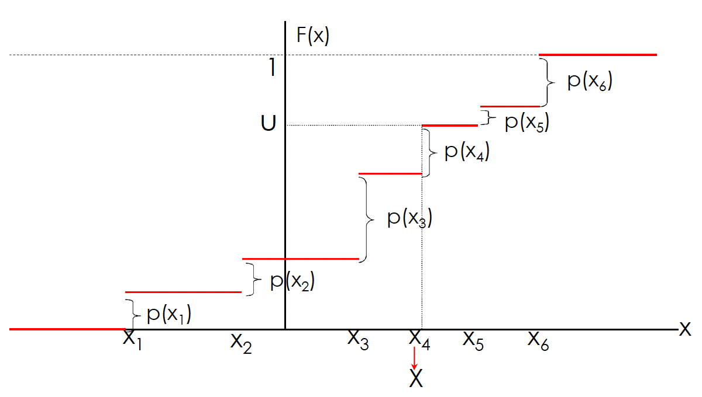
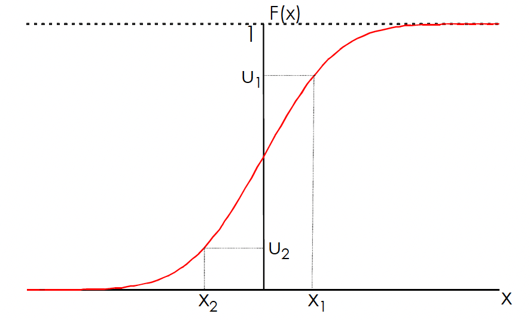

---
output:
  pdf_document: default
  html_document: default
---
# Método da transformada inversa

O **método da transformada inversa** é uma técnica fundamental na geração de variáveis aleatórias com distribuições específicas. Embora o R ofereça funções prontas para gerar números aleatórios de diversas distribuições, compreender e aplicar o método da transformada inversa é essencial em situações como:

- **Distribuições Não Implementadas**: Quando se lida com distribuições que não possuem funções dedicadas no R, o método da transformada inversa permite gerar amostras dessas distribuições a partir de números uniformemente distribuídos.
- **Simulações Personalizadas**: Em simulações que requerem distribuições específicas ou personalizadas, o método oferece flexibilidade para definir e gerar variáveis aleatórias conforme necessário.
- **Fins Educacionais**: Para estudantes e profissionais que desejam aprofundar-se nos fundamentos da geração de variáveis aleatórias, implementar o método manualmente proporciona uma compreensão mais profunda dos processos subjacentes.

## Variável aleatória discreta

Este método é baseado no seguinte resultado.

Seja $U\sim U(0,1)$. Para qualquer função de distribuição $F$, a variável aleatória $X$ definida por $$X = F^{-1}(U)$$ possui distribuição $F$, onde $$F^{-1}(u) = \inf\{x: F(x)\geq u\}$$ é a inversa generalizada de $F$. Além disso, segue que $F(X)\sim U(0,1)$.

Este resultado afirma que podemos simular um valor de uma variável aleatória $X$ ($X$ com distribuição $F$) aplicando o seguinte algoritmo:

```{r eval=FALSE}
Algoritmo: método da transformação inversa
Entrada: invGF() # inversa generalizada de F
  1 Gere um número aleatório u 
  2 Calcule x <- invGF(u)
Saída: x
```

Suponha que queremos gerar o valor de uma variável aleatória discreta
$X$ com função massa de probabilidade $P(X = x_{i}) = p_{i}$,
$i=0,1,\ldots$, $\sum_{i}p_{i}=1$. Para isso, basta gerar um número
aleatório $U \sim U(0,1)$ e considerar: $$X = \begin{cases}
x_{0},& \quad \text{se} \quad U<p_{0} \\
x_{1},& \quad \text{se} \quad p_{0}\leq U <p_{0}+p_{1}\\
\vdots& \\
x_{i},& \quad \text{se} \quad \sum_{j=0}^{i-1}p_{j}\leq U < \sum_{j=0}^{i}p_{j} \\
\vdots
\end{cases}$$

Como, para $0<a<b<1$, $P(a\leq U<b)=b-a$, temos que
$$P(X=x_{i}) = P\left( \sum_{j=0}^{i-1}p_{j} \leq U < \sum_{j=0}^{i}p_{j} \right) = p_{i.}$$

Se os $x_{i}$, $i\geq 0$, estão ordenados $x_{0}<x_{1}<\cdots$ e se
denotarmos por $F$ a função de distribuição de $X$, então
$F(x_{k})=\sum_{i=0}^{k}p_{i}$ e assim
$$X = x_{i} \quad \text{se} \quad F(x_{i-1})\leq U < F(x_{i})$$

Em outras palavras, depois de gerar um número aleatório $U$ nós
determinamos o valor de $X$ encontrando o intervalo
$[F(x_{i-1}),F(x_{i})]$ no qual $U$ pertence (ou, equivalentemente,
encontrando a inversa de $F(U)$).

 **Exemplo 1**: Seja $X$ uma variável
aleatória discreta tal que $p_{1}=0.20$, $p_{2}=0.15$, $p_{3}=0.25$,
$p_{4}=0.40$ onde $p_{j}=P(X=j)$. Gere 10000 valores dessa variável
aleatória.

Para a variável aleatória $X$, a função de distribuição acumulada é dada
pela soma cumulativa das probabilidades:

$$
F(x) = 
\begin{cases} 
0, & \text{se } x < 1 \\
p_1, & \text{se } 1 \leq x < 2 \\
p_1 + p_2, & \text{se } 2 \leq x < 3 \\
p_1 + p_2 + p_3, & \text{se } 3 \leq x < 4 \\
1, & \text{se } x \geq 4 
\end{cases}
$$

Com os valores fornecidos:

$$
F(x) = 
\begin{cases} 
0, & \text{se } x < 1 \\
0.20, & \text{se } 1 \leq x < 2 \\
0.35, & \text{se } 2 \leq x < 3 \\
0.60, & \text{se } 3 \leq x < 4 \\
1, & \text{se } x \geq 4 
\end{cases}
$$

Gerar um número aleatório uniforme $U$ no intervalo [0,1]. Para
determinar o valor de $X$ correspondente a $U$:

-   Se $U <0.20$, então $X=1$
-   Se $0.20 \leq U < 0.35$, então $X=2$
-   Se $0.35\leq U < 0.60$, então $X=3$
-   Se $0.60 \leq U \leq 1$, então $X=4$

```{r}
gerar_inversa <- function(){
  u <- runif(1,0,1)
  ifelse(u<0.20, return(1), 
         ifelse(u>=0.20 & u<0.35, return(2),
                ifelse(u>=0.35 & u<0.60, return(3), return(4))))
}

valores <- replicate(10000, gerar_inversa())

table(valores)/10000
```


**Exemplo 2**: Seja $X$ uma variável aleatória discreta assumindo os
valores: $1,2,\ldots,10$ com probabilidade $1/10$ para
$x=1,2,\ldots,10$. Gerar 5000 valores dessa variável aleatória e representar graficamente.

```{r}
gerar_va_inversa <- function(){
  # Gerar número aleatório entre 0 e 1
  u <- runif(1,0,1)
  p <- 1/10 # primeira probabilidade P(X=1)
  F <- p # inicializar a função de distribuição acumulada
  X <- 1 # inicializar o valor da va X
  
  while(u > F){
    X <- X+1
    F <- F+p
  }
  return(X)
}
valores <- replicate(5000,gerar_va_inversa())
barplot(table(valores)/5000)
```

**Exemplo 3**: Geração de uma variável aleatória com distribuição de
Bernoulli. A variável aleatória $X$ é de Bernoulli com parâmetro $p$ se
$$P(X = x) = \begin{cases} 1-p,& \quad \text{se} \quad x=0\\
p,& \quad \text{se} \quad x=1 \end{cases}$$ Para gerar uma
$Bernoulli(p)$ podemos usar o seguinte algoritmo que é equivalente ao
método da transformada inversa

1.  Gerar um número aleatório $U$;
2.  Se $U \leq p$ então $X=1$ senão $X=0$.

```{r}
# Gerando uma variável aleatória com distribuição de Bernoulli(p)
gerar_bernoulli_inversa <- function(p){
  U <- runif(1)
  if (U <= p){
    X <- 1
  } else {
    X <- 0
  }
  return(X)
}

valores <- replicate(100,gerar_bernoulli_inversa(0.8))
sum(valores)/100
```

**Exemplo 4**: Gerar uma variável aleatória com distribuição
$Binomial(n,p)$. Aqui podemos usar o facto de que se
$X_{1},X_{2},\ldots,X_{n}$ são Bernoullis i.i.d., então
$$X = X_{1}+X_{2}+\ldots+X_{n}$$ é uma $Binomial(n,p)$.

```{r}
# Gerando uma variável aleatória com distribuição Binomial(n,p)

gerar_binomial_inversa <- function(n,p){
  X <- sum(replicate(n,gerar_bernoulli_inversa(p)))
  return(X)
}

valores <- replicate(10000,gerar_binomial_inversa(10,0.5))
hist(valores, freq = FALSE, breaks = 11)
points(0:10, dbinom(0:10,10,0.5))
```

**Exemplo 5**: Geração de uma variável aleatória com distribuição
$Geométrica(p)$. Seja $X\sim Geometrica(p)$. Lembre que
$$P(X=x)=p(1-p)^{x-1}$$ e que
$$F(x) = P(X\leq x) = \begin{cases} 0,& \quad \text{se} \quad x<1 \\
1-(1-p)^x,& \quad \text{se} \quad x\geq 1\end{cases}$$ O seguinte
algoritmo é equivalente ao método da transformada inversa:

1.  Gerar um número aleatório $U$;

2.  Fazer $X = \lfloor ln(1-U)/ln(1-p)\rfloor$

onde $\lfloor  \rfloor =$ maior inteiro.

```{r}
# Gerar uma variável aleatória com distribuição Geométrica(p)

gerar_geometrica_inversa <- function(p){
  U <- runif(1)
  X <- ceiling(log(1-U)/log(1-p))-1
  return(X)
}

valores <- replicate(10000, gerar_geometrica_inversa(0.5))
hist(valores, freq = FALSE)
points(0:10, dgeom(0:10,0.5))
```

**Exemplo 6**: Geração de uma variável aleatória com distribuição de
Poisson. A variável aleatória $X$ é de Poisson com média $\lambda$ se
$$p_{i} = P(X = i) = \frac{e^{-\lambda}\lambda^i}{i!}, \quad i=0,1,\ldots$$

A chave para usar o método da transformada inversa para gerar uma tal
variável aleatória é dada pela seguinte identidade:
$$p_{i+1}=\frac{\lambda}{i+1}p_{i}, \quad i\geq 0.$$

Ao utilizar a recursão acima para calcular as probabilidades de Poisson
quando elas são necessárias, o algoritmo da transformada inversa para
gerar uma variável aleatória de Poisson com média $\lambda$ pode ser
expresso da seguinte forma.

```{r}
# Gerando uma va com distribuição de Poisson

lambda <- 3  # exemplo com lambda = 3

# Função para gerar uma variável aleatória de Poisson usando o método da transformada inversa
gerar_poisson_inversa <- function(lambda) {
  U <- runif(1)  # Gerar um número aleatório uniforme entre 0 e 1
  p <- exp(-lambda)  # Inicializar a primeira probabilidade P(X=0)
  F <- p  # Inicializar a função de distribuição acumulada (CDF)
  X <- 0  # Inicializar o valor da variável aleatória
  
  # Acumular probabilidades até que a CDF exceda U
  while (U > F) {
    X <- X + 1
    p <- p * lambda / X  # Atualizar a probabilidade P(X=k)
    F <- F + p  # Atualizar a CDF
  }
  
  return(X)
}

set.seed(123)
hist(replicate(10000,gerar_poisson_inversa(3)),freq = FALSE, breaks = 12)
points(0:10,dpois(0:10,3))
```

## Exercícios

**1.** Considere uma variável aleatória $X$ com a seguinte distribuição
de probabilidades:

$$P(X = 1) = 0.2, \quad P(X = 2) = 0.5, \quad P(X = 3) = 0.3$$ 

- Calcule a função de distribuição acumulada de $X$.

- Utilize o método da transformada inversa para gerar 1.000 amostras de  $X$.

- Construa um gráfico de barras das amostras geradas e compare com as probabilidades teóricas.

**2.** Uma moeda viciada é tal que a probabilidade de cara (C) é 0.7 e a
probabilidade de coroa (K) é 0.3.

- Defina a função de distribuição acumulada para este experimento.

- Utilize o método da transformada inversa para simular 500 lançamentos dessa moeda.

- Calcule a proporção de caras e coroas nas simulações e compare com as probabilidades esperadas.

**3.** Considere uma variável aleatória $X$ com a seguinte distribuição:

$$P(X = 1) = 0.1, \quad P(X = 2) = 0.3, \quad P(X = 3) = 0.4, \quad P(X = 4) = 0.2$$
Gere 2000 amostras de $X$ usando o método da transformada inversa e
compare a distribuição empírica com a teórica.

**4.** Considere uma variável aleatória $X$ com distribuição geométrica
com parâmetro $p = 0.2$. Isso significa que:

$$P(X = k) = (1 - p)^{k-1}p$$
Fixando a semente em 1234, gere 1000 valores de $X$ usando o método da transformada inversa.

Indique a proporção de valores simulados que são superiores à soma da média com o desvio padrão amostrais. Apresente o resultado com 4 casas decimais. Note que você terá que calcular a função de distribuição acumulada para $X$.

## Variável aleatória contínua

Uma variável aleatória $X$ tem densidade $f(x)=2x$, para $0<x<1$, e 0,
caso contrário. Suponha que queremos simular observações de $X$. Nesta
secção, apresentaremos um método simples e flexível para simulação de
uma distribuição contínua.

**Proposição**: Suponha que $X$ é uma variável aleatória com função de
distribuição $F$, onde $F$ é invertível com função inversa $F^{-1}$.
Seja $U$ uma variável aleatória uniforme $(0,1)$. Então a distribuição
de $F^{-1}(U)$ é igual a distribuição de $X$, ou seja, a variável
aleatória $X$ definida por $X=F^{-1}(U)$ tem distribuição $F$.

A prova desta proposição é fácil e rápida. Precisamos mostrar que
$F^{-1}(U)$ tem a mesma distribuição que $X$. Assim,

\begin{align*}
P(X \leq x) &= P(F^{-1}(U)\leq x) = P(FF^{-1}(U) \leq F(x)) \\
&= P(U \leq F(x)) = P(0\leq U \leq F(x)) \\
&= F(x)-0 \\
&= F(x).
\end{align*}

A última igualdade decorre do facto de que $U\sim U(0,1)$ e
$0\leq F(x) \leq 1$.

Esta proposição mostra que se pode gerar uma variável aleatória $X$ de
uma função de distribuição contínua $F$, gerando um número aleatório $U$
e tomando $X = F^{-1}(U)$.



**Exemplo 1**: Considere nossa varíavel aleatória $X$ com densidade
$f(x)=2x$. A função de distribuição de $X$ é
$$F(x)=P(X\leq x)=\int_{0}^{x}2t\, dt = x^2, \quad \text{para} \quad 0<x<1.$$

A função $F(x)=x^2$ é invertível no intervalo $(0,1)$ e
$F^{-1}(x)=\sqrt{x}$. O método da transformada inversa diz que se
$U\sim U(0,1)$, então $F^{-1}(U)=\sqrt{U}$ tem a mesma distribuição que
$X$. Portanto, para simular $X$, basta gerar $\sqrt{U}$.

```{r}
n <- 10000
set.seed(123)
simlist <- sqrt(runif(n))
hist(simlist, prob=T, main="", xlab="")
curve(2*x, 0,1, add=T)
```

**Exemplo 2**: Geração de uma variável aleatória $Uniforme(a,b)$. A
geração é feita através de $$X = a+(b-a)U.$$

```{r}
# Geração de uma va uniforme(-2,2)
a <- -2
b <- 2
n <- 10000
set.seed(123)
simlist <- a+(b-a)*runif(n)
hist(simlist, prob=T, main="",xlab="")
curve(dunif(x,a,b), col="red",add=TRUE)
```

**Exemplo 3**: Geração de uma variável aleatória exponencial. Seja $X$
uma variável aleatória exponencial com taxa 1, então sua função de
distribuição é dada por $$F(x)=1-e^{x}.$$ Como $0\leq F(x)\leq 1$,
tomando $F(x)=u$, onde $u\sim U(0,1)$ tem-se: $$u=F(x)=1-e^{x}$$ ou
$$1-u=e^{-x}$$ ou, aplicando o logaritmo $$x=-ln(1-u).$$ Daí, pode-se
gerar uma exponencial com parâmetro 1 gerando um número aleatório $U$ e
em seguida fazendo $$X = F^{-1}(U) = -ln(1-U).$$ Uma pequena economia de
tempo pode ser obtida ao notar que $1-U$ também é uniforme em $(0,1)$, e
assim, $-ln(1-U)$ tem a mesma distribuição que $-ln(U)$. Isto é, o
logaritmo negativo de um número aleatório é exponencialmente distribuído
com taxa 1.

Além disso, note que se $X$ é uma exponencial com média 1, então para
qualquer constante $c$, $cX$ é uma exponencial com média $c$. Assim, uma
variável aleatória exponencial $X$ com taxa $\lambda$ (média
$\frac{1}{\lambda}$) pode ser gerada através da geração de um número
aleatório $U$ e fazendo $$X = -\frac{1}{\lambda}ln (U).$$

```{r}
# Definir a sequência de valores x
x <- seq(0,3, by = 0.02)

# Definir o parâmetro lambda da distribuição exponencial
lambda <- 3

# Número de simulação
n <- 10000

# Simular valores de uma distribuição exponencial
set.seed(123)
simlist <- -log(runif(n))/lambda

# Plotar o histograma da simulação com a densidade de probabilidade
hist(simlist, probability = TRUE, main = "Comparação da Distribuição Exponencial Simulada e Teórica",
     xlab = "Valores", ylab = "Densidade", col = "lightblue", border = "black")

# Adicionar a curva de densidade teórica
curve(dexp(x, rate = lambda), add = TRUE, col = "red", lwd = 2)

# Adicionar uma legenda
legend("topright", legend = c("Simulação", "Teórica"), col = c("lightblue", "red"), lwd = 2, fill = c("lightblue", NA))
```

## Exercícios

**1.** Dada uma variável aleatória $X$ com distribuição exponencial de
parâmetro $\lambda = 2$, use o Método da Transformada Inversa para gerar
1000 valores de $X$ e visualize a distribuição com um histograma. Lembre
que $F_{X}(x) = 1-e^{-\lambda x}$ e mostre que
$X = -\frac{ln(1-u)}{\lambda}$.

**2.** Use o Método da Transformada Inversa para gerar 500 valores de
uma variável aleatória $X$ com distribuição uniforme no intervalo (2,
5). Lembre que a função de distribuição de uma uniforme $U(a,b)$ é
$F_{X}(x) = \frac{x-a}{b-a}$. Mostre que $X = a+u(b-a)$. Visualize a distribuição com um histograma e compare com a distribuição teórica.

**3.** Dada uma variável aleatória $X$ com distribuição Cauchy, use o Método da Transformada Inversa para gerar 1000 valores de $X$ com parâmteros 0 e 1. Lembre que $F_{X}(x) = \frac{1}{\pi}arctan(\frac{x-x_0}{\gamma})+\frac{1}{2}$. Mostre que
$X = x_0 + \gamma \, tan[\pi(u-0.5)]$. Visualize a distribuição com um histograma e compare com a distribuição teórica. Use `dcauchy()`.

**4.** Seja $X$ uma variável aleatória com distribuição
$W(\alpha, \beta)$. Assim a f.d.p de $X$ é $$f(x) = \begin{cases}
\alpha \beta^{-\alpha} x^{\alpha -1} e^{-(x/\beta)^\alpha},& \quad \text{se} \quad x>0 \\
0,& \quad \text{se} \quad x\leq 0
\end{cases}$$

A função de distribuição de $X$ é:
$$F(x) = \int_{0}^{x}f(u)\, du = \begin{cases}
1-e^{-(x/\beta)^\alpha},& \quad \text{se} \quad x>0\\
0,& \quad \text{se} \quad x\leq 0
\end{cases}$$

Mostre que $X = \beta[-ln(U)]^{1/\alpha}$. Gere 10000 valores de uma
$W(2,3)$. Visualize a distribuição com um histograma e compare com a distribuição teórica. Use `dweibull()`.

**5.** Obtenha o gerador de números aleatórios das distribuições
especificadas abaixo usando o método da transformada inversa

-   $F(x) = 1-(x-1)^2, \quad 0<x<1$.

-   $F(x) = x^{\theta}, \quad 0<x<1, \theta>1$.

-   $F(x) = 1-exp(-x^2/2\tau^2), \quad x>0, \tau>0$.

-   $f(x) = \frac{1}{2}sin(x), \quad 0<x<\pi$.

-   $f(x) = \frac{sec^2(x)}{\sqrt{3}}, \quad 0<x<\pi/3$.

**Soluções**

-   $F^{-1}(u) = 1-\sqrt{1-u}$ ou apenas $F^{-1}(u)=1-\sqrt{u}$ por
    simetria.

-   $F^{-1}(u) = u^{1/\theta}$.

-   $F^{-1}(u) = \sqrt{-2\tau \cdot \log(1-u)}$.

-   $F(x) = \frac{1-\cos(x)}{2}$ e $F^{-1}(u)=arcos(1-2u)$.

-   $F(x) = \frac{tan(x)}{\sqrt{3}}$ e $F^{-1}(u) = arctan(u\sqrt3)$.

Quando usar o método da transformada inversa?

Sempre que possível.

-   O método funciona quando $F^{-1}(u)$ existe.

-   Existem distribuições onde $F(x)$ é não inversão analítica.

-   Existem distribuições onde $F(x)$ não existe (apenas $f(x)$).

Alternativas

-   Pode-se aproximar numericamente $F(x)$ e/ou $F^{-1}(u)$ para gerador
    de número aleatório.

-   Pode-se considerar métodos não baseados em $F^{-1}(u)$.
