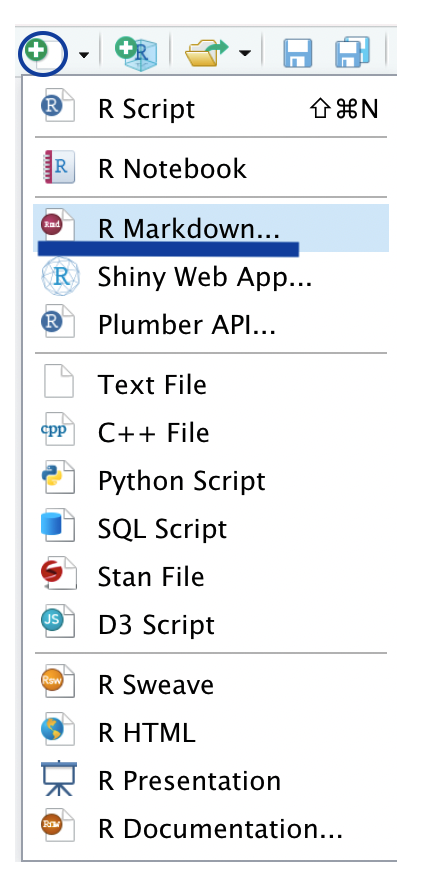
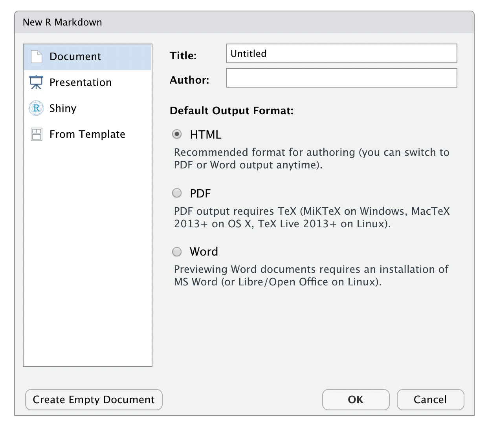
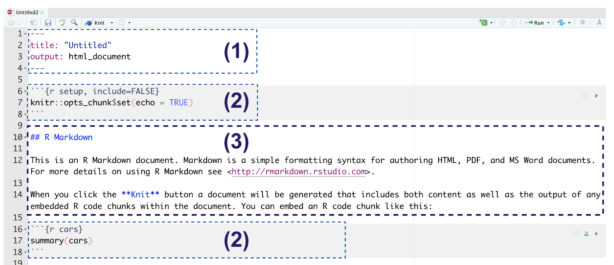

# Relatórios

Com a ajuda do R Markdown, uma interface de anotações que combina texto livre com códigos em R, podemos construir relatórios não só reprodutíveis, mas elegantemente bem formatados, sem sair do R!

Antes de mais nada, vamos instalar os pacotes ``{rmarkdown}`` e ``{knitr}``. O primeiro reúne todas as funcionalidades para juntar nossos textos narrativos e códigos de R. O segundo vai fazer a magia de transformar nossos simples arquivos de texto em arquivos HTML, PDF e Word (.doc).

```{r eval=FALSE}
install.packages(c("rmarkdown", "knitr"))
```

Nas seções a seguir, vamos mostrar como começar a utilizar o R Markdown para criar esses documentos. Não se esqueça de conferir (e deixar por perto) as folhas de cola sobre R Markdown:

...

## Markdown

Se você é uma pessoa que utiliza R, sabe das possibilidades de utilizar R Markdown (e os pacotes que expandem mais ainda as possibilidades) e gostaria de começar a utilizá-lo, é importante conhecer o Markdown. Por quê? O R Markdown tem como base a linguagem de marcação Markdown.

Os arquivos markdown podem ser abertos por qualquer software que suporte este formato aberto. Além disso, independente da plataforma de trabalho, pode-se migrar para um arquivo de texto sem perder a formatação. O Markdown também é usado em outros lugares, como no GitHub.

Uma referência interessante para ter sempre em mãos é a Folha de cola (Cheatsheet) do Markdown.

Nas seções seguintes, descreveremos como podemos marcar os nossos textos e códigos usando markdown, e você poderá usar isso tanto em arquivos .Rmd, quanto em outros lugares que também utilizam essa marcação.

### Ênfase

**Negrito**

Para destacar um texto em negrito, coloque `**` ou `__` ao redor do texto.

Por exemplo:

| Como é escrito no código                                | Como aparece no relatório                         |
|--------------------------------------------------------|--------------------------------------------------|
| `Esse é um texto com uma palavra destacada em **negrito**.` | Esse é um texto com uma palavra destacada em **negrito**. |
| `Esse é um texto com uma palavra destacada em __negrito__.` | Esse é um texto com uma palavra destacada em **negrito**. |

**Itálico**

Para destacar um texto em itálico, coloque `*` ou `_` ao redor do texto.

Por exemplo:

| Como é escrito no código                                | Como aparece no relatório                         |
|--------------------------------------------------------|--------------------------------------------------|
| `Esse é um texto com uma palavra destacada em *itálico*.` | Esse é um texto com uma palavra destacada em *itálico*. |
| `Esse é um texto com uma palavra destacada em _itálico_.` | Esse é um texto com uma palavra destacada em *itálico*. |

**Riscado (ou tachado)**

Para riscar/tachar um texto, coloque `~~` ao redor do texto.

Por exemplo:

Esse é um texto com uma palavra riscada/tachada.

| Como é escrito no código                                     | Como aparece no relatório                               |
|-------------------------------------------------------------|--------------------------------------------------------|
| `Esse é um texto com uma palavra ~~riscada/tachada~~.`      | Esse é um texto com uma palavra ~~riscada/tachada~~.    |

### Títulos

Os títulos funcionam como uma hierarquia, e para criar um título é necessário colocar um `#` no início da linha. Então, um `#` marca um título, `##` marca um subtítulo, e assim sucessivamente. Veja os exemplos:

| Como é escrito no código | Como aparece no relatório   |
|--------------------------|-----------------------------|
| `# Título 1`             | # Título 1                 |
| `## Título 2`            | ##  Título 2                |
| `### Título 3`           | ### Título 3               |

### Listas

Você pode fazer uma lista ordenada usando somente números. Você pode repetir o número quantas vezes quiser:

Como é escrito no código:

`1. Maçã`

`1. Banana`

`1. Uva`

Como aparece no relatório:

1. Maçã
2. Banana
3. Uva

**Listas não ordenadas**

Você pode fazer uma lista não ordenada escrevendo com hífens ou asteriscos, como a seguir:

`* Maçã`

`* Banana`

`* Uva`


`- Maçã`

`- Banana`

`- Uva`

O resultado será:

* Maçã
* Banana
* Uva

Você também pode adicionar sub-itens na lista indicando a hierarquia através da identação no Markdown (dica: utilize a tecla `tab` do teclado):

* Frutas
  * Maçã
  * Banana
  * Uva

### Equações

Você pode adicionar equações utilizando LaTeX. Você pode saber mais na [página do Overleaf sobre expressões matemáticas](https://pt.overleaf.com/learn/latex/Mathematical_expressions). Além disso, existem [geradores de equações online](https://www.codecogs.com/latex/eqneditor.php) que ajudam a escrevê-las em LaTeX, HTML, entre outras linguagens de marcação.

É possível centralizar a equação envolvendo o código com `$$`. Veja o exemplo abaixo:

| Como é escrito no código                                 | Como aparece no relatório                            |
|---------------------------------------------------------|-----------------------------------------------------|
| `$$y = \mu + \sum_{i=1}^p \beta_i x_i + \epsilon$$`     | $$y = \mu + \sum_{i=1}^p \beta_i x_i + \epsilon$$   |

Também é possível adicionar a equação na mesma linha que o texto, envolvendo o código com `$`. Veja o exemplo abaixo:

| Como é escrito no código                                                        | Como aparece no relatório                                                  |
|---------------------------------------------------------------------------------|----------------------------------------------------------------------------|
| `Ou também na linha $y = \mu + \sum_{i=1}^p \beta_i x_i + \epsilon$, junto ao texto!` | Ou também na linha $y = \mu + \sum_{i=1}^p \beta_i x_i + \epsilon$, junto ao texto! |

### Código

É possível **marcar textos para que fiquem formatados como códigos**, usando a crase: `` ` ``

Mas atenção: o texto será **formatado como código**, porém não será executado!

| Como é escrito no código                                     | Como aparece no relatório                               |
|-------------------------------------------------------------|--------------------------------------------------------|
| `` `mean(pinguins$massa_corporal, na.rm = TRUE)` ``         | `mean(pinguins$massa_corporal, na.rm = TRUE)`          |

Também é possível delimitar um trecho maior de código, utilizando três crases.

**Exemplo:**

```
library(dados)
mean(pinguins$massa_corporal, na.rm = TRUE)
```

Como o código aparece no relatório

```{r eval=FALSE}
library(dados)
mean(pinguins$massa_corporal, na.rm = TRUE)
```

### Links

Você pode criar um link utilizando esta estrutura:

  `[texto](http://url-da-pagina.com)`.

  Por exemplo:

  | Como é escrito no código                                        | Como aparece no relatório                                   |
  |-----------------------------------------------------------------|-----------------------------------------------------------|
  | Você pode consultar mais [materiais sobre R nesta página](https://renatorpa.github.io/labestatistica1/relatórios.html). | Você pode consultar mais **materiais sobre R nesta página**. |

### Imagens

Você pode incluir uma imagem utilizando esta estrutura:

``.

Não se esqueça: a descrição da imagem é importante para acessibilidade do conteúdo através de leitores de tela!

| Como é escrito no código                                 | Como aparece no relatório                   |
|----------------------------------------------------------|---------------------------------------------|
| `` |  |

### Tabelas

As tabelas em Markdown têm uma estrutura definida, como mostra o exemplo abaixo.

É possível usar ferramentas online para gerar tabelas em Markdown, como por exemplo o [Tables Generator](https://www.tablesgenerator.com/markdown_tables).

Em Markdown:

```{r eval=FALSE}
| a  | b  | c  |
|:--:|:--:|:--:|
| 1  | 2  | 3  |
| 2  | 3  | 4  |
```

Resultado:

| a  | b  | c  |
|:--:|:--:|:--:|
| 1  | 2  | 3  |
| 2  | 3  | 4  |

## R Markdown

O R Markdown é a junção da linguagem Markdown com o poder de códigos em R. A mágica acontece em arquivos do tipo `.Rmd`, onde é possível adicionar textos, códigos, resultados de códigos e muito mais.

### Criando um arquivo `.Rmd`

Falamos que mágica acontece em arquivos do tipo `.Rmd`, porém, como podemos criar esses arquivos? Primeiramente, no menu superior, clique em **File > New File > R Markdown**, ou utilize os botões da interface gráfica, como mostrado na imagem a seguir:



Uma janela será aberta, chamada **New R Markdown**. Neste momento, iremos focar na seção inicial (**Document**). Nessa janela, é possível informar o título do relatório, o nome das pessoas autoras, e o formato em que deseja criar o relatório (sendo HTML, PDF ou Word). Caso queira gerar um PDF, será necessário instalar o LaTeX (saiba como no [capítulo sobre instalações adicionais](https://livro.curso-r.com/1-3-instalacao-adicionais.html#instalacao-latex)).

Para facilitar o aprendizado, recomendamos que escolha a opção HTML, sendo que é possível alterar todos esses campos posteriormente. Para que o arquivo seja criado, é necessário clicar no botão **OK**. Para o envio do exercício 2 escolha a opção PDF.



### Estrutura do arquivo R Markdown

Quando criamos um novo arquivo `.Rmd` (como descrito na seção anterior), o arquivo vem com alguns conteúdos para nos ajudar a organizar corretamente.

O arquivo `.Rmd` possui a seguinte estrutura, ilustrada pela figura a seguir:

- **1. YAML** - Uma seção de metadados, que apresenta códigos `YAML`. Essa seção apresenta informações que serão usadas para gerar o arquivo final, como por exemplo: título do relatório, autoria, data, formato gerado, etc. É necessário cuidado ao editar essa seção, pois coisas simples como indentação incorreta, fechamento incorreto de textos, etc, podem resultar em um erro ao gerar seu relatório. Essa seção deve estar sempre ao início do documento, e é delimitado por três traços no começo e no final: `---`.

- **2. Chunks** - Nos campos de código (também chamados de *chunks*) podemos adicionar códigos em R (ou em algumas outras linguagens). Os chunks são delimitados por três crases, e a linguagem deve ser especificada entre chaves. Caso queira adicionar chunks com código em Python, é necessário ter o pacote {reticulate} instalado. Exemplo de um chunk que apresenta código em R:

```{r, echo=FALSE}
cat("```{r}\n código em R aqui\n```")
```

- **3. Markdown** - Textos marcados com Markdown podem ser adicionados ao longo do relatório, fora das demarcações do YAMl e dos Chunks.


